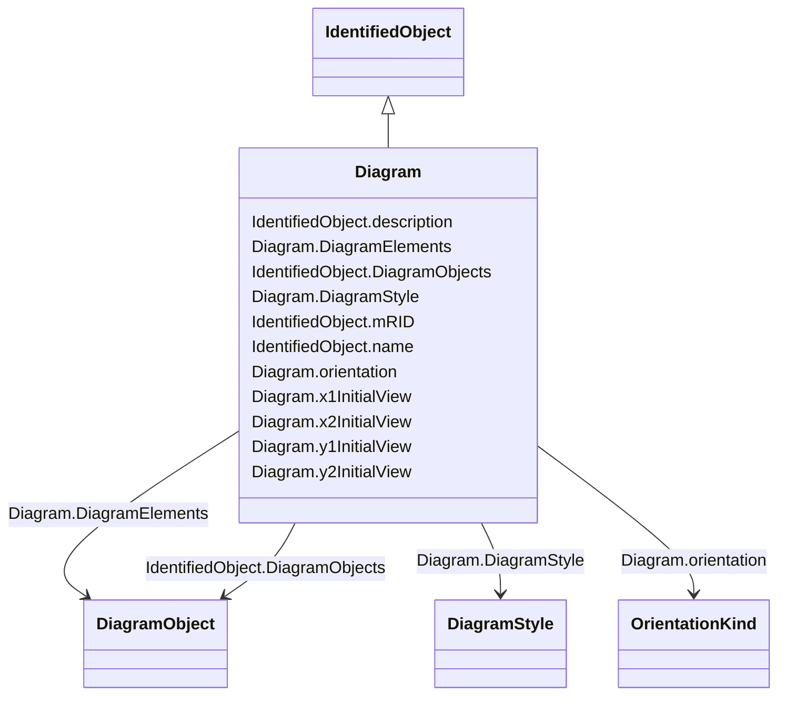

# Diagram

_The diagram being exchanged. The coordinate system is a standard Cartesian coordinate system and the orientation attribute defines the orientation. The initial view related attributes can be used to specify an initial view with the x,y coordinates of the diagonal points._

**URI**: [cim:Diagram](http://iec.ch/TC57/CIM100#Diagram) 
**Type**: Class

## Inheritance
* [IdentifiedObject](IdentifiedObject.md)
    * **Diagram**

## Attributes

| Name | URI | Cardinality and Range | Description | Inheritance |
| ---  | --- | --- | --- | --- |
| orientation | [cim:Diagram.orientation](http://iec.ch/TC57/CIM100#Diagram.orientation) | 1..1    [OrientationKind](OrientationKind.md)  | Coordinate system orientation of the diagram | direct |
| x1InitialView | [cim:Diagram.x1InitialView](http://iec.ch/TC57/CIM100#Diagram.x1InitialView) | 0..1    float  | X coordinate of the first corner of the initial view | direct |
| x2InitialView | [cim:Diagram.x2InitialView](http://iec.ch/TC57/CIM100#Diagram.x2InitialView) | 0..1    float  | X coordinate of the second corner of the initial view | direct |
| y1InitialView | [cim:Diagram.y1InitialView](http://iec.ch/TC57/CIM100#Diagram.y1InitialView) | 0..1    float  | Y coordinate of the first corner of the initial view | direct |
| y2InitialView | [cim:Diagram.y2InitialView](http://iec.ch/TC57/CIM100#Diagram.y2InitialView) | 0..1    float  | Y coordinate of the second corner of the initial view | direct |
| DiagramElements | [cim:Diagram.DiagramElements](http://iec.ch/TC57/CIM100#Diagram.DiagramElements) | 0..*    [DiagramObject](DiagramObject.md)  | A diagram is made up of multiple diagram objects | direct |
| DiagramStyle | [cim:Diagram.DiagramStyle](http://iec.ch/TC57/CIM100#Diagram.DiagramStyle) | 0..1    [DiagramStyle](DiagramStyle.md)  | A Diagram may have a DiagramStyle | direct |
| DiagramObjects | [cim:IdentifiedObject.DiagramObjects](http://iec.ch/TC57/CIM100#IdentifiedObject.DiagramObjects) | 0..*    [DiagramObject](DiagramObject.md)  | The diagram objects that are associated with the domain object | [IdentifiedObject](IdentifiedObject.md) |
| mRID | [cim:IdentifiedObject.mRID](http://iec.ch/TC57/CIM100#IdentifiedObject.mRID) | 1..1    string  | Master resource identifier issued by a model authority | [IdentifiedObject](IdentifiedObject.md) |
| name | [cim:IdentifiedObject.name](http://iec.ch/TC57/CIM100#IdentifiedObject.name) | 1..1    string  | The name is any free human readable and possibly non unique text naming the o... | [IdentifiedObject](IdentifiedObject.md) |
| description | [cim:IdentifiedObject.description](http://iec.ch/TC57/CIM100#IdentifiedObject.description) | 0..1    string  | The description is a free human readable text describing or naming the object | [IdentifiedObject](IdentifiedObject.md) |

## Usages

| used by | used in | type | used |
| ---  | --- | --- | --- |
| [DiagramObject](DiagramObject.md) | Diagram | range | [Diagram](Diagram.md) |
| [DiagramStyle](DiagramStyle.md) | Diagram | range | [Diagram](Diagram.md) |
| [TextDiagramObject](TextDiagramObject.md) | Diagram | range | [Diagram](Diagram.md) |

## Identifier and Mapping Information

### Schema Source

* from schema: http://iec.ch/TC57/ns/CIM/DiagramLayout-EU#Package_DiagramLayoutProfile

## Mappings

| Mapping Type | Mapped Value |
| ---  | ---  |
| self | cim:Diagram |
| native | this:Diagram |

