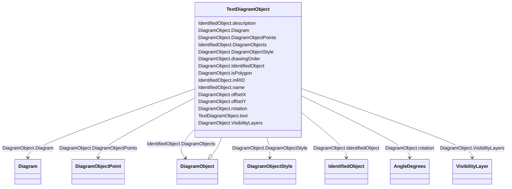

# TextDiagramObject

_A diagram object for placing free-text or text derived from an associated domain object._

**URI**: [cim:TextDiagramObject](http://iec.ch/TC57/CIM100#TextDiagramObject) 
**Type**: Class

## Inheritance
* [IdentifiedObject](IdentifiedObject.md)
    * [DiagramObject](DiagramObject.md)
        * **TextDiagramObject**

## Attributes

| Name | URI | Cardinality and Range | Description | Inheritance |
| ---  | --- | --- | --- | --- |
| text | [cim:TextDiagramObject.text](http://iec.ch/TC57/CIM100#TextDiagramObject.text) | 1..1    string  | The text that is displayed by this text diagram object | direct |
| Diagram | [cim:DiagramObject.Diagram](http://iec.ch/TC57/CIM100#DiagramObject.Diagram) | 1..1    [Diagram](Diagram.md)  | A diagram object is part of a diagram | [DiagramObject](DiagramObject.md) |
| drawingOrder | [cim:DiagramObject.drawingOrder](http://iec.ch/TC57/CIM100#DiagramObject.drawingOrder) | 0..1    integer  | The drawing order of this element | [DiagramObject](DiagramObject.md) |
| isPolygon | [cim:DiagramObject.isPolygon](http://iec.ch/TC57/CIM100#DiagramObject.isPolygon) | 0..1    boolean  | Defines whether or not the diagram objects points define the boundaries of a ... | [DiagramObject](DiagramObject.md) |
| offsetX | [cim:DiagramObject.offsetX](http://iec.ch/TC57/CIM100#DiagramObject.offsetX) | 0..1    float  | The offset in the X direction | [DiagramObject](DiagramObject.md) |
| offsetY | [cim:DiagramObject.offsetY](http://iec.ch/TC57/CIM100#DiagramObject.offsetY) | 0..1    float  | The offset in the Y direction | [DiagramObject](DiagramObject.md) |
| rotation | [cim:DiagramObject.rotation](http://iec.ch/TC57/CIM100#DiagramObject.rotation) | 0..1    [AngleDegrees](AngleDegrees.md)  | Sets the angle of rotation of the diagram object | [DiagramObject](DiagramObject.md) |
| IdentifiedObject | [cim:DiagramObject.IdentifiedObject](http://iec.ch/TC57/CIM100#DiagramObject.IdentifiedObject) | 0..1    [IdentifiedObject](IdentifiedObject.md)  | The domain object to which this diagram object is associated | [DiagramObject](DiagramObject.md) |
| DiagramObjectPoints | [cim:DiagramObject.DiagramObjectPoints](http://iec.ch/TC57/CIM100#DiagramObject.DiagramObjectPoints) | 0..*    [DiagramObjectPoint](DiagramObjectPoint.md)  | A diagram object can have 0 or more points to reflect its layout position, ro... | [DiagramObject](DiagramObject.md) |
| VisibilityLayers | [cim:DiagramObject.VisibilityLayers](http://iec.ch/TC57/CIM100#DiagramObject.VisibilityLayers) | 0..*    [VisibilityLayer](VisibilityLayer.md)  | A diagram object can be part of multiple visibility layers | [DiagramObject](DiagramObject.md) |
| DiagramObjectStyle | [cim:DiagramObject.DiagramObjectStyle](http://iec.ch/TC57/CIM100#DiagramObject.DiagramObjectStyle) | 0..1    [DiagramObjectStyle](DiagramObjectStyle.md)  | A diagram object has a style associated that provides a reference for the sty... | [DiagramObject](DiagramObject.md) |
| DiagramObjects | [cim:IdentifiedObject.DiagramObjects](http://iec.ch/TC57/CIM100#IdentifiedObject.DiagramObjects) | 0..*    [DiagramObject](DiagramObject.md)  | The diagram objects that are associated with the domain object | [IdentifiedObject](IdentifiedObject.md) |
| mRID | [cim:IdentifiedObject.mRID](http://iec.ch/TC57/CIM100#IdentifiedObject.mRID) | 1..1    string  | Master resource identifier issued by a model authority | [IdentifiedObject](IdentifiedObject.md) |
| name | [cim:IdentifiedObject.name](http://iec.ch/TC57/CIM100#IdentifiedObject.name) | 1..1    string  | The name is any free human readable and possibly non unique text naming the o... | [IdentifiedObject](IdentifiedObject.md) |
| description | [cim:IdentifiedObject.description](http://iec.ch/TC57/CIM100#IdentifiedObject.description) | 0..1    string  | The description is a free human readable text describing or naming the object | [IdentifiedObject](IdentifiedObject.md) |

## Identifier and Mapping Information

### Schema Source

* from schema: http://iec.ch/TC57/ns/CIM/DiagramLayout-EU#Package_DiagramLayoutProfile

## Mappings

| Mapping Type | Mapped Value |
| ---  | ---  |
| self | cim:TextDiagramObject |
| native | this:TextDiagramObject |

