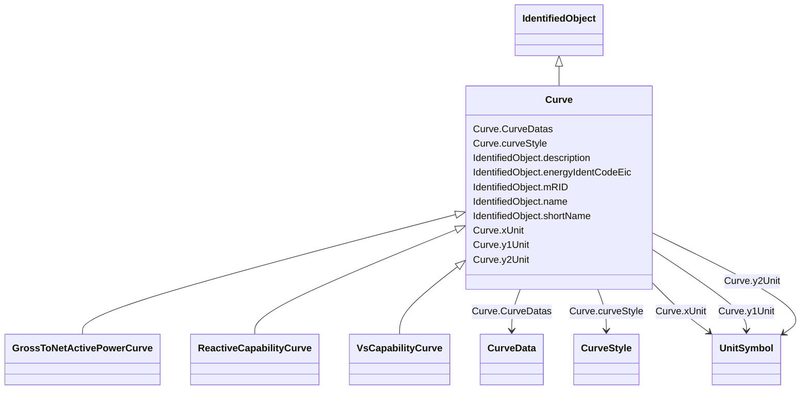

# Curve

_A multi-purpose curve or functional relationship between an independent variable (X-axis) and dependent (Y-axis) variables._

**URI**: [cim:Curve](http://iec.ch/TC57/CIM100#Curve) 
**Type**: Class

## Inheritance
* [IdentifiedObject](IdentifiedObject.md)
    * **Curve**
        * [GrossToNetActivePowerCurve](GrossToNetActivePowerCurve.md)
        * [ReactiveCapabilityCurve](ReactiveCapabilityCurve.md)
        * [VsCapabilityCurve](VsCapabilityCurve.md)

## Attributes

| Name | URI | Cardinality and Range | Description | Inheritance |
| ---  | --- | --- | --- | --- |
| curveStyle | [cim:Curve.curveStyle](http://iec.ch/TC57/CIM100#Curve.curveStyle) | 1..1    [CurveStyle](CurveStyle.md)  | The style or shape of the curve | direct |
| xUnit | [cim:Curve.xUnit](http://iec.ch/TC57/CIM100#Curve.xUnit) | 1..1    [UnitSymbol](UnitSymbol.md)  | The X-axis units of measure | direct |
| y1Unit | [cim:Curve.y1Unit](http://iec.ch/TC57/CIM100#Curve.y1Unit) | 1..1    [UnitSymbol](UnitSymbol.md)  | The Y1-axis units of measure | direct |
| y2Unit | [cim:Curve.y2Unit](http://iec.ch/TC57/CIM100#Curve.y2Unit) | 0..1    [UnitSymbol](UnitSymbol.md)  | The Y2-axis units of measure | direct |
| CurveDatas | [cim:Curve.CurveDatas](http://iec.ch/TC57/CIM100#Curve.CurveDatas) | 1..*    [CurveData](CurveData.md)  | The point data values that define this curve | direct |
| description | [cim:IdentifiedObject.description](http://iec.ch/TC57/CIM100#IdentifiedObject.description) | 0..1    string  | The description is a free human readable text describing or naming the object | [IdentifiedObject](IdentifiedObject.md) |
| energyIdentCodeEic | [eu:IdentifiedObject.energyIdentCodeEic](http://iec.ch/TC57/CIM100-European#IdentifiedObject.energyIdentCodeEic) | 0..1    string  | The attribute is used for an exchange of the EIC code (Energy identification ... | [IdentifiedObject](IdentifiedObject.md) |
| mRID | [cim:IdentifiedObject.mRID](http://iec.ch/TC57/CIM100#IdentifiedObject.mRID) | 1..1    string  | Master resource identifier issued by a model authority | [IdentifiedObject](IdentifiedObject.md) |
| name | [cim:IdentifiedObject.name](http://iec.ch/TC57/CIM100#IdentifiedObject.name) | 1..1    string  | The name is any free human readable and possibly non unique text naming the o... | [IdentifiedObject](IdentifiedObject.md) |
| shortName | [eu:IdentifiedObject.shortName](http://iec.ch/TC57/CIM100-European#IdentifiedObject.shortName) | 0..1    string  | The attribute is used for an exchange of a human readable short name with len... | [IdentifiedObject](IdentifiedObject.md) |

## Usages

| used by | used in | type | used |
| ---  | --- | --- | --- |
| [CurveData](CurveData.md) | Curve | range | [Curve](Curve.md) |

## Identifier and Mapping Information

### Schema Source

* from schema: http://iec.ch/TC57/ns/CIM/CoreEquipment-EU#Package_CoreEquipmentProfile

## Mappings

| Mapping Type | Mapped Value |
| ---  | ---  |
| self | cim:Curve |
| native | this:Curve |

