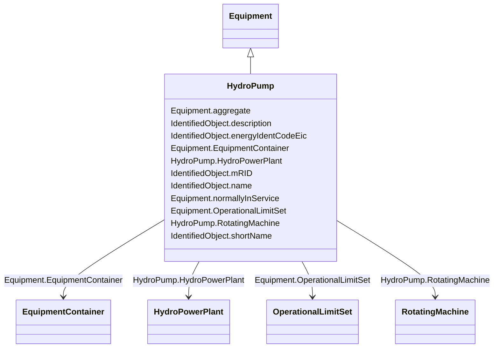

# HydroPump

_A synchronous motor-driven pump, typically associated with a pumped storage plant._

**URI**: [cim:HydroPump](http://iec.ch/TC57/CIM100#HydroPump) 
**Type**: Class

## Inheritance
* [IdentifiedObject](IdentifiedObject.md)
    * [PowerSystemResource](PowerSystemResource.md)
        * [Equipment](Equipment.md)
            * **HydroPump**

## Attributes

| Name | URI | Cardinality and Range | Description | Inheritance |
| ---  | --- | --- | --- | --- |
| HydroPowerPlant | [cim:HydroPump.HydroPowerPlant](http://iec.ch/TC57/CIM100#HydroPump.HydroPowerPlant) | 0..1    [HydroPowerPlant](HydroPowerPlant.md)  | The hydro pump may be a member of a pumped storage plant or a pump for distri... | direct |
| RotatingMachine | [cim:HydroPump.RotatingMachine](http://iec.ch/TC57/CIM100#HydroPump.RotatingMachine) | 1..1    [RotatingMachine](RotatingMachine.md)  | The synchronous machine drives the turbine which moves the water from a low e... | direct |
| aggregate | [cim:Equipment.aggregate](http://iec.ch/TC57/CIM100#Equipment.aggregate) | 0..1    boolean  | The aggregate flag provides an alternative way of representing an aggregated ... | [Equipment](Equipment.md) |
| normallyInService | [cim:Equipment.normallyInService](http://iec.ch/TC57/CIM100#Equipment.normallyInService) | 0..1    boolean  | Specifies the availability of the equipment under normal operating conditions | [Equipment](Equipment.md) |
| EquipmentContainer | [cim:Equipment.EquipmentContainer](http://iec.ch/TC57/CIM100#Equipment.EquipmentContainer) | 0..1    [EquipmentContainer](EquipmentContainer.md)  | Container of this equipment | [Equipment](Equipment.md) |
| OperationalLimitSet | [cim:Equipment.OperationalLimitSet](http://iec.ch/TC57/CIM100#Equipment.OperationalLimitSet) | 0..*    [OperationalLimitSet](OperationalLimitSet.md)  | The operational limit sets associated with this equipment | [Equipment](Equipment.md) |
| description | [cim:IdentifiedObject.description](http://iec.ch/TC57/CIM100#IdentifiedObject.description) | 0..1    string  | The description is a free human readable text describing or naming the object | [IdentifiedObject](IdentifiedObject.md) |
| energyIdentCodeEic | [eu:IdentifiedObject.energyIdentCodeEic](http://iec.ch/TC57/CIM100-European#IdentifiedObject.energyIdentCodeEic) | 0..1    string  | The attribute is used for an exchange of the EIC code (Energy identification ... | [IdentifiedObject](IdentifiedObject.md) |
| mRID | [cim:IdentifiedObject.mRID](http://iec.ch/TC57/CIM100#IdentifiedObject.mRID) | 1..1    string  | Master resource identifier issued by a model authority | [IdentifiedObject](IdentifiedObject.md) |
| name | [cim:IdentifiedObject.name](http://iec.ch/TC57/CIM100#IdentifiedObject.name) | 1..1    string  | The name is any free human readable and possibly non unique text naming the o... | [IdentifiedObject](IdentifiedObject.md) |
| shortName | [eu:IdentifiedObject.shortName](http://iec.ch/TC57/CIM100-European#IdentifiedObject.shortName) | 0..1    string  | The attribute is used for an exchange of a human readable short name with len... | [IdentifiedObject](IdentifiedObject.md) |

## Usages

| used by | used in | type | used |
| ---  | --- | --- | --- |
| [AsynchronousMachine](AsynchronousMachine.md) | HydroPump | range | [HydroPump](HydroPump.md) |
| [HydroPowerPlant](HydroPowerPlant.md) | HydroPumps | range | [HydroPump](HydroPump.md) |
| [RotatingMachine](RotatingMachine.md) | HydroPump | range | [HydroPump](HydroPump.md) |
| [SynchronousMachine](SynchronousMachine.md) | HydroPump | range | [HydroPump](HydroPump.md) |

## Identifier and Mapping Information

### Schema Source

* from schema: http://iec.ch/TC57/ns/CIM/CoreEquipment-EU#Package_CoreEquipmentProfile

## Mappings

| Mapping Type | Mapped Value |
| ---  | ---  |
| self | cim:HydroPump |
| native | this:HydroPump |

