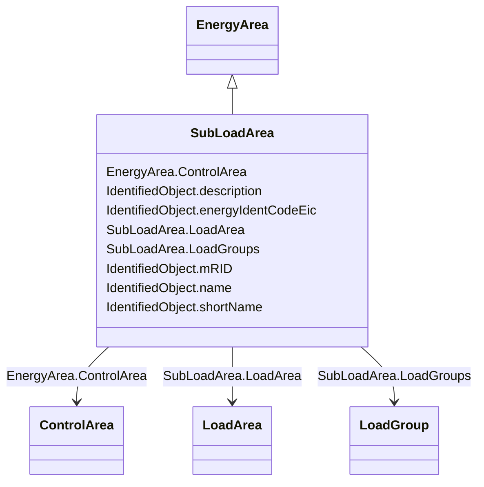

# SubLoadArea

_The class is the second level in a hierarchical structure for grouping of loads for the purpose of load flow load scaling._

**URI**: [cim:SubLoadArea](http://iec.ch/TC57/CIM100#SubLoadArea) 
**Type**: Class

## Inheritance
* [IdentifiedObject](IdentifiedObject.md)
    * [EnergyArea](EnergyArea.md)
        * **SubLoadArea**

## Attributes

| Name | URI | Cardinality and Range | Description | Inheritance |
| ---  | --- | --- | --- | --- |
| LoadArea | [cim:SubLoadArea.LoadArea](http://iec.ch/TC57/CIM100#SubLoadArea.LoadArea) | 1..1    [LoadArea](LoadArea.md)  | The LoadArea where the SubLoadArea belongs | direct |
| LoadGroups | [cim:SubLoadArea.LoadGroups](http://iec.ch/TC57/CIM100#SubLoadArea.LoadGroups) | 1..*    [LoadGroup](LoadGroup.md)  | The Loadgroups in the SubLoadArea | direct |
| ControlArea | [cim:EnergyArea.ControlArea](http://iec.ch/TC57/CIM100#EnergyArea.ControlArea) | 0..1    [ControlArea](ControlArea.md)  | The control area specification that is used for the load forecast | [EnergyArea](EnergyArea.md) |
| description | [cim:IdentifiedObject.description](http://iec.ch/TC57/CIM100#IdentifiedObject.description) | 0..1    string  | The description is a free human readable text describing or naming the object | [IdentifiedObject](IdentifiedObject.md) |
| energyIdentCodeEic | [eu:IdentifiedObject.energyIdentCodeEic](http://iec.ch/TC57/CIM100-European#IdentifiedObject.energyIdentCodeEic) | 0..1    string  | The attribute is used for an exchange of the EIC code (Energy identification ... | [IdentifiedObject](IdentifiedObject.md) |
| mRID | [cim:IdentifiedObject.mRID](http://iec.ch/TC57/CIM100#IdentifiedObject.mRID) | 1..1    string  | Master resource identifier issued by a model authority | [IdentifiedObject](IdentifiedObject.md) |
| name | [cim:IdentifiedObject.name](http://iec.ch/TC57/CIM100#IdentifiedObject.name) | 1..1    string  | The name is any free human readable and possibly non unique text naming the o... | [IdentifiedObject](IdentifiedObject.md) |
| shortName | [eu:IdentifiedObject.shortName](http://iec.ch/TC57/CIM100-European#IdentifiedObject.shortName) | 0..1    string  | The attribute is used for an exchange of a human readable short name with len... | [IdentifiedObject](IdentifiedObject.md) |

## Usages

| used by | used in | type | used |
| ---  | --- | --- | --- |
| [ConformLoadGroup](ConformLoadGroup.md) | SubLoadArea | range | [SubLoadArea](SubLoadArea.md) |
| [LoadArea](LoadArea.md) | SubLoadAreas | range | [SubLoadArea](SubLoadArea.md) |
| [LoadGroup](LoadGroup.md) | SubLoadArea | range | [SubLoadArea](SubLoadArea.md) |
| [NonConformLoadGroup](NonConformLoadGroup.md) | SubLoadArea | range | [SubLoadArea](SubLoadArea.md) |

## Identifier and Mapping Information

### Schema Source

* from schema: http://iec.ch/TC57/ns/CIM/CoreEquipment-EU#Package_CoreEquipmentProfile

## Mappings

| Mapping Type | Mapped Value |
| ---  | ---  |
| self | cim:SubLoadArea |
| native | this:SubLoadArea |

