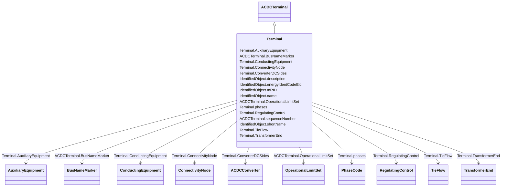

# Terminal

_An AC electrical connection point to a piece of conducting equipment. Terminals are connected at physical connection points called connectivity nodes._

**URI**: [cim:Terminal](http://iec.ch/TC57/CIM100#Terminal) 
**Type**: Class

## Inheritance
* [IdentifiedObject](IdentifiedObject.md)
    * [ACDCTerminal](ACDCTerminal.md)
        * **Terminal**

## Attributes

| Name | URI | Cardinality and Range | Description | Inheritance |
| ---  | --- | --- | --- | --- |
| ConverterDCSides | [cim:Terminal.ConverterDCSides](http://iec.ch/TC57/CIM100#Terminal.ConverterDCSides) | 0..*    [ACDCConverter](ACDCConverter.md)  | All converters' DC sides linked to this point of common coupling terminal | direct |
| AuxiliaryEquipment | [cim:Terminal.AuxiliaryEquipment](http://iec.ch/TC57/CIM100#Terminal.AuxiliaryEquipment) | 0..*    [AuxiliaryEquipment](AuxiliaryEquipment.md)  | The auxiliary equipment connected to the terminal | direct |
| ConductingEquipment | [cim:Terminal.ConductingEquipment](http://iec.ch/TC57/CIM100#Terminal.ConductingEquipment) | 1..1    [ConductingEquipment](ConductingEquipment.md)  | The conducting equipment of the terminal | direct |
| ConnectivityNode | [cim:Terminal.ConnectivityNode](http://iec.ch/TC57/CIM100#Terminal.ConnectivityNode) | 0..1    [ConnectivityNode](ConnectivityNode.md)  | The connectivity node to which this terminal connects with zero impedance | direct |
| RegulatingControl | [cim:Terminal.RegulatingControl](http://iec.ch/TC57/CIM100#Terminal.RegulatingControl) | 0..*    [RegulatingControl](RegulatingControl.md)  | The controls regulating this terminal | direct |
| phases | [cim:Terminal.phases](http://iec.ch/TC57/CIM100#Terminal.phases) | 0..1    [PhaseCode](PhaseCode.md)  | Represents the normal network phasing condition | direct |
| TransformerEnd | [cim:Terminal.TransformerEnd](http://iec.ch/TC57/CIM100#Terminal.TransformerEnd) | 0..*    [TransformerEnd](TransformerEnd.md)  | All transformer ends connected at this terminal | direct |
| TieFlow | [cim:Terminal.TieFlow](http://iec.ch/TC57/CIM100#Terminal.TieFlow) | 0..*    [TieFlow](TieFlow.md)  | The control area tie flows to which this terminal associates | direct |
| sequenceNumber | [cim:ACDCTerminal.sequenceNumber](http://iec.ch/TC57/CIM100#ACDCTerminal.sequenceNumber) | 1..1    integer  | The orientation of the terminal connections for a multiple terminal conductin... | [ACDCTerminal](ACDCTerminal.md) |
| OperationalLimitSet | [cim:ACDCTerminal.OperationalLimitSet](http://iec.ch/TC57/CIM100#ACDCTerminal.OperationalLimitSet) | 0..*    [OperationalLimitSet](OperationalLimitSet.md)  | The operational limit sets at the terminal | [ACDCTerminal](ACDCTerminal.md) |
| BusNameMarker | [cim:ACDCTerminal.BusNameMarker](http://iec.ch/TC57/CIM100#ACDCTerminal.BusNameMarker) | 0..1    [BusNameMarker](BusNameMarker.md)  | The bus name marker used to name the bus (topological node) | [ACDCTerminal](ACDCTerminal.md) |
| description | [cim:IdentifiedObject.description](http://iec.ch/TC57/CIM100#IdentifiedObject.description) | 0..1    string  | The description is a free human readable text describing or naming the object | [IdentifiedObject](IdentifiedObject.md) |
| energyIdentCodeEic | [eu:IdentifiedObject.energyIdentCodeEic](http://iec.ch/TC57/CIM100-European#IdentifiedObject.energyIdentCodeEic) | 0..1    string  | The attribute is used for an exchange of the EIC code (Energy identification ... | [IdentifiedObject](IdentifiedObject.md) |
| mRID | [cim:IdentifiedObject.mRID](http://iec.ch/TC57/CIM100#IdentifiedObject.mRID) | 1..1    string  | Master resource identifier issued by a model authority | [IdentifiedObject](IdentifiedObject.md) |
| name | [cim:IdentifiedObject.name](http://iec.ch/TC57/CIM100#IdentifiedObject.name) | 1..1    string  | The name is any free human readable and possibly non unique text naming the o... | [IdentifiedObject](IdentifiedObject.md) |
| shortName | [eu:IdentifiedObject.shortName](http://iec.ch/TC57/CIM100-European#IdentifiedObject.shortName) | 0..1    string  | The attribute is used for an exchange of a human readable short name with len... | [IdentifiedObject](IdentifiedObject.md) |

## Usages

| used by | used in | type | used |
| ---  | --- | --- | --- |
| [ACDCConverter](ACDCConverter.md) | PccTerminal | range | [Terminal](Terminal.md) |
| [ACDCConverter](ACDCConverter.md) | Terminals | range | [Terminal](Terminal.md) |
| [ACLineSegment](ACLineSegment.md) | Terminals | range | [Terminal](Terminal.md) |
| [AsynchronousMachine](AsynchronousMachine.md) | Terminals | range | [Terminal](Terminal.md) |
| [AuxiliaryEquipment](AuxiliaryEquipment.md) | Terminal | range | [Terminal](Terminal.md) |
| [Breaker](Breaker.md) | Terminals | range | [Terminal](Terminal.md) |
| [BusbarSection](BusbarSection.md) | Terminals | range | [Terminal](Terminal.md) |
| [Clamp](Clamp.md) | Terminals | range | [Terminal](Terminal.md) |
| [ConductingEquipment](ConductingEquipment.md) | Terminals | range | [Terminal](Terminal.md) |
| [Conductor](Conductor.md) | Terminals | range | [Terminal](Terminal.md) |
| [ConformLoad](ConformLoad.md) | Terminals | range | [Terminal](Terminal.md) |
| [ConnectivityNode](ConnectivityNode.md) | Terminals | range | [Terminal](Terminal.md) |
| [Connector](Connector.md) | Terminals | range | [Terminal](Terminal.md) |
| [CsConverter](CsConverter.md) | PccTerminal | range | [Terminal](Terminal.md) |
| [CsConverter](CsConverter.md) | Terminals | range | [Terminal](Terminal.md) |
| [CurrentTransformer](CurrentTransformer.md) | Terminal | range | [Terminal](Terminal.md) |
| [Cut](Cut.md) | Terminals | range | [Terminal](Terminal.md) |
| [Disconnector](Disconnector.md) | Terminals | range | [Terminal](Terminal.md) |
| [DisconnectingCircuitBreaker](DisconnectingCircuitBreaker.md) | Terminals | range | [Terminal](Terminal.md) |
| [EarthFaultCompensator](EarthFaultCompensator.md) | Terminals | range | [Terminal](Terminal.md) |
| [EnergyConnection](EnergyConnection.md) | Terminals | range | [Terminal](Terminal.md) |
| [EnergyConsumer](EnergyConsumer.md) | Terminals | range | [Terminal](Terminal.md) |
| [EnergySource](EnergySource.md) | Terminals | range | [Terminal](Terminal.md) |
| [EquivalentBranch](EquivalentBranch.md) | Terminals | range | [Terminal](Terminal.md) |
| [EquivalentEquipment](EquivalentEquipment.md) | Terminals | range | [Terminal](Terminal.md) |
| [EquivalentInjection](EquivalentInjection.md) | Terminals | range | [Terminal](Terminal.md) |
| [EquivalentShunt](EquivalentShunt.md) | Terminals | range | [Terminal](Terminal.md) |
| [ExternalNetworkInjection](ExternalNetworkInjection.md) | Terminals | range | [Terminal](Terminal.md) |
| [FaultIndicator](FaultIndicator.md) | Terminal | range | [Terminal](Terminal.md) |
| [Fuse](Fuse.md) | Terminals | range | [Terminal](Terminal.md) |
| [Ground](Ground.md) | Terminals | range | [Terminal](Terminal.md) |
| [GroundDisconnector](GroundDisconnector.md) | Terminals | range | [Terminal](Terminal.md) |
| [GroundingImpedance](GroundingImpedance.md) | Terminals | range | [Terminal](Terminal.md) |
| [Jumper](Jumper.md) | Terminals | range | [Terminal](Terminal.md) |
| [Junction](Junction.md) | Terminals | range | [Terminal](Terminal.md) |
| [LinearShuntCompensator](LinearShuntCompensator.md) | Terminals | range | [Terminal](Terminal.md) |
| [LoadBreakSwitch](LoadBreakSwitch.md) | Terminals | range | [Terminal](Terminal.md) |
| [NonConformLoad](NonConformLoad.md) | Terminals | range | [Terminal](Terminal.md) |
| [NonlinearShuntCompensator](NonlinearShuntCompensator.md) | Terminals | range | [Terminal](Terminal.md) |
| [PetersenCoil](PetersenCoil.md) | Terminals | range | [Terminal](Terminal.md) |
| [PostLineSensor](PostLineSensor.md) | Terminal | range | [Terminal](Terminal.md) |
| [PotentialTransformer](PotentialTransformer.md) | Terminal | range | [Terminal](Terminal.md) |
| [PowerElectronicsConnection](PowerElectronicsConnection.md) | Terminals | range | [Terminal](Terminal.md) |
| [PowerTransformer](PowerTransformer.md) | Terminals | range | [Terminal](Terminal.md) |
| [PowerTransformerEnd](PowerTransformerEnd.md) | Terminal | range | [Terminal](Terminal.md) |
| [ProtectedSwitch](ProtectedSwitch.md) | Terminals | range | [Terminal](Terminal.md) |
| [RegulatingCondEq](RegulatingCondEq.md) | Terminals | range | [Terminal](Terminal.md) |
| [RegulatingControl](RegulatingControl.md) | Terminal | range | [Terminal](Terminal.md) |
| [RotatingMachine](RotatingMachine.md) | Terminals | range | [Terminal](Terminal.md) |
| [Sensor](Sensor.md) | Terminal | range | [Terminal](Terminal.md) |
| [SeriesCompensator](SeriesCompensator.md) | Terminals | range | [Terminal](Terminal.md) |
| [ShuntCompensator](ShuntCompensator.md) | Terminals | range | [Terminal](Terminal.md) |
| [StaticVarCompensator](StaticVarCompensator.md) | Terminals | range | [Terminal](Terminal.md) |
| [StationSupply](StationSupply.md) | Terminals | range | [Terminal](Terminal.md) |
| [SurgeArrester](SurgeArrester.md) | Terminal | range | [Terminal](Terminal.md) |
| [Switch](Switch.md) | Terminals | range | [Terminal](Terminal.md) |
| [SynchronousMachine](SynchronousMachine.md) | Terminals | range | [Terminal](Terminal.md) |
| [TapChangerControl](TapChangerControl.md) | Terminal | range | [Terminal](Terminal.md) |
| [TieFlow](TieFlow.md) | Terminal | range | [Terminal](Terminal.md) |
| [TransformerEnd](TransformerEnd.md) | Terminal | range | [Terminal](Terminal.md) |
| [VsConverter](VsConverter.md) | PccTerminal | range | [Terminal](Terminal.md) |
| [VsConverter](VsConverter.md) | Terminals | range | [Terminal](Terminal.md) |
| [WaveTrap](WaveTrap.md) | Terminal | range | [Terminal](Terminal.md) |

## Identifier and Mapping Information

### Schema Source

* from schema: http://iec.ch/TC57/ns/CIM/CoreEquipment-EU#Package_CoreEquipmentProfile

## Mappings

| Mapping Type | Mapped Value |
| ---  | ---  |
| self | cim:Terminal |
| native | this:Terminal |

