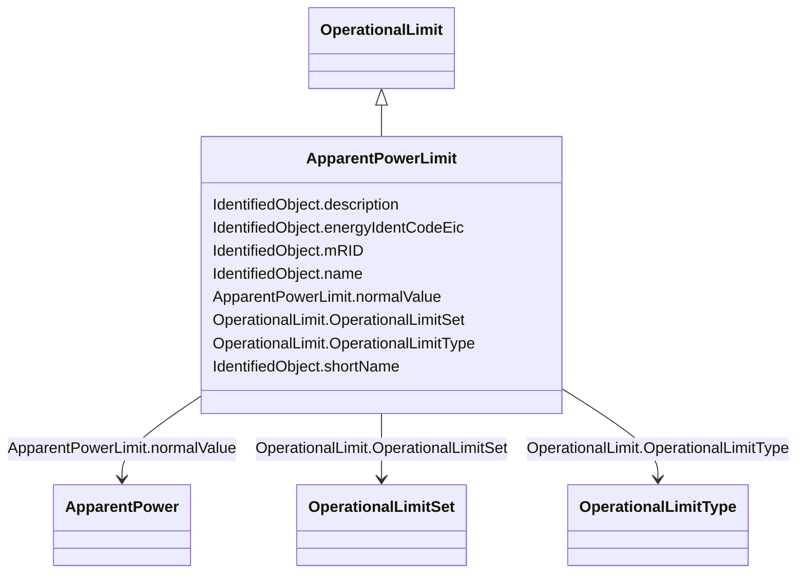

# ApparentPowerLimit

_Apparent power limit._

**URI**: [cim:ApparentPowerLimit](http://iec.ch/TC57/CIM100#ApparentPowerLimit) 
**Type**: Class

## Inheritance
* [IdentifiedObject](IdentifiedObject.md)
    * [OperationalLimit](OperationalLimit.md)
        * **ApparentPowerLimit**

## Attributes

| Name | URI | Cardinality and Range | Description | Inheritance |
| ---  | --- | --- | --- | --- |
| normalValue | [cim:ApparentPowerLimit.normalValue](http://iec.ch/TC57/CIM100#ApparentPowerLimit.normalValue) | 1..1    [ApparentPower](ApparentPower.md)  | The normal apparent power limit | direct |
| OperationalLimitSet | [cim:OperationalLimit.OperationalLimitSet](http://iec.ch/TC57/CIM100#OperationalLimit.OperationalLimitSet) | 1..1    [OperationalLimitSet](OperationalLimitSet.md)  | The limit set to which the limit values belong | [OperationalLimit](OperationalLimit.md) |
| OperationalLimitType | [cim:OperationalLimit.OperationalLimitType](http://iec.ch/TC57/CIM100#OperationalLimit.OperationalLimitType) | 1..1    [OperationalLimitType](OperationalLimitType.md)  | The limit type associated with this limit | [OperationalLimit](OperationalLimit.md) |
| description | [cim:IdentifiedObject.description](http://iec.ch/TC57/CIM100#IdentifiedObject.description) | 0..1    string  | The description is a free human readable text describing or naming the object | [IdentifiedObject](IdentifiedObject.md) |
| energyIdentCodeEic | [eu:IdentifiedObject.energyIdentCodeEic](http://iec.ch/TC57/CIM100-European#IdentifiedObject.energyIdentCodeEic) | 0..1    string  | The attribute is used for an exchange of the EIC code (Energy identification ... | [IdentifiedObject](IdentifiedObject.md) |
| mRID | [cim:IdentifiedObject.mRID](http://iec.ch/TC57/CIM100#IdentifiedObject.mRID) | 1..1    string  | Master resource identifier issued by a model authority | [IdentifiedObject](IdentifiedObject.md) |
| name | [cim:IdentifiedObject.name](http://iec.ch/TC57/CIM100#IdentifiedObject.name) | 1..1    string  | The name is any free human readable and possibly non unique text naming the o... | [IdentifiedObject](IdentifiedObject.md) |
| shortName | [eu:IdentifiedObject.shortName](http://iec.ch/TC57/CIM100-European#IdentifiedObject.shortName) | 0..1    string  | The attribute is used for an exchange of a human readable short name with len... | [IdentifiedObject](IdentifiedObject.md) |

## Identifier and Mapping Information

### Schema Source

* from schema: http://iec.ch/TC57/ns/CIM/CoreEquipment-EU#Package_CoreEquipmentProfile

## Mappings

| Mapping Type | Mapped Value |
| ---  | ---  |
| self | cim:ApparentPowerLimit |
| native | this:ApparentPowerLimit |

