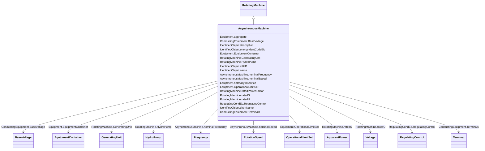

# AsynchronousMachine

_A rotating machine whose shaft rotates asynchronously with the electrical field.  Also known as an induction machine with no external connection to the rotor windings, e.g. squirrel-cage induction machine._

**URI**: [cim:AsynchronousMachine](http://iec.ch/TC57/CIM100#AsynchronousMachine) 
**Type**: Class

## Inheritance
* [IdentifiedObject](IdentifiedObject.md)
    * [PowerSystemResource](PowerSystemResource.md)
        * [Equipment](Equipment.md)
            * [ConductingEquipment](ConductingEquipment.md)
                * [EnergyConnection](EnergyConnection.md)
                    * [RegulatingCondEq](RegulatingCondEq.md)
                        * [RotatingMachine](RotatingMachine.md)
                            * **AsynchronousMachine**

## Attributes

| Name | URI | Cardinality and Range | Description | Inheritance |
| ---  | --- | --- | --- | --- |
| nominalFrequency | [cim:AsynchronousMachine.nominalFrequency](http://iec.ch/TC57/CIM100#AsynchronousMachine.nominalFrequency) | 0..1    [Frequency](Frequency.md)  | Nameplate data indicates if the machine is 50 Hz or 60 Hz | direct |
| nominalSpeed | [cim:AsynchronousMachine.nominalSpeed](http://iec.ch/TC57/CIM100#AsynchronousMachine.nominalSpeed) | 0..1    [RotationSpeed](RotationSpeed.md)  | Nameplate data | direct |
| GeneratingUnit | [cim:RotatingMachine.GeneratingUnit](http://iec.ch/TC57/CIM100#RotatingMachine.GeneratingUnit) | 0..1    [GeneratingUnit](GeneratingUnit.md)  | A synchronous machine may operate as a generator and as such becomes a member... | [RotatingMachine](RotatingMachine.md) |
| HydroPump | [cim:RotatingMachine.HydroPump](http://iec.ch/TC57/CIM100#RotatingMachine.HydroPump) | 0..1    [HydroPump](HydroPump.md)  | The synchronous machine drives the turbine which moves the water from a low e... | [RotatingMachine](RotatingMachine.md) |
| ratedPowerFactor | [cim:RotatingMachine.ratedPowerFactor](http://iec.ch/TC57/CIM100#RotatingMachine.ratedPowerFactor) | 0..1    float  | Power factor (nameplate data) | [RotatingMachine](RotatingMachine.md) |
| ratedS | [cim:RotatingMachine.ratedS](http://iec.ch/TC57/CIM100#RotatingMachine.ratedS) | 0..1    [ApparentPower](ApparentPower.md)  | Nameplate apparent power rating for the unit | [RotatingMachine](RotatingMachine.md) |
| ratedU | [cim:RotatingMachine.ratedU](http://iec.ch/TC57/CIM100#RotatingMachine.ratedU) | 0..1    [Voltage](Voltage.md)  | Rated voltage (nameplate data, Ur in IEC 60909-0) | [RotatingMachine](RotatingMachine.md) |
| RegulatingControl | [cim:RegulatingCondEq.RegulatingControl](http://iec.ch/TC57/CIM100#RegulatingCondEq.RegulatingControl) | 0..1    [RegulatingControl](RegulatingControl.md)  | The regulating control scheme in which this equipment participates | [RegulatingCondEq](RegulatingCondEq.md) |
| BaseVoltage | [cim:ConductingEquipment.BaseVoltage](http://iec.ch/TC57/CIM100#ConductingEquipment.BaseVoltage) | 0..1    [BaseVoltage](BaseVoltage.md)  | Base voltage of this conducting equipment | [ConductingEquipment](ConductingEquipment.md) |
| Terminals | [cim:ConductingEquipment.Terminals](http://iec.ch/TC57/CIM100#ConductingEquipment.Terminals) | 0..*    [Terminal](Terminal.md)  | Conducting equipment have terminals that may be connected to other conducting... | [ConductingEquipment](ConductingEquipment.md) |
| aggregate | [cim:Equipment.aggregate](http://iec.ch/TC57/CIM100#Equipment.aggregate) | 0..1    boolean  | The aggregate flag provides an alternative way of representing an aggregated ... | [Equipment](Equipment.md) |
| normallyInService | [cim:Equipment.normallyInService](http://iec.ch/TC57/CIM100#Equipment.normallyInService) | 0..1    boolean  | Specifies the availability of the equipment under normal operating conditions | [Equipment](Equipment.md) |
| EquipmentContainer | [cim:Equipment.EquipmentContainer](http://iec.ch/TC57/CIM100#Equipment.EquipmentContainer) | 0..1    [EquipmentContainer](EquipmentContainer.md)  | Container of this equipment | [Equipment](Equipment.md) |
| OperationalLimitSet | [cim:Equipment.OperationalLimitSet](http://iec.ch/TC57/CIM100#Equipment.OperationalLimitSet) | 0..*    [OperationalLimitSet](OperationalLimitSet.md)  | The operational limit sets associated with this equipment | [Equipment](Equipment.md) |
| description | [cim:IdentifiedObject.description](http://iec.ch/TC57/CIM100#IdentifiedObject.description) | 0..1    string  | The description is a free human readable text describing or naming the object | [IdentifiedObject](IdentifiedObject.md) |
| energyIdentCodeEic | [eu:IdentifiedObject.energyIdentCodeEic](http://iec.ch/TC57/CIM100-European#IdentifiedObject.energyIdentCodeEic) | 0..1    string  | The attribute is used for an exchange of the EIC code (Energy identification ... | [IdentifiedObject](IdentifiedObject.md) |
| mRID | [cim:IdentifiedObject.mRID](http://iec.ch/TC57/CIM100#IdentifiedObject.mRID) | 1..1    string  | Master resource identifier issued by a model authority | [IdentifiedObject](IdentifiedObject.md) |
| name | [cim:IdentifiedObject.name](http://iec.ch/TC57/CIM100#IdentifiedObject.name) | 1..1    string  | The name is any free human readable and possibly non unique text naming the o... | [IdentifiedObject](IdentifiedObject.md) |
| shortName | [eu:IdentifiedObject.shortName](http://iec.ch/TC57/CIM100-European#IdentifiedObject.shortName) | 0..1    string  | The attribute is used for an exchange of a human readable short name with len... | [IdentifiedObject](IdentifiedObject.md) |

## Identifier and Mapping Information

### Schema Source

* from schema: http://iec.ch/TC57/ns/CIM/CoreEquipment-EU#Package_CoreEquipmentProfile

## Mappings

| Mapping Type | Mapped Value |
| ---  | ---  |
| self | cim:AsynchronousMachine |
| native | this:AsynchronousMachine |

