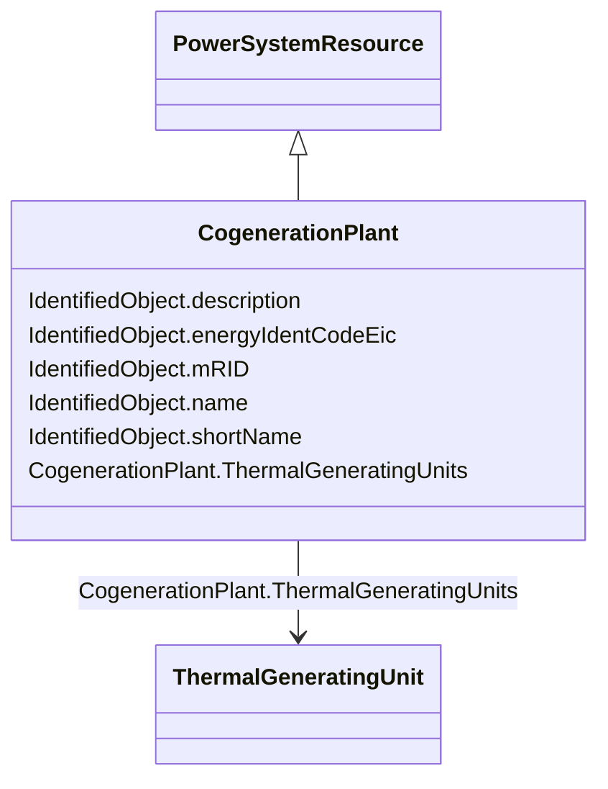

# CogenerationPlant

_A set of thermal generating units for the production of electrical energy and process steam (usually from the output of the steam turbines). The steam sendout is typically used for industrial purposes or for municipal heating and cooling._

**URI**: [cim:CogenerationPlant](http://iec.ch/TC57/CIM100#CogenerationPlant) 
**Type**: Class

## Inheritance
* [IdentifiedObject](IdentifiedObject.md)
    * [PowerSystemResource](PowerSystemResource.md)
        * **CogenerationPlant**

## Attributes

| Name | URI | Cardinality and Range | Description | Inheritance |
| ---  | --- | --- | --- | --- |
| ThermalGeneratingUnits | [cim:CogenerationPlant.ThermalGeneratingUnits](http://iec.ch/TC57/CIM100#CogenerationPlant.ThermalGeneratingUnits) | 0..*    [ThermalGeneratingUnit](ThermalGeneratingUnit.md)  | A thermal generating unit may be a member of a cogeneration plant | direct |
| description | [cim:IdentifiedObject.description](http://iec.ch/TC57/CIM100#IdentifiedObject.description) | 0..1    string  | The description is a free human readable text describing or naming the object | [IdentifiedObject](IdentifiedObject.md) |
| energyIdentCodeEic | [eu:IdentifiedObject.energyIdentCodeEic](http://iec.ch/TC57/CIM100-European#IdentifiedObject.energyIdentCodeEic) | 0..1    string  | The attribute is used for an exchange of the EIC code (Energy identification ... | [IdentifiedObject](IdentifiedObject.md) |
| mRID | [cim:IdentifiedObject.mRID](http://iec.ch/TC57/CIM100#IdentifiedObject.mRID) | 1..1    string  | Master resource identifier issued by a model authority | [IdentifiedObject](IdentifiedObject.md) |
| name | [cim:IdentifiedObject.name](http://iec.ch/TC57/CIM100#IdentifiedObject.name) | 1..1    string  | The name is any free human readable and possibly non unique text naming the o... | [IdentifiedObject](IdentifiedObject.md) |
| shortName | [eu:IdentifiedObject.shortName](http://iec.ch/TC57/CIM100-European#IdentifiedObject.shortName) | 0..1    string  | The attribute is used for an exchange of a human readable short name with len... | [IdentifiedObject](IdentifiedObject.md) |

## Usages

| used by | used in | type | used |
| ---  | --- | --- | --- |
| [ThermalGeneratingUnit](ThermalGeneratingUnit.md) | CogenerationPlant | range | [CogenerationPlant](CogenerationPlant.md) |

## Identifier and Mapping Information

### Schema Source

* from schema: http://iec.ch/TC57/ns/CIM/CoreEquipment-EU#Package_CoreEquipmentProfile

## Mappings

| Mapping Type | Mapped Value |
| ---  | ---  |
| self | cim:CogenerationPlant |
| native | this:CogenerationPlant |

