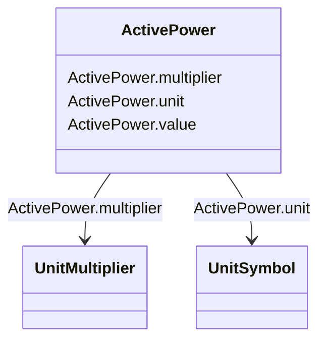

# ActivePower

_Product of RMS value of the voltage and the RMS value of the in-phase component of the current._

**URI**: [cim:ActivePower](http://iec.ch/TC57/CIM100#ActivePower) 
**Type**: Class

<!-- no inheritance hierarchy -->

## Attributes

| Name | URI | Cardinality and Range | Description | Inheritance |
| ---  | --- | --- | --- | --- |
| value | [cim:ActivePower.value](http://iec.ch/TC57/CIM100#ActivePower.value) | 0..1    float  |  | direct |
| multiplier | [cim:ActivePower.multiplier](http://iec.ch/TC57/CIM100#ActivePower.multiplier) | 0..1    [UnitMultiplier](UnitMultiplier.md)  |  | direct |
| unit | [cim:ActivePower.unit](http://iec.ch/TC57/CIM100#ActivePower.unit) | 0..1    [UnitSymbol](UnitSymbol.md)  |  | direct |

## Usages

| used by | used in | type | used |
| ---  | --- | --- | --- |
| [ACDCConverter](ACDCConverter.md) | idleLoss | range | [ActivePower](ActivePower.md) |
| [ACDCConverter](ACDCConverter.md) | maxP | range | [ActivePower](ActivePower.md) |
| [ACDCConverter](ACDCConverter.md) | minP | range | [ActivePower](ActivePower.md) |
| [ActivePowerLimit](ActivePowerLimit.md) | normalValue | range | [ActivePower](ActivePower.md) |
| [BatteryUnit](BatteryUnit.md) | maxP | range | [ActivePower](ActivePower.md) |
| [BatteryUnit](BatteryUnit.md) | minP | range | [ActivePower](ActivePower.md) |
| [ConformLoad](ConformLoad.md) | pfixed | range | [ActivePower](ActivePower.md) |
| [CsConverter](CsConverter.md) | idleLoss | range | [ActivePower](ActivePower.md) |
| [CsConverter](CsConverter.md) | maxP | range | [ActivePower](ActivePower.md) |
| [CsConverter](CsConverter.md) | minP | range | [ActivePower](ActivePower.md) |
| [EnergyConsumer](EnergyConsumer.md) | pfixed | range | [ActivePower](ActivePower.md) |
| [EnergySource](EnergySource.md) | pMin | range | [ActivePower](ActivePower.md) |
| [EnergySource](EnergySource.md) | pMax | range | [ActivePower](ActivePower.md) |
| [EquivalentInjection](EquivalentInjection.md) | maxP | range | [ActivePower](ActivePower.md) |
| [EquivalentInjection](EquivalentInjection.md) | minP | range | [ActivePower](ActivePower.md) |
| [ExternalNetworkInjection](ExternalNetworkInjection.md) | maxP | range | [ActivePower](ActivePower.md) |
| [ExternalNetworkInjection](ExternalNetworkInjection.md) | minP | range | [ActivePower](ActivePower.md) |
| [GeneratingUnit](GeneratingUnit.md) | maximumAllowableSpinningReserve | range | [ActivePower](ActivePower.md) |
| [GeneratingUnit](GeneratingUnit.md) | maxOperatingP | range | [ActivePower](ActivePower.md) |
| [GeneratingUnit](GeneratingUnit.md) | minOperatingP | range | [ActivePower](ActivePower.md) |
| [GeneratingUnit](GeneratingUnit.md) | nominalP | range | [ActivePower](ActivePower.md) |
| [GeneratingUnit](GeneratingUnit.md) | ratedGrossMaxP | range | [ActivePower](ActivePower.md) |
| [GeneratingUnit](GeneratingUnit.md) | ratedGrossMinP | range | [ActivePower](ActivePower.md) |
| [GeneratingUnit](GeneratingUnit.md) | ratedNetMaxP | range | [ActivePower](ActivePower.md) |
| [HydroGeneratingUnit](HydroGeneratingUnit.md) | maximumAllowableSpinningReserve | range | [ActivePower](ActivePower.md) |
| [HydroGeneratingUnit](HydroGeneratingUnit.md) | maxOperatingP | range | [ActivePower](ActivePower.md) |
| [HydroGeneratingUnit](HydroGeneratingUnit.md) | minOperatingP | range | [ActivePower](ActivePower.md) |
| [HydroGeneratingUnit](HydroGeneratingUnit.md) | nominalP | range | [ActivePower](ActivePower.md) |
| [HydroGeneratingUnit](HydroGeneratingUnit.md) | ratedGrossMaxP | range | [ActivePower](ActivePower.md) |
| [HydroGeneratingUnit](HydroGeneratingUnit.md) | ratedGrossMinP | range | [ActivePower](ActivePower.md) |
| [HydroGeneratingUnit](HydroGeneratingUnit.md) | ratedNetMaxP | range | [ActivePower](ActivePower.md) |
| [NonConformLoad](NonConformLoad.md) | pfixed | range | [ActivePower](ActivePower.md) |
| [NuclearGeneratingUnit](NuclearGeneratingUnit.md) | maximumAllowableSpinningReserve | range | [ActivePower](ActivePower.md) |
| [NuclearGeneratingUnit](NuclearGeneratingUnit.md) | maxOperatingP | range | [ActivePower](ActivePower.md) |
| [NuclearGeneratingUnit](NuclearGeneratingUnit.md) | minOperatingP | range | [ActivePower](ActivePower.md) |
| [NuclearGeneratingUnit](NuclearGeneratingUnit.md) | nominalP | range | [ActivePower](ActivePower.md) |
| [NuclearGeneratingUnit](NuclearGeneratingUnit.md) | ratedGrossMaxP | range | [ActivePower](ActivePower.md) |
| [NuclearGeneratingUnit](NuclearGeneratingUnit.md) | ratedGrossMinP | range | [ActivePower](ActivePower.md) |
| [NuclearGeneratingUnit](NuclearGeneratingUnit.md) | ratedNetMaxP | range | [ActivePower](ActivePower.md) |
| [PhotoVoltaicUnit](PhotoVoltaicUnit.md) | maxP | range | [ActivePower](ActivePower.md) |
| [PhotoVoltaicUnit](PhotoVoltaicUnit.md) | minP | range | [ActivePower](ActivePower.md) |
| [PowerElectronicsUnit](PowerElectronicsUnit.md) | maxP | range | [ActivePower](ActivePower.md) |
| [PowerElectronicsUnit](PowerElectronicsUnit.md) | minP | range | [ActivePower](ActivePower.md) |
| [PowerElectronicsWindUnit](PowerElectronicsWindUnit.md) | maxP | range | [ActivePower](ActivePower.md) |
| [PowerElectronicsWindUnit](PowerElectronicsWindUnit.md) | minP | range | [ActivePower](ActivePower.md) |
| [SolarGeneratingUnit](SolarGeneratingUnit.md) | maximumAllowableSpinningReserve | range | [ActivePower](ActivePower.md) |
| [SolarGeneratingUnit](SolarGeneratingUnit.md) | maxOperatingP | range | [ActivePower](ActivePower.md) |
| [SolarGeneratingUnit](SolarGeneratingUnit.md) | minOperatingP | range | [ActivePower](ActivePower.md) |
| [SolarGeneratingUnit](SolarGeneratingUnit.md) | nominalP | range | [ActivePower](ActivePower.md) |
| [SolarGeneratingUnit](SolarGeneratingUnit.md) | ratedGrossMaxP | range | [ActivePower](ActivePower.md) |
| [SolarGeneratingUnit](SolarGeneratingUnit.md) | ratedGrossMinP | range | [ActivePower](ActivePower.md) |
| [SolarGeneratingUnit](SolarGeneratingUnit.md) | ratedNetMaxP | range | [ActivePower](ActivePower.md) |
| [StationSupply](StationSupply.md) | pfixed | range | [ActivePower](ActivePower.md) |
| [ThermalGeneratingUnit](ThermalGeneratingUnit.md) | maximumAllowableSpinningReserve | range | [ActivePower](ActivePower.md) |
| [ThermalGeneratingUnit](ThermalGeneratingUnit.md) | maxOperatingP | range | [ActivePower](ActivePower.md) |
| [ThermalGeneratingUnit](ThermalGeneratingUnit.md) | minOperatingP | range | [ActivePower](ActivePower.md) |
| [ThermalGeneratingUnit](ThermalGeneratingUnit.md) | nominalP | range | [ActivePower](ActivePower.md) |
| [ThermalGeneratingUnit](ThermalGeneratingUnit.md) | ratedGrossMaxP | range | [ActivePower](ActivePower.md) |
| [ThermalGeneratingUnit](ThermalGeneratingUnit.md) | ratedGrossMinP | range | [ActivePower](ActivePower.md) |
| [ThermalGeneratingUnit](ThermalGeneratingUnit.md) | ratedNetMaxP | range | [ActivePower](ActivePower.md) |
| [VsConverter](VsConverter.md) | idleLoss | range | [ActivePower](ActivePower.md) |
| [VsConverter](VsConverter.md) | maxP | range | [ActivePower](ActivePower.md) |
| [VsConverter](VsConverter.md) | minP | range | [ActivePower](ActivePower.md) |
| [WindGeneratingUnit](WindGeneratingUnit.md) | maximumAllowableSpinningReserve | range | [ActivePower](ActivePower.md) |
| [WindGeneratingUnit](WindGeneratingUnit.md) | maxOperatingP | range | [ActivePower](ActivePower.md) |
| [WindGeneratingUnit](WindGeneratingUnit.md) | minOperatingP | range | [ActivePower](ActivePower.md) |
| [WindGeneratingUnit](WindGeneratingUnit.md) | nominalP | range | [ActivePower](ActivePower.md) |
| [WindGeneratingUnit](WindGeneratingUnit.md) | ratedGrossMaxP | range | [ActivePower](ActivePower.md) |
| [WindGeneratingUnit](WindGeneratingUnit.md) | ratedGrossMinP | range | [ActivePower](ActivePower.md) |
| [WindGeneratingUnit](WindGeneratingUnit.md) | ratedNetMaxP | range | [ActivePower](ActivePower.md) |

## Identifier and Mapping Information

### Schema Source

* from schema: http://iec.ch/TC57/ns/CIM/CoreEquipment-EU#Package_CoreEquipmentProfile

## Mappings

| Mapping Type | Mapped Value |
| ---  | ---  |
| self | cim:ActivePower |
| native | this:ActivePower |

