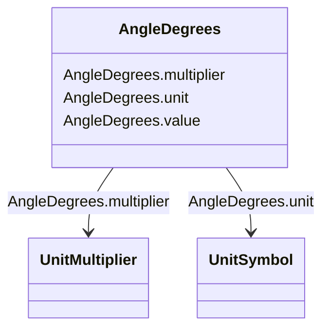

# AngleDegrees

_Measurement of angle in degrees._

**URI**: [cim:AngleDegrees](http://iec.ch/TC57/CIM100#AngleDegrees) 
**Type**: Class

<!-- no inheritance hierarchy -->

## Attributes

| Name | URI | Cardinality and Range | Description | Inheritance |
| ---  | --- | --- | --- | --- |
| value | [cim:AngleDegrees.value](http://iec.ch/TC57/CIM100#AngleDegrees.value) | 0..1    float  |  | direct |
| unit | [cim:AngleDegrees.unit](http://iec.ch/TC57/CIM100#AngleDegrees.unit) | 0..1    [UnitSymbol](UnitSymbol.md)  |  | direct |
| multiplier | [cim:AngleDegrees.multiplier](http://iec.ch/TC57/CIM100#AngleDegrees.multiplier) | 0..1    [UnitMultiplier](UnitMultiplier.md)  |  | direct |

## Usages

| used by | used in | type | used |
| ---  | --- | --- | --- |
| [CsConverter](CsConverter.md) | maxAlpha | range | [AngleDegrees](AngleDegrees.md) |
| [CsConverter](CsConverter.md) | maxGamma | range | [AngleDegrees](AngleDegrees.md) |
| [CsConverter](CsConverter.md) | minAlpha | range | [AngleDegrees](AngleDegrees.md) |
| [CsConverter](CsConverter.md) | minGamma | range | [AngleDegrees](AngleDegrees.md) |
| [PhaseTapChangerAsymmetrical](PhaseTapChangerAsymmetrical.md) | windingConnectionAngle | range | [AngleDegrees](AngleDegrees.md) |
| [PhaseTapChangerLinear](PhaseTapChangerLinear.md) | stepPhaseShiftIncrement | range | [AngleDegrees](AngleDegrees.md) |
| [PhaseTapChangerTablePoint](PhaseTapChangerTablePoint.md) | angle | range | [AngleDegrees](AngleDegrees.md) |

## Identifier and Mapping Information

### Schema Source

* from schema: http://iec.ch/TC57/ns/CIM/CoreEquipment-EU#Package_CoreEquipmentProfile

## Mappings

| Mapping Type | Mapped Value |
| ---  | ---  |
| self | cim:AngleDegrees |
| native | this:AngleDegrees |

