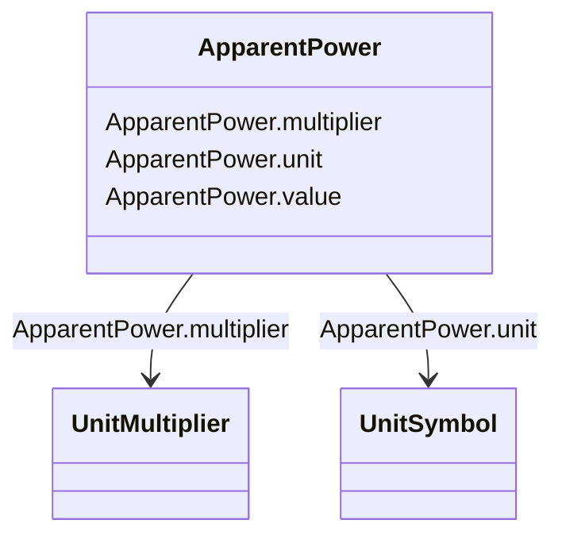

# ApparentPower

_Product of the RMS value of the voltage and the RMS value of the current._

**URI**: [cim:ApparentPower](http://iec.ch/TC57/CIM100#ApparentPower) 
**Type**: Class

<!-- no inheritance hierarchy -->

## Attributes

| Name | URI | Cardinality and Range | Description | Inheritance |
| ---  | --- | --- | --- | --- |
| value | [cim:ApparentPower.value](http://iec.ch/TC57/CIM100#ApparentPower.value) | 0..1    float  |  | direct |
| multiplier | [cim:ApparentPower.multiplier](http://iec.ch/TC57/CIM100#ApparentPower.multiplier) | 0..1    [UnitMultiplier](UnitMultiplier.md)  |  | direct |
| unit | [cim:ApparentPower.unit](http://iec.ch/TC57/CIM100#ApparentPower.unit) | 0..1    [UnitSymbol](UnitSymbol.md)  |  | direct |

## Usages

| used by | used in | type | used |
| ---  | --- | --- | --- |
| [ACDCConverter](ACDCConverter.md) | baseS | range | [ApparentPower](ApparentPower.md) |
| [ApparentPowerLimit](ApparentPowerLimit.md) | normalValue | range | [ApparentPower](ApparentPower.md) |
| [AsynchronousMachine](AsynchronousMachine.md) | ratedS | range | [ApparentPower](ApparentPower.md) |
| [CsConverter](CsConverter.md) | baseS | range | [ApparentPower](ApparentPower.md) |
| [PowerElectronicsConnection](PowerElectronicsConnection.md) | ratedS | range | [ApparentPower](ApparentPower.md) |
| [PowerTransformerEnd](PowerTransformerEnd.md) | ratedS | range | [ApparentPower](ApparentPower.md) |
| [RotatingMachine](RotatingMachine.md) | ratedS | range | [ApparentPower](ApparentPower.md) |
| [SynchronousMachine](SynchronousMachine.md) | ratedS | range | [ApparentPower](ApparentPower.md) |
| [VsConverter](VsConverter.md) | baseS | range | [ApparentPower](ApparentPower.md) |

## Identifier and Mapping Information

### Schema Source

* from schema: http://iec.ch/TC57/ns/CIM/CoreEquipment-EU#Package_CoreEquipmentProfile

## Mappings

| Mapping Type | Mapped Value |
| ---  | ---  |
| self | cim:ApparentPower |
| native | this:ApparentPower |

