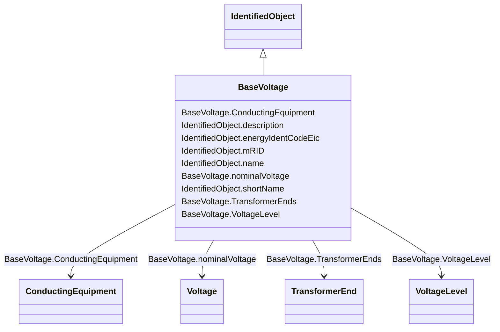

# BaseVoltage

_Defines a system base voltage which is referenced._

**URI**: [cim:BaseVoltage](http://iec.ch/TC57/CIM100#BaseVoltage) 
**Type**: Class

## Inheritance
* [IdentifiedObject](IdentifiedObject.md)
    * **BaseVoltage**

## Attributes

| Name | URI | Cardinality and Range | Description | Inheritance |
| ---  | --- | --- | --- | --- |
| nominalVoltage | [cim:BaseVoltage.nominalVoltage](http://iec.ch/TC57/CIM100#BaseVoltage.nominalVoltage) | 1..1    [Voltage](Voltage.md)  | The power system resource's base voltage | direct |
| ConductingEquipment | [cim:BaseVoltage.ConductingEquipment](http://iec.ch/TC57/CIM100#BaseVoltage.ConductingEquipment) | 0..*    [ConductingEquipment](ConductingEquipment.md)  | All conducting equipment with this base voltage | direct |
| VoltageLevel | [cim:BaseVoltage.VoltageLevel](http://iec.ch/TC57/CIM100#BaseVoltage.VoltageLevel) | 0..*    [VoltageLevel](VoltageLevel.md)  | The voltage levels having this base voltage | direct |
| TransformerEnds | [cim:BaseVoltage.TransformerEnds](http://iec.ch/TC57/CIM100#BaseVoltage.TransformerEnds) | 0..*    [TransformerEnd](TransformerEnd.md)  | Transformer ends at the base voltage | direct |
| description | [cim:IdentifiedObject.description](http://iec.ch/TC57/CIM100#IdentifiedObject.description) | 0..1    string  | The description is a free human readable text describing or naming the object | [IdentifiedObject](IdentifiedObject.md) |
| energyIdentCodeEic | [eu:IdentifiedObject.energyIdentCodeEic](http://iec.ch/TC57/CIM100-European#IdentifiedObject.energyIdentCodeEic) | 0..1    string  | The attribute is used for an exchange of the EIC code (Energy identification ... | [IdentifiedObject](IdentifiedObject.md) |
| mRID | [cim:IdentifiedObject.mRID](http://iec.ch/TC57/CIM100#IdentifiedObject.mRID) | 1..1    string  | Master resource identifier issued by a model authority | [IdentifiedObject](IdentifiedObject.md) |
| name | [cim:IdentifiedObject.name](http://iec.ch/TC57/CIM100#IdentifiedObject.name) | 1..1    string  | The name is any free human readable and possibly non unique text naming the o... | [IdentifiedObject](IdentifiedObject.md) |
| shortName | [eu:IdentifiedObject.shortName](http://iec.ch/TC57/CIM100-European#IdentifiedObject.shortName) | 0..1    string  | The attribute is used for an exchange of a human readable short name with len... | [IdentifiedObject](IdentifiedObject.md) |

## Usages

| used by | used in | type | used |
| ---  | --- | --- | --- |
| [ACDCConverter](ACDCConverter.md) | BaseVoltage | range | [BaseVoltage](BaseVoltage.md) |
| [ACLineSegment](ACLineSegment.md) | BaseVoltage | range | [BaseVoltage](BaseVoltage.md) |
| [AsynchronousMachine](AsynchronousMachine.md) | BaseVoltage | range | [BaseVoltage](BaseVoltage.md) |
| [Breaker](Breaker.md) | BaseVoltage | range | [BaseVoltage](BaseVoltage.md) |
| [BusbarSection](BusbarSection.md) | BaseVoltage | range | [BaseVoltage](BaseVoltage.md) |
| [Clamp](Clamp.md) | BaseVoltage | range | [BaseVoltage](BaseVoltage.md) |
| [ConductingEquipment](ConductingEquipment.md) | BaseVoltage | range | [BaseVoltage](BaseVoltage.md) |
| [Conductor](Conductor.md) | BaseVoltage | range | [BaseVoltage](BaseVoltage.md) |
| [ConformLoad](ConformLoad.md) | BaseVoltage | range | [BaseVoltage](BaseVoltage.md) |
| [Connector](Connector.md) | BaseVoltage | range | [BaseVoltage](BaseVoltage.md) |
| [CsConverter](CsConverter.md) | BaseVoltage | range | [BaseVoltage](BaseVoltage.md) |
| [Cut](Cut.md) | BaseVoltage | range | [BaseVoltage](BaseVoltage.md) |
| [Disconnector](Disconnector.md) | BaseVoltage | range | [BaseVoltage](BaseVoltage.md) |
| [DisconnectingCircuitBreaker](DisconnectingCircuitBreaker.md) | BaseVoltage | range | [BaseVoltage](BaseVoltage.md) |
| [EarthFaultCompensator](EarthFaultCompensator.md) | BaseVoltage | range | [BaseVoltage](BaseVoltage.md) |
| [EnergyConnection](EnergyConnection.md) | BaseVoltage | range | [BaseVoltage](BaseVoltage.md) |
| [EnergyConsumer](EnergyConsumer.md) | BaseVoltage | range | [BaseVoltage](BaseVoltage.md) |
| [EnergySource](EnergySource.md) | BaseVoltage | range | [BaseVoltage](BaseVoltage.md) |
| [EquivalentBranch](EquivalentBranch.md) | BaseVoltage | range | [BaseVoltage](BaseVoltage.md) |
| [EquivalentEquipment](EquivalentEquipment.md) | BaseVoltage | range | [BaseVoltage](BaseVoltage.md) |
| [EquivalentInjection](EquivalentInjection.md) | BaseVoltage | range | [BaseVoltage](BaseVoltage.md) |
| [EquivalentShunt](EquivalentShunt.md) | BaseVoltage | range | [BaseVoltage](BaseVoltage.md) |
| [ExternalNetworkInjection](ExternalNetworkInjection.md) | BaseVoltage | range | [BaseVoltage](BaseVoltage.md) |
| [Fuse](Fuse.md) | BaseVoltage | range | [BaseVoltage](BaseVoltage.md) |
| [Ground](Ground.md) | BaseVoltage | range | [BaseVoltage](BaseVoltage.md) |
| [GroundDisconnector](GroundDisconnector.md) | BaseVoltage | range | [BaseVoltage](BaseVoltage.md) |
| [GroundingImpedance](GroundingImpedance.md) | BaseVoltage | range | [BaseVoltage](BaseVoltage.md) |
| [Jumper](Jumper.md) | BaseVoltage | range | [BaseVoltage](BaseVoltage.md) |
| [Junction](Junction.md) | BaseVoltage | range | [BaseVoltage](BaseVoltage.md) |
| [LinearShuntCompensator](LinearShuntCompensator.md) | BaseVoltage | range | [BaseVoltage](BaseVoltage.md) |
| [LoadBreakSwitch](LoadBreakSwitch.md) | BaseVoltage | range | [BaseVoltage](BaseVoltage.md) |
| [NonConformLoad](NonConformLoad.md) | BaseVoltage | range | [BaseVoltage](BaseVoltage.md) |
| [NonlinearShuntCompensator](NonlinearShuntCompensator.md) | BaseVoltage | range | [BaseVoltage](BaseVoltage.md) |
| [PetersenCoil](PetersenCoil.md) | BaseVoltage | range | [BaseVoltage](BaseVoltage.md) |
| [PowerElectronicsConnection](PowerElectronicsConnection.md) | BaseVoltage | range | [BaseVoltage](BaseVoltage.md) |
| [PowerTransformer](PowerTransformer.md) | BaseVoltage | range | [BaseVoltage](BaseVoltage.md) |
| [PowerTransformerEnd](PowerTransformerEnd.md) | BaseVoltage | range | [BaseVoltage](BaseVoltage.md) |
| [ProtectedSwitch](ProtectedSwitch.md) | BaseVoltage | range | [BaseVoltage](BaseVoltage.md) |
| [RegulatingCondEq](RegulatingCondEq.md) | BaseVoltage | range | [BaseVoltage](BaseVoltage.md) |
| [RotatingMachine](RotatingMachine.md) | BaseVoltage | range | [BaseVoltage](BaseVoltage.md) |
| [SeriesCompensator](SeriesCompensator.md) | BaseVoltage | range | [BaseVoltage](BaseVoltage.md) |
| [ShuntCompensator](ShuntCompensator.md) | BaseVoltage | range | [BaseVoltage](BaseVoltage.md) |
| [StaticVarCompensator](StaticVarCompensator.md) | BaseVoltage | range | [BaseVoltage](BaseVoltage.md) |
| [StationSupply](StationSupply.md) | BaseVoltage | range | [BaseVoltage](BaseVoltage.md) |
| [Switch](Switch.md) | BaseVoltage | range | [BaseVoltage](BaseVoltage.md) |
| [SynchronousMachine](SynchronousMachine.md) | BaseVoltage | range | [BaseVoltage](BaseVoltage.md) |
| [TransformerEnd](TransformerEnd.md) | BaseVoltage | range | [BaseVoltage](BaseVoltage.md) |
| [VoltageLevel](VoltageLevel.md) | BaseVoltage | range | [BaseVoltage](BaseVoltage.md) |
| [VsConverter](VsConverter.md) | BaseVoltage | range | [BaseVoltage](BaseVoltage.md) |

## Identifier and Mapping Information

### Schema Source

* from schema: http://iec.ch/TC57/ns/CIM/CoreEquipment-EU#Package_CoreEquipmentProfile

## Mappings

| Mapping Type | Mapped Value |
| ---  | ---  |
| self | cim:BaseVoltage |
| native | this:BaseVoltage |

