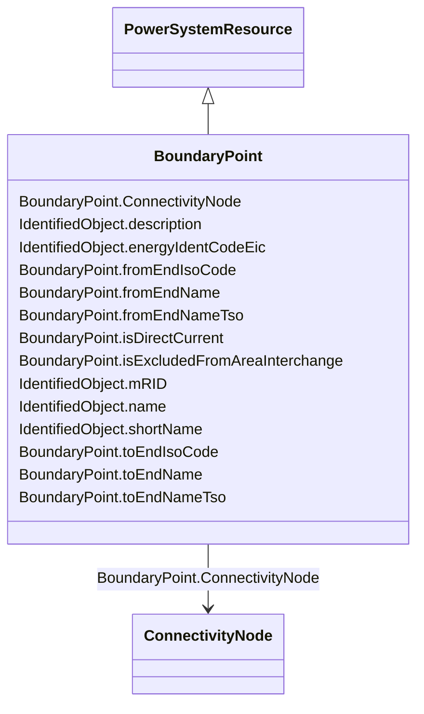

# BoundaryPoint

_Designates a connection point at which one or more model authority sets shall connect to. The location of the connection point as well as other properties are agreed between organisations responsible for the interconnection, hence all attributes of the class represent this agreement.  It is primarily used in a boundary model authority set which can contain one or many BoundaryPoint-s among other Equipment-s and their connections._

**URI**: [eu:BoundaryPoint](http://iec.ch/TC57/CIM100-European#BoundaryPoint) 
**Type**: Class

## Inheritance
* [IdentifiedObject](IdentifiedObject.md)
    * [PowerSystemResource](PowerSystemResource.md)
        * **BoundaryPoint**

## Attributes

| Name | URI | Cardinality and Range | Description | Inheritance |
| ---  | --- | --- | --- | --- |
| fromEndIsoCode | [eu:BoundaryPoint.fromEndIsoCode](http://iec.ch/TC57/CIM100-European#BoundaryPoint.fromEndIsoCode) | 1    string  | The ISO code of the region which the "From" side of the Boundary point belong... | direct |
| fromEndName | [eu:BoundaryPoint.fromEndName](http://iec.ch/TC57/CIM100-European#BoundaryPoint.fromEndName) | 1    string  | A human readable name with length of the string 64 characters maximum | direct |
| fromEndNameTso | [eu:BoundaryPoint.fromEndNameTso](http://iec.ch/TC57/CIM100-European#BoundaryPoint.fromEndNameTso) | 1    string  | Identifies the name of the transmission system operator, distribution system ... | direct |
| toEndIsoCode | [eu:BoundaryPoint.toEndIsoCode](http://iec.ch/TC57/CIM100-European#BoundaryPoint.toEndIsoCode) | 1    string  | The ISO code of the region which the "To" side of the Boundary point belongs ... | direct |
| toEndName | [eu:BoundaryPoint.toEndName](http://iec.ch/TC57/CIM100-European#BoundaryPoint.toEndName) | 1    string  | A human readable name with length of the string 64 characters maximum | direct |
| toEndNameTso | [eu:BoundaryPoint.toEndNameTso](http://iec.ch/TC57/CIM100-European#BoundaryPoint.toEndNameTso) | 1    string  | Identifies the name of the transmission system operator, distribution system ... | direct |
| isDirectCurrent | [eu:BoundaryPoint.isDirectCurrent](http://iec.ch/TC57/CIM100-European#BoundaryPoint.isDirectCurrent) | 0..1    boolean  | If true, this boundary point is a point of common coupling (PCC) of a direct ... | direct |
| isExcludedFromAreaInterchange | [eu:BoundaryPoint.isExcludedFromAreaInterchange](http://iec.ch/TC57/CIM100-European#BoundaryPoint.isExcludedFromAreaInterchange) | 0..1    boolean  | If true, this boundary point is on the interconnection that is excluded from ... | direct |
| ConnectivityNode | [eu:BoundaryPoint.ConnectivityNode](http://iec.ch/TC57/CIM100-European#BoundaryPoint.ConnectivityNode) | 1    [ConnectivityNode](ConnectivityNode.md)  | The connectivity node that is designated as a boundary point | direct |
| description | [cim:IdentifiedObject.description](http://iec.ch/TC57/CIM100#IdentifiedObject.description) | 0..1    string  | The description is a free human readable text describing or naming the object | [IdentifiedObject](IdentifiedObject.md) |
| energyIdentCodeEic | [eu:IdentifiedObject.energyIdentCodeEic](http://iec.ch/TC57/CIM100-European#IdentifiedObject.energyIdentCodeEic) | 0..1    string  | The attribute is used for an exchange of the EIC code (Energy identification ... | [IdentifiedObject](IdentifiedObject.md) |
| mRID | [cim:IdentifiedObject.mRID](http://iec.ch/TC57/CIM100#IdentifiedObject.mRID) | 1    string  | Master resource identifier issued by a model authority | [IdentifiedObject](IdentifiedObject.md) |
| name | [cim:IdentifiedObject.name](http://iec.ch/TC57/CIM100#IdentifiedObject.name) | 1    string  | The name is any free human readable and possibly non unique text naming the o... | [IdentifiedObject](IdentifiedObject.md) |
| shortName | [eu:IdentifiedObject.shortName](http://iec.ch/TC57/CIM100-European#IdentifiedObject.shortName) | 0..1    string  | The attribute is used for an exchange of a human readable short name with len... | [IdentifiedObject](IdentifiedObject.md) |

## Usages

| used by | used in | type | used |
| ---  | --- | --- | --- |
| [ConnectivityNode](ConnectivityNode.md) | BoundaryPoint | range | [BoundaryPoint](BoundaryPoint.md) |

## Identifier and Mapping Information

### Schema Source

* from schema: http://iec.ch/TC57/ns/CIM/CoreEquipment-EU#Package_CoreEquipmentProfile

## Mappings

| Mapping Type | Mapped Value |
| ---  | ---  |
| self | eu:BoundaryPoint |
| native | this:BoundaryPoint |

