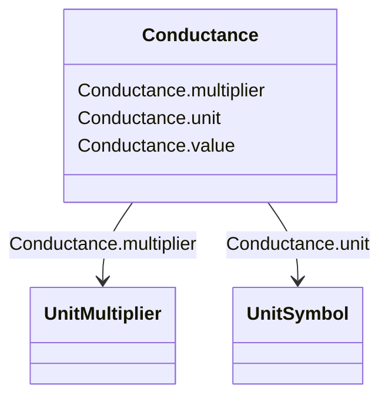

# Conductance

_Factor by which voltage must be multiplied to give corresponding power lost from a circuit. Real part of admittance._

**URI**: [cim:Conductance](http://iec.ch/TC57/CIM100#Conductance) 
**Type**: Class

<!-- no inheritance hierarchy -->

## Attributes

| Name | URI | Cardinality and Range | Description | Inheritance |
| ---  | --- | --- | --- | --- |
| value | [cim:Conductance.value](http://iec.ch/TC57/CIM100#Conductance.value) | 0..1    float  |  | direct |
| unit | [cim:Conductance.unit](http://iec.ch/TC57/CIM100#Conductance.unit) | 0..1    [UnitSymbol](UnitSymbol.md)  |  | direct |
| multiplier | [cim:Conductance.multiplier](http://iec.ch/TC57/CIM100#Conductance.multiplier) | 0..1    [UnitMultiplier](UnitMultiplier.md)  |  | direct |

## Usages

| used by | used in | type | used |
| ---  | --- | --- | --- |
| [ACLineSegment](ACLineSegment.md) | gch | range | [Conductance](Conductance.md) |
| [EquivalentShunt](EquivalentShunt.md) | g | range | [Conductance](Conductance.md) |
| [LinearShuntCompensator](LinearShuntCompensator.md) | gPerSection | range | [Conductance](Conductance.md) |
| [NonlinearShuntCompensatorPoint](NonlinearShuntCompensatorPoint.md) | g | range | [Conductance](Conductance.md) |
| [PowerTransformerEnd](PowerTransformerEnd.md) | g | range | [Conductance](Conductance.md) |

## Identifier and Mapping Information

### Schema Source

* from schema: http://iec.ch/TC57/ns/CIM/CoreEquipment-EU#Package_CoreEquipmentProfile

## Mappings

| Mapping Type | Mapped Value |
| ---  | ---  |
| self | cim:Conductance |
| native | this:Conductance |

