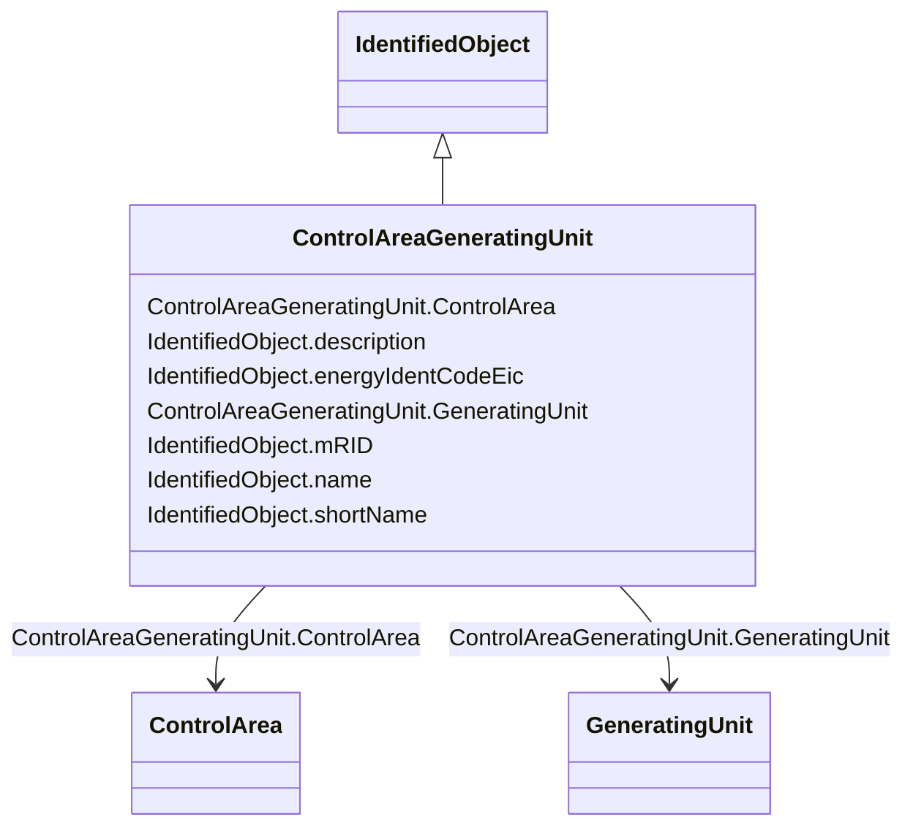

# ControlAreaGeneratingUnit

_A control area generating unit. This class is needed so that alternate control area definitions may include the same generating unit.   It should be noted that only one instance within a control area should reference a specific generating unit._

**URI**: [cim:ControlAreaGeneratingUnit](http://iec.ch/TC57/CIM100#ControlAreaGeneratingUnit) 
**Type**: Class

## Inheritance
* [IdentifiedObject](IdentifiedObject.md)
    * **ControlAreaGeneratingUnit**

## Attributes

| Name | URI | Cardinality and Range | Description | Inheritance |
| ---  | --- | --- | --- | --- |
| ControlArea | [cim:ControlAreaGeneratingUnit.ControlArea](http://iec.ch/TC57/CIM100#ControlAreaGeneratingUnit.ControlArea) | 1..1    [ControlArea](ControlArea.md)  | The parent control area for the generating unit specifications | direct |
| GeneratingUnit | [cim:ControlAreaGeneratingUnit.GeneratingUnit](http://iec.ch/TC57/CIM100#ControlAreaGeneratingUnit.GeneratingUnit) | 1..1    [GeneratingUnit](GeneratingUnit.md)  | The generating unit specified for this control area | direct |
| description | [cim:IdentifiedObject.description](http://iec.ch/TC57/CIM100#IdentifiedObject.description) | 0..1    string  | The description is a free human readable text describing or naming the object | [IdentifiedObject](IdentifiedObject.md) |
| energyIdentCodeEic | [eu:IdentifiedObject.energyIdentCodeEic](http://iec.ch/TC57/CIM100-European#IdentifiedObject.energyIdentCodeEic) | 0..1    string  | The attribute is used for an exchange of the EIC code (Energy identification ... | [IdentifiedObject](IdentifiedObject.md) |
| mRID | [cim:IdentifiedObject.mRID](http://iec.ch/TC57/CIM100#IdentifiedObject.mRID) | 1..1    string  | Master resource identifier issued by a model authority | [IdentifiedObject](IdentifiedObject.md) |
| name | [cim:IdentifiedObject.name](http://iec.ch/TC57/CIM100#IdentifiedObject.name) | 1..1    string  | The name is any free human readable and possibly non unique text naming the o... | [IdentifiedObject](IdentifiedObject.md) |
| shortName | [eu:IdentifiedObject.shortName](http://iec.ch/TC57/CIM100-European#IdentifiedObject.shortName) | 0..1    string  | The attribute is used for an exchange of a human readable short name with len... | [IdentifiedObject](IdentifiedObject.md) |

## Usages

| used by | used in | type | used |
| ---  | --- | --- | --- |
| [ControlArea](ControlArea.md) | ControlAreaGeneratingUnit | range | [ControlAreaGeneratingUnit](ControlAreaGeneratingUnit.md) |
| [GeneratingUnit](GeneratingUnit.md) | ControlAreaGeneratingUnit | range | [ControlAreaGeneratingUnit](ControlAreaGeneratingUnit.md) |
| [HydroGeneratingUnit](HydroGeneratingUnit.md) | ControlAreaGeneratingUnit | range | [ControlAreaGeneratingUnit](ControlAreaGeneratingUnit.md) |
| [NuclearGeneratingUnit](NuclearGeneratingUnit.md) | ControlAreaGeneratingUnit | range | [ControlAreaGeneratingUnit](ControlAreaGeneratingUnit.md) |
| [SolarGeneratingUnit](SolarGeneratingUnit.md) | ControlAreaGeneratingUnit | range | [ControlAreaGeneratingUnit](ControlAreaGeneratingUnit.md) |
| [ThermalGeneratingUnit](ThermalGeneratingUnit.md) | ControlAreaGeneratingUnit | range | [ControlAreaGeneratingUnit](ControlAreaGeneratingUnit.md) |
| [WindGeneratingUnit](WindGeneratingUnit.md) | ControlAreaGeneratingUnit | range | [ControlAreaGeneratingUnit](ControlAreaGeneratingUnit.md) |

## Identifier and Mapping Information

### Schema Source

* from schema: http://iec.ch/TC57/ns/CIM/CoreEquipment-EU#Package_CoreEquipmentProfile

## Mappings

| Mapping Type | Mapped Value |
| ---  | ---  |
| self | cim:ControlAreaGeneratingUnit |
| native | this:ControlAreaGeneratingUnit |

