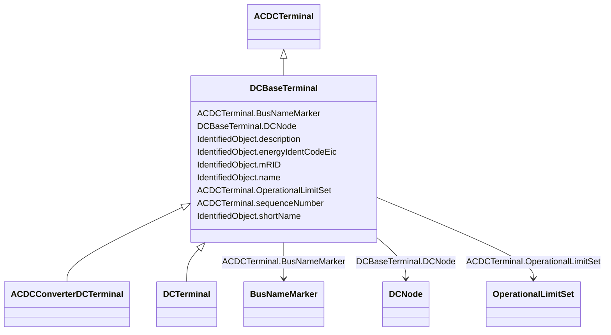

# DCBaseTerminal

_An electrical connection point at a piece of DC conducting equipment. DC terminals are connected at one physical DC node that may have multiple DC terminals connected. A DC node is similar to an AC connectivity node. The model requires that DC connections are distinct from AC connections._

**URI**: [cim:DCBaseTerminal](http://iec.ch/TC57/CIM100#DCBaseTerminal) 
**Type**: Class

## Inheritance
* [IdentifiedObject](IdentifiedObject.md)
    * [ACDCTerminal](ACDCTerminal.md)
        * **DCBaseTerminal**
            * [ACDCConverterDCTerminal](ACDCConverterDCTerminal.md)
            * [DCTerminal](DCTerminal.md)

## Attributes

| Name | URI | Cardinality and Range | Description | Inheritance |
| ---  | --- | --- | --- | --- |
| DCNode | [cim:DCBaseTerminal.DCNode](http://iec.ch/TC57/CIM100#DCBaseTerminal.DCNode) | 0..1    [DCNode](DCNode.md)  | The DC connectivity node to which this DC base terminal connects with zero im... | direct |
| sequenceNumber | [cim:ACDCTerminal.sequenceNumber](http://iec.ch/TC57/CIM100#ACDCTerminal.sequenceNumber) | 1    integer  | The orientation of the terminal connections for a multiple terminal conductin... | [ACDCTerminal](ACDCTerminal.md) |
| OperationalLimitSet | [cim:ACDCTerminal.OperationalLimitSet](http://iec.ch/TC57/CIM100#ACDCTerminal.OperationalLimitSet) | *    [OperationalLimitSet](OperationalLimitSet.md)  | The operational limit sets at the terminal | [ACDCTerminal](ACDCTerminal.md) |
| BusNameMarker | [cim:ACDCTerminal.BusNameMarker](http://iec.ch/TC57/CIM100#ACDCTerminal.BusNameMarker) | 0..1    [BusNameMarker](BusNameMarker.md)  | The bus name marker used to name the bus (topological node) | [ACDCTerminal](ACDCTerminal.md) |
| description | [cim:IdentifiedObject.description](http://iec.ch/TC57/CIM100#IdentifiedObject.description) | 0..1    string  | The description is a free human readable text describing or naming the object | [IdentifiedObject](IdentifiedObject.md) |
| energyIdentCodeEic | [eu:IdentifiedObject.energyIdentCodeEic](http://iec.ch/TC57/CIM100-European#IdentifiedObject.energyIdentCodeEic) | 0..1    string  | The attribute is used for an exchange of the EIC code (Energy identification ... | [IdentifiedObject](IdentifiedObject.md) |
| mRID | [cim:IdentifiedObject.mRID](http://iec.ch/TC57/CIM100#IdentifiedObject.mRID) | 1    string  | Master resource identifier issued by a model authority | [IdentifiedObject](IdentifiedObject.md) |
| name | [cim:IdentifiedObject.name](http://iec.ch/TC57/CIM100#IdentifiedObject.name) | 1    string  | The name is any free human readable and possibly non unique text naming the o... | [IdentifiedObject](IdentifiedObject.md) |
| shortName | [eu:IdentifiedObject.shortName](http://iec.ch/TC57/CIM100-European#IdentifiedObject.shortName) | 0..1    string  | The attribute is used for an exchange of a human readable short name with len... | [IdentifiedObject](IdentifiedObject.md) |

## Usages

| used by | used in | type | used |
| ---  | --- | --- | --- |
| [DCNode](DCNode.md) | DCTerminals | range | [DCBaseTerminal](DCBaseTerminal.md) |

## Identifier and Mapping Information

### Schema Source

* from schema: http://iec.ch/TC57/ns/CIM/CoreEquipment-EU#Package_CoreEquipmentProfile

## Mappings

| Mapping Type | Mapped Value |
| ---  | ---  |
| self | cim:DCBaseTerminal |
| native | this:DCBaseTerminal |

