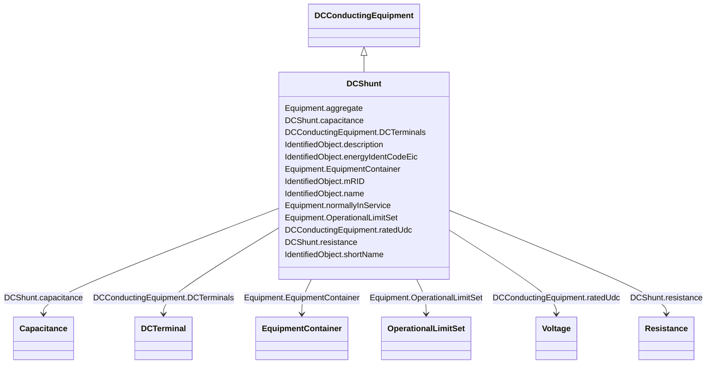

# DCShunt

_A shunt device within the DC system, typically used for filtering.  Needed for transient and short circuit studies._

**URI**: [cim:DCShunt](http://iec.ch/TC57/CIM100#DCShunt) 
**Type**: Class

## Inheritance
* [IdentifiedObject](IdentifiedObject.md)
    * [PowerSystemResource](PowerSystemResource.md)
        * [Equipment](Equipment.md)
            * [DCConductingEquipment](DCConductingEquipment.md)
                * **DCShunt**

## Attributes

| Name | URI | Cardinality and Range | Description | Inheritance |
| ---  | --- | --- | --- | --- |
| capacitance | [cim:DCShunt.capacitance](http://iec.ch/TC57/CIM100#DCShunt.capacitance) | 1    [Capacitance](Capacitance.md)  | Capacitance of the DC shunt | direct |
| resistance | [cim:DCShunt.resistance](http://iec.ch/TC57/CIM100#DCShunt.resistance) | 1    [Resistance](Resistance.md)  | Resistance of the DC device | direct |
| ratedUdc | [cim:DCConductingEquipment.ratedUdc](http://iec.ch/TC57/CIM100#DCConductingEquipment.ratedUdc) | 1    [Voltage](Voltage.md)  | Rated DC device voltage | [DCConductingEquipment](DCConductingEquipment.md) |
| DCTerminals | [cim:DCConductingEquipment.DCTerminals](http://iec.ch/TC57/CIM100#DCConductingEquipment.DCTerminals) | *    [DCTerminal](DCTerminal.md)  | A DC conducting equipment has DC terminals | [DCConductingEquipment](DCConductingEquipment.md) |
| aggregate | [cim:Equipment.aggregate](http://iec.ch/TC57/CIM100#Equipment.aggregate) | 0..1    boolean  | The aggregate flag provides an alternative way of representing an aggregated ... | [Equipment](Equipment.md) |
| normallyInService | [cim:Equipment.normallyInService](http://iec.ch/TC57/CIM100#Equipment.normallyInService) | 0..1    boolean  | Specifies the availability of the equipment under normal operating conditions | [Equipment](Equipment.md) |
| EquipmentContainer | [cim:Equipment.EquipmentContainer](http://iec.ch/TC57/CIM100#Equipment.EquipmentContainer) | 0..1    [EquipmentContainer](EquipmentContainer.md)  | Container of this equipment | [Equipment](Equipment.md) |
| OperationalLimitSet | [cim:Equipment.OperationalLimitSet](http://iec.ch/TC57/CIM100#Equipment.OperationalLimitSet) | *    [OperationalLimitSet](OperationalLimitSet.md)  | The operational limit sets associated with this equipment | [Equipment](Equipment.md) |
| description | [cim:IdentifiedObject.description](http://iec.ch/TC57/CIM100#IdentifiedObject.description) | 0..1    string  | The description is a free human readable text describing or naming the object | [IdentifiedObject](IdentifiedObject.md) |
| energyIdentCodeEic | [eu:IdentifiedObject.energyIdentCodeEic](http://iec.ch/TC57/CIM100-European#IdentifiedObject.energyIdentCodeEic) | 0..1    string  | The attribute is used for an exchange of the EIC code (Energy identification ... | [IdentifiedObject](IdentifiedObject.md) |
| mRID | [cim:IdentifiedObject.mRID](http://iec.ch/TC57/CIM100#IdentifiedObject.mRID) | 1    string  | Master resource identifier issued by a model authority | [IdentifiedObject](IdentifiedObject.md) |
| name | [cim:IdentifiedObject.name](http://iec.ch/TC57/CIM100#IdentifiedObject.name) | 1    string  | The name is any free human readable and possibly non unique text naming the o... | [IdentifiedObject](IdentifiedObject.md) |
| shortName | [eu:IdentifiedObject.shortName](http://iec.ch/TC57/CIM100-European#IdentifiedObject.shortName) | 0..1    string  | The attribute is used for an exchange of a human readable short name with len... | [IdentifiedObject](IdentifiedObject.md) |

## Identifier and Mapping Information

### Schema Source

* from schema: http://iec.ch/TC57/ns/CIM/CoreEquipment-EU#Package_CoreEquipmentProfile

## Mappings

| Mapping Type | Mapped Value |
| ---  | ---  |
| self | cim:DCShunt |
| native | this:DCShunt |

