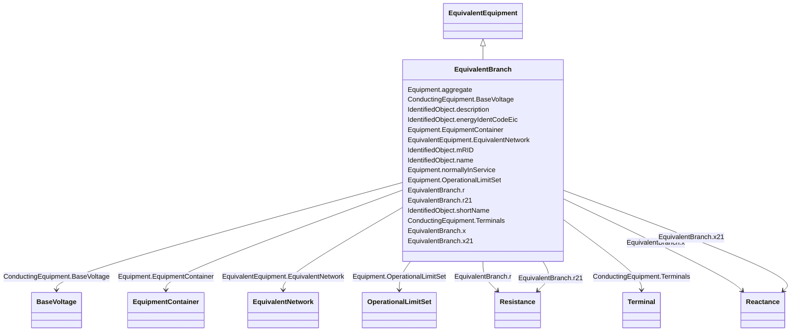

# EquivalentBranch

_The class represents equivalent branches. In cases where a transformer phase shift is modelled and the EquivalentBranch is spanning the same nodes, the impedance quantities for the EquivalentBranch shall consider the needed phase shift._

**URI**: [cim:EquivalentBranch](http://iec.ch/TC57/CIM100#EquivalentBranch) 
**Type**: Class

## Inheritance
* [IdentifiedObject](IdentifiedObject.md)
    * [PowerSystemResource](PowerSystemResource.md)
        * [Equipment](Equipment.md)
            * [ConductingEquipment](ConductingEquipment.md)
                * [EquivalentEquipment](EquivalentEquipment.md)
                    * **EquivalentBranch**

## Attributes

| Name | URI | Cardinality and Range | Description | Inheritance |
| ---  | --- | --- | --- | --- |
| r | [cim:EquivalentBranch.r](http://iec.ch/TC57/CIM100#EquivalentBranch.r) | 1    [Resistance](Resistance.md)  | Positive sequence series resistance of the reduced branch | direct |
| r21 | [cim:EquivalentBranch.r21](http://iec.ch/TC57/CIM100#EquivalentBranch.r21) | 0..1    [Resistance](Resistance.md)  | Resistance from terminal sequence 2 to terminal sequence 1  | direct |
| x | [cim:EquivalentBranch.x](http://iec.ch/TC57/CIM100#EquivalentBranch.x) | 1    [Reactance](Reactance.md)  | Positive sequence series reactance of the reduced branch | direct |
| x21 | [cim:EquivalentBranch.x21](http://iec.ch/TC57/CIM100#EquivalentBranch.x21) | 0..1    [Reactance](Reactance.md)  | Reactance from terminal sequence 2 to terminal sequence 1 | direct |
| EquivalentNetwork | [cim:EquivalentEquipment.EquivalentNetwork](http://iec.ch/TC57/CIM100#EquivalentEquipment.EquivalentNetwork) | 0..1    [EquivalentNetwork](EquivalentNetwork.md)  | The equivalent where the reduced model belongs | [EquivalentEquipment](EquivalentEquipment.md) |
| BaseVoltage | [cim:ConductingEquipment.BaseVoltage](http://iec.ch/TC57/CIM100#ConductingEquipment.BaseVoltage) | 0..1    [BaseVoltage](BaseVoltage.md)  | Base voltage of this conducting equipment | [ConductingEquipment](ConductingEquipment.md) |
| Terminals | [cim:ConductingEquipment.Terminals](http://iec.ch/TC57/CIM100#ConductingEquipment.Terminals) | *    [Terminal](Terminal.md)  | Conducting equipment have terminals that may be connected to other conducting... | [ConductingEquipment](ConductingEquipment.md) |
| aggregate | [cim:Equipment.aggregate](http://iec.ch/TC57/CIM100#Equipment.aggregate) | 0..1    boolean  | The aggregate flag provides an alternative way of representing an aggregated ... | [Equipment](Equipment.md) |
| normallyInService | [cim:Equipment.normallyInService](http://iec.ch/TC57/CIM100#Equipment.normallyInService) | 0..1    boolean  | Specifies the availability of the equipment under normal operating conditions | [Equipment](Equipment.md) |
| EquipmentContainer | [cim:Equipment.EquipmentContainer](http://iec.ch/TC57/CIM100#Equipment.EquipmentContainer) | 0..1    [EquipmentContainer](EquipmentContainer.md)  | Container of this equipment | [Equipment](Equipment.md) |
| OperationalLimitSet | [cim:Equipment.OperationalLimitSet](http://iec.ch/TC57/CIM100#Equipment.OperationalLimitSet) | *    [OperationalLimitSet](OperationalLimitSet.md)  | The operational limit sets associated with this equipment | [Equipment](Equipment.md) |
| description | [cim:IdentifiedObject.description](http://iec.ch/TC57/CIM100#IdentifiedObject.description) | 0..1    string  | The description is a free human readable text describing or naming the object | [IdentifiedObject](IdentifiedObject.md) |
| energyIdentCodeEic | [eu:IdentifiedObject.energyIdentCodeEic](http://iec.ch/TC57/CIM100-European#IdentifiedObject.energyIdentCodeEic) | 0..1    string  | The attribute is used for an exchange of the EIC code (Energy identification ... | [IdentifiedObject](IdentifiedObject.md) |
| mRID | [cim:IdentifiedObject.mRID](http://iec.ch/TC57/CIM100#IdentifiedObject.mRID) | 1    string  | Master resource identifier issued by a model authority | [IdentifiedObject](IdentifiedObject.md) |
| name | [cim:IdentifiedObject.name](http://iec.ch/TC57/CIM100#IdentifiedObject.name) | 1    string  | The name is any free human readable and possibly non unique text naming the o... | [IdentifiedObject](IdentifiedObject.md) |
| shortName | [eu:IdentifiedObject.shortName](http://iec.ch/TC57/CIM100-European#IdentifiedObject.shortName) | 0..1    string  | The attribute is used for an exchange of a human readable short name with len... | [IdentifiedObject](IdentifiedObject.md) |

## Identifier and Mapping Information

### Schema Source

* from schema: http://iec.ch/TC57/ns/CIM/CoreEquipment-EU#Package_CoreEquipmentProfile

## Mappings

| Mapping Type | Mapped Value |
| ---  | ---  |
| self | cim:EquivalentBranch |
| native | this:EquivalentBranch |

