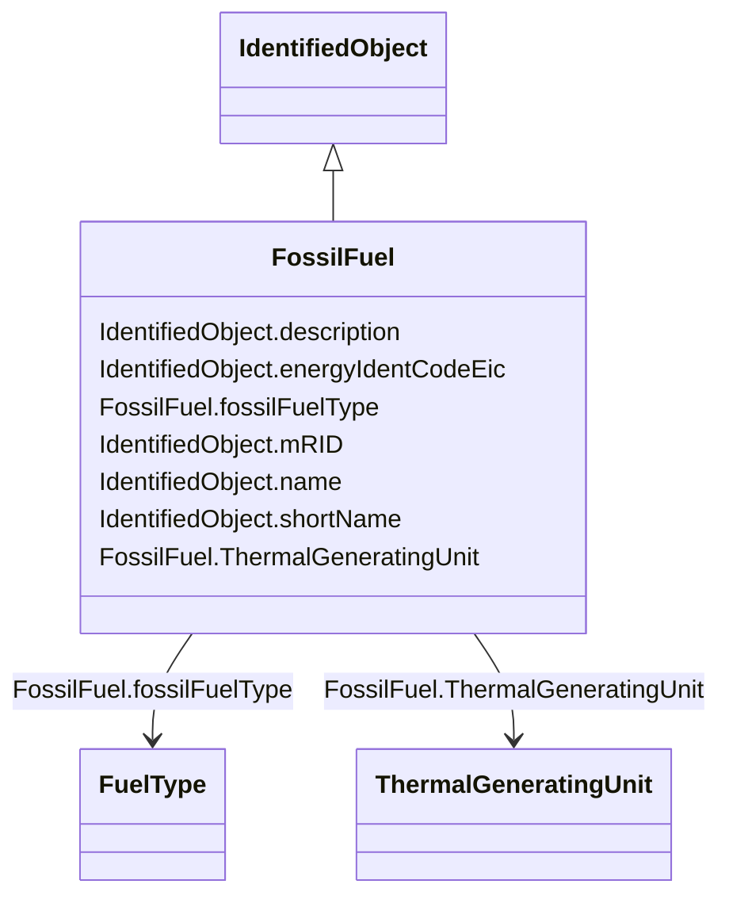

# FossilFuel

_The fossil fuel consumed by the non-nuclear thermal generating unit.   For example, coal, oil, gas, etc.   These are the specific fuels that the generating unit can consume._

**URI**: [cim:FossilFuel](http://iec.ch/TC57/CIM100#FossilFuel) 
**Type**: Class

## Inheritance
* [IdentifiedObject](IdentifiedObject.md)
    * **FossilFuel**

## Attributes

| Name | URI | Cardinality and Range | Description | Inheritance |
| ---  | --- | --- | --- | --- |
| fossilFuelType | [cim:FossilFuel.fossilFuelType](http://iec.ch/TC57/CIM100#FossilFuel.fossilFuelType) | 1    [FuelType](FuelType.md)  | The type of fossil fuel, such as coal, oil, or gas | direct |
| ThermalGeneratingUnit | [cim:FossilFuel.ThermalGeneratingUnit](http://iec.ch/TC57/CIM100#FossilFuel.ThermalGeneratingUnit) | 1    [ThermalGeneratingUnit](ThermalGeneratingUnit.md)  | A thermal generating unit may have one or more fossil fuels | direct |
| description | [cim:IdentifiedObject.description](http://iec.ch/TC57/CIM100#IdentifiedObject.description) | 0..1    string  | The description is a free human readable text describing or naming the object | [IdentifiedObject](IdentifiedObject.md) |
| energyIdentCodeEic | [eu:IdentifiedObject.energyIdentCodeEic](http://iec.ch/TC57/CIM100-European#IdentifiedObject.energyIdentCodeEic) | 0..1    string  | The attribute is used for an exchange of the EIC code (Energy identification ... | [IdentifiedObject](IdentifiedObject.md) |
| mRID | [cim:IdentifiedObject.mRID](http://iec.ch/TC57/CIM100#IdentifiedObject.mRID) | 1    string  | Master resource identifier issued by a model authority | [IdentifiedObject](IdentifiedObject.md) |
| name | [cim:IdentifiedObject.name](http://iec.ch/TC57/CIM100#IdentifiedObject.name) | 1    string  | The name is any free human readable and possibly non unique text naming the o... | [IdentifiedObject](IdentifiedObject.md) |
| shortName | [eu:IdentifiedObject.shortName](http://iec.ch/TC57/CIM100-European#IdentifiedObject.shortName) | 0..1    string  | The attribute is used for an exchange of a human readable short name with len... | [IdentifiedObject](IdentifiedObject.md) |

## Usages

| used by | used in | type | used |
| ---  | --- | --- | --- |
| [ThermalGeneratingUnit](ThermalGeneratingUnit.md) | FossilFuels | range | [FossilFuel](FossilFuel.md) |

## Identifier and Mapping Information

### Schema Source

* from schema: http://iec.ch/TC57/ns/CIM/CoreEquipment-EU#Package_CoreEquipmentProfile

## Mappings

| Mapping Type | Mapped Value |
| ---  | ---  |
| self | cim:FossilFuel |
| native | this:FossilFuel |

