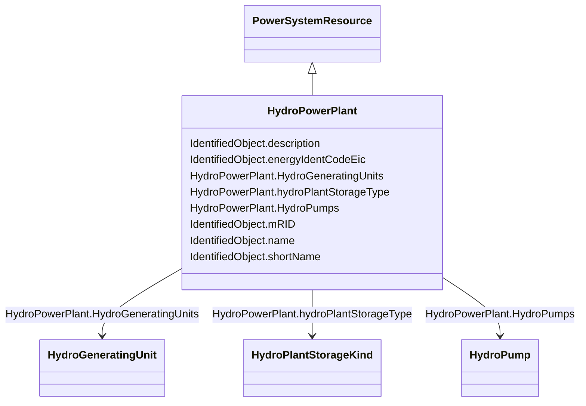

# HydroPowerPlant

_A hydro power station which can generate or pump. When generating, the generator turbines receive water from an upper reservoir. When pumping, the pumps receive their water from a lower reservoir._

**URI**: [cim:HydroPowerPlant](http://iec.ch/TC57/CIM100#HydroPowerPlant) 
**Type**: Class

## Inheritance
* [IdentifiedObject](IdentifiedObject.md)
    * [PowerSystemResource](PowerSystemResource.md)
        * **HydroPowerPlant**

## Attributes

| Name | URI | Cardinality and Range | Description | Inheritance |
| ---  | --- | --- | --- | --- |
| HydroGeneratingUnits | [cim:HydroPowerPlant.HydroGeneratingUnits](http://iec.ch/TC57/CIM100#HydroPowerPlant.HydroGeneratingUnits) | *    [HydroGeneratingUnit](HydroGeneratingUnit.md)  | The hydro generating unit belongs to a hydro power plant | direct |
| hydroPlantStorageType | [cim:HydroPowerPlant.hydroPlantStorageType](http://iec.ch/TC57/CIM100#HydroPowerPlant.hydroPlantStorageType) | 1    [HydroPlantStorageKind](HydroPlantStorageKind.md)  | The type of hydro power plant water storage | direct |
| HydroPumps | [cim:HydroPowerPlant.HydroPumps](http://iec.ch/TC57/CIM100#HydroPowerPlant.HydroPumps) | *    [HydroPump](HydroPump.md)  | The hydro pump may be a member of a pumped storage plant or a pump for distri... | direct |
| description | [cim:IdentifiedObject.description](http://iec.ch/TC57/CIM100#IdentifiedObject.description) | 0..1    string  | The description is a free human readable text describing or naming the object | [IdentifiedObject](IdentifiedObject.md) |
| energyIdentCodeEic | [eu:IdentifiedObject.energyIdentCodeEic](http://iec.ch/TC57/CIM100-European#IdentifiedObject.energyIdentCodeEic) | 0..1    string  | The attribute is used for an exchange of the EIC code (Energy identification ... | [IdentifiedObject](IdentifiedObject.md) |
| mRID | [cim:IdentifiedObject.mRID](http://iec.ch/TC57/CIM100#IdentifiedObject.mRID) | 1    string  | Master resource identifier issued by a model authority | [IdentifiedObject](IdentifiedObject.md) |
| name | [cim:IdentifiedObject.name](http://iec.ch/TC57/CIM100#IdentifiedObject.name) | 1    string  | The name is any free human readable and possibly non unique text naming the o... | [IdentifiedObject](IdentifiedObject.md) |
| shortName | [eu:IdentifiedObject.shortName](http://iec.ch/TC57/CIM100-European#IdentifiedObject.shortName) | 0..1    string  | The attribute is used for an exchange of a human readable short name with len... | [IdentifiedObject](IdentifiedObject.md) |

## Usages

| used by | used in | type | used |
| ---  | --- | --- | --- |
| [HydroGeneratingUnit](HydroGeneratingUnit.md) | HydroPowerPlant | range | [HydroPowerPlant](HydroPowerPlant.md) |
| [HydroPump](HydroPump.md) | HydroPowerPlant | range | [HydroPowerPlant](HydroPowerPlant.md) |

## Identifier and Mapping Information

### Schema Source

* from schema: http://iec.ch/TC57/ns/CIM/CoreEquipment-EU#Package_CoreEquipmentProfile

## Mappings

| Mapping Type | Mapped Value |
| ---  | ---  |
| self | cim:HydroPowerPlant |
| native | this:HydroPowerPlant |

