# IdentifiedObject

_This is a root class to provide common identification for all classes needing identification and naming attributes._

**URI**: [cim:IdentifiedObject](http://iec.ch/TC57/CIM100#IdentifiedObject) 
**Type**: Class

```mermaid
 classDiagram
    class IdentifiedObject
    click IdentifiedObject href "../IdentifiedObject"
      IdentifiedObject <|-- ACDCTerminal
        click ACDCTerminal href "../ACDCTerminal"
      IdentifiedObject <|-- BaseVoltage
        click BaseVoltage href "../BaseVoltage"
      IdentifiedObject <|-- BasicIntervalSchedule
        click BasicIntervalSchedule href "../BasicIntervalSchedule"
      IdentifiedObject <|-- BusNameMarker
        click BusNameMarker href "../BusNameMarker"
      IdentifiedObject <|-- ConnectivityNode
        click ConnectivityNode href "../ConnectivityNode"
      IdentifiedObject <|-- ControlAreaGeneratingUnit
        click ControlAreaGeneratingUnit href "../ControlAreaGeneratingUnit"
      IdentifiedObject <|-- Curve
        click Curve href "../Curve"
      IdentifiedObject <|-- DayType
        click DayType href "../DayType"
      IdentifiedObject <|-- DCNode
        click DCNode href "../DCNode"
      IdentifiedObject <|-- EnergyArea
        click EnergyArea href "../EnergyArea"
      IdentifiedObject <|-- EnergySchedulingType
        click EnergySchedulingType href "../EnergySchedulingType"
      IdentifiedObject <|-- FossilFuel
        click FossilFuel href "../FossilFuel"
      IdentifiedObject <|-- GeographicalRegion
        click GeographicalRegion href "../GeographicalRegion"
      IdentifiedObject <|-- LoadGroup
        click LoadGroup href "../LoadGroup"
      IdentifiedObject <|-- LoadResponseCharacteristic
        click LoadResponseCharacteristic href "../LoadResponseCharacteristic"
      IdentifiedObject <|-- OperationalLimit
        click OperationalLimit href "../OperationalLimit"
      IdentifiedObject <|-- OperationalLimitSet
        click OperationalLimitSet href "../OperationalLimitSet"
      IdentifiedObject <|-- OperationalLimitType
        click OperationalLimitType href "../OperationalLimitType"
      IdentifiedObject <|-- PhaseTapChangerTable
        click PhaseTapChangerTable href "../PhaseTapChangerTable"
      IdentifiedObject <|-- PowerSystemResource
        click PowerSystemResource href "../PowerSystemResource"
      IdentifiedObject <|-- RatioTapChangerTable
        click RatioTapChangerTable href "../RatioTapChangerTable"
      IdentifiedObject <|-- ReportingGroup
        click ReportingGroup href "../ReportingGroup"
      IdentifiedObject <|-- Season
        click Season href "../Season"
      IdentifiedObject <|-- SubGeographicalRegion
        click SubGeographicalRegion href "../SubGeographicalRegion"
      IdentifiedObject <|-- TieFlow
        click TieFlow href "../TieFlow"
      IdentifiedObject <|-- TransformerEnd
        click TransformerEnd href "../TransformerEnd"
      
      IdentifiedObject : IdentifiedObject.description
        
      IdentifiedObject : IdentifiedObject.energyIdentCodeEic
        
      IdentifiedObject : IdentifiedObject.mRID
        
      IdentifiedObject : IdentifiedObject.name
        
      IdentifiedObject : IdentifiedObject.shortName
        
      
```

## Inheritance
* **IdentifiedObject**
    * [ACDCTerminal](ACDCTerminal.md)
    * [BaseVoltage](BaseVoltage.md)
    * [BasicIntervalSchedule](BasicIntervalSchedule.md)
    * [BusNameMarker](BusNameMarker.md)
    * [ConnectivityNode](ConnectivityNode.md)
    * [ControlAreaGeneratingUnit](ControlAreaGeneratingUnit.md)
    * [Curve](Curve.md)
    * [DayType](DayType.md)
    * [DCNode](DCNode.md)
    * [EnergyArea](EnergyArea.md)
    * [EnergySchedulingType](EnergySchedulingType.md)
    * [FossilFuel](FossilFuel.md)
    * [GeographicalRegion](GeographicalRegion.md)
    * [LoadGroup](LoadGroup.md)
    * [LoadResponseCharacteristic](LoadResponseCharacteristic.md)
    * [OperationalLimit](OperationalLimit.md)
    * [OperationalLimitSet](OperationalLimitSet.md)
    * [OperationalLimitType](OperationalLimitType.md)
    * [PhaseTapChangerTable](PhaseTapChangerTable.md)
    * [PowerSystemResource](PowerSystemResource.md)
    * [RatioTapChangerTable](RatioTapChangerTable.md)
    * [ReportingGroup](ReportingGroup.md)
    * [Season](Season.md)
    * [SubGeographicalRegion](SubGeographicalRegion.md)
    * [TieFlow](TieFlow.md)
    * [TransformerEnd](TransformerEnd.md)

## Attributes

| Name | URI | Cardinality and Range | Description | Inheritance |
| ---  | --- | --- | --- | --- |
| description | [cim:IdentifiedObject.description](http://iec.ch/TC57/CIM100#IdentifiedObject.description) | 0..1    string  | The description is a free human readable text describing or naming the object | direct |
| energyIdentCodeEic | [eu:IdentifiedObject.energyIdentCodeEic](http://iec.ch/TC57/CIM100-European#IdentifiedObject.energyIdentCodeEic) | 0..1    string  | The attribute is used for an exchange of the EIC code (Energy identification ... | direct |
| mRID | [cim:IdentifiedObject.mRID](http://iec.ch/TC57/CIM100#IdentifiedObject.mRID) | 1    string  | Master resource identifier issued by a model authority | direct |
| name | [cim:IdentifiedObject.name](http://iec.ch/TC57/CIM100#IdentifiedObject.name) | 1    string  | The name is any free human readable and possibly non unique text naming the o... | direct |
| shortName | [eu:IdentifiedObject.shortName](http://iec.ch/TC57/CIM100-European#IdentifiedObject.shortName) | 0..1    string  | The attribute is used for an exchange of a human readable short name with len... | direct |

## Identifier and Mapping Information

### Schema Source

* from schema: http://iec.ch/TC57/ns/CIM/CoreEquipment-EU#Package_CoreEquipmentProfile

## Mappings

| Mapping Type | Mapped Value |
| ---  | ---  |
| self | cim:IdentifiedObject |
| native | this:IdentifiedObject |

