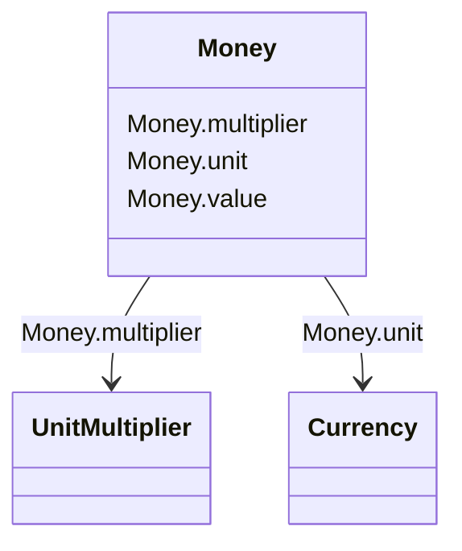

# Money

_Amount of money._

**URI**: [cim:Money](http://iec.ch/TC57/CIM100#Money) 
**Type**: Class

<!-- no inheritance hierarchy -->

## Attributes

| Name | URI | Cardinality and Range | Description | Inheritance |
| ---  | --- | --- | --- | --- |
| unit | [cim:Money.unit](http://iec.ch/TC57/CIM100#Money.unit) | 0..1    [Currency](Currency.md)  |  | direct |
| multiplier | [cim:Money.multiplier](http://iec.ch/TC57/CIM100#Money.multiplier) | 0..1    [UnitMultiplier](UnitMultiplier.md)  |  | direct |
| value | [cim:Money.value](http://iec.ch/TC57/CIM100#Money.value) | 0..1    double  |  | direct |

## Usages

| used by | used in | type | used |
| ---  | --- | --- | --- |
| [GeneratingUnit](GeneratingUnit.md) | startupCost | range | [Money](Money.md) |
| [GeneratingUnit](GeneratingUnit.md) | variableCost | range | [Money](Money.md) |
| [HydroGeneratingUnit](HydroGeneratingUnit.md) | startupCost | range | [Money](Money.md) |
| [HydroGeneratingUnit](HydroGeneratingUnit.md) | variableCost | range | [Money](Money.md) |
| [NuclearGeneratingUnit](NuclearGeneratingUnit.md) | startupCost | range | [Money](Money.md) |
| [NuclearGeneratingUnit](NuclearGeneratingUnit.md) | variableCost | range | [Money](Money.md) |
| [SolarGeneratingUnit](SolarGeneratingUnit.md) | startupCost | range | [Money](Money.md) |
| [SolarGeneratingUnit](SolarGeneratingUnit.md) | variableCost | range | [Money](Money.md) |
| [ThermalGeneratingUnit](ThermalGeneratingUnit.md) | startupCost | range | [Money](Money.md) |
| [ThermalGeneratingUnit](ThermalGeneratingUnit.md) | variableCost | range | [Money](Money.md) |
| [WindGeneratingUnit](WindGeneratingUnit.md) | startupCost | range | [Money](Money.md) |
| [WindGeneratingUnit](WindGeneratingUnit.md) | variableCost | range | [Money](Money.md) |

## Identifier and Mapping Information

### Schema Source

* from schema: http://iec.ch/TC57/ns/CIM/CoreEquipment-EU#Package_CoreEquipmentProfile

## Mappings

| Mapping Type | Mapped Value |
| ---  | ---  |
| self | cim:Money |
| native | this:Money |

