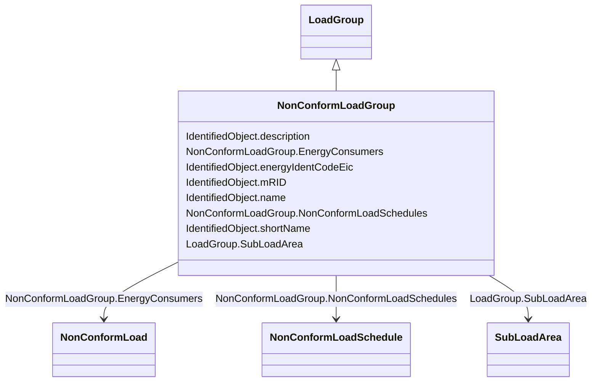

# NonConformLoadGroup

_Loads that do not follow a daily and seasonal load variation pattern._

**URI**: [cim:NonConformLoadGroup](http://iec.ch/TC57/CIM100#NonConformLoadGroup) 
**Type**: Class

## Inheritance
* [IdentifiedObject](IdentifiedObject.md)
    * [LoadGroup](LoadGroup.md)
        * **NonConformLoadGroup**

## Attributes

| Name | URI | Cardinality and Range | Description | Inheritance |
| ---  | --- | --- | --- | --- |
| EnergyConsumers | [cim:NonConformLoadGroup.EnergyConsumers](http://iec.ch/TC57/CIM100#NonConformLoadGroup.EnergyConsumers) | 1..*    [NonConformLoad](NonConformLoad.md)  | Conform loads assigned to this ConformLoadGroup | direct |
| NonConformLoadSchedules | [cim:NonConformLoadGroup.NonConformLoadSchedules](http://iec.ch/TC57/CIM100#NonConformLoadGroup.NonConformLoadSchedules) | 0..*    [NonConformLoadSchedule](NonConformLoadSchedule.md)  | The NonConformLoadSchedules in the NonConformLoadGroup | direct |
| SubLoadArea | [cim:LoadGroup.SubLoadArea](http://iec.ch/TC57/CIM100#LoadGroup.SubLoadArea) | 1..1    [SubLoadArea](SubLoadArea.md)  | The SubLoadArea where the Loadgroup belongs | [LoadGroup](LoadGroup.md) |
| description | [cim:IdentifiedObject.description](http://iec.ch/TC57/CIM100#IdentifiedObject.description) | 0..1    string  | The description is a free human readable text describing or naming the object | [IdentifiedObject](IdentifiedObject.md) |
| energyIdentCodeEic | [eu:IdentifiedObject.energyIdentCodeEic](http://iec.ch/TC57/CIM100-European#IdentifiedObject.energyIdentCodeEic) | 0..1    string  | The attribute is used for an exchange of the EIC code (Energy identification ... | [IdentifiedObject](IdentifiedObject.md) |
| mRID | [cim:IdentifiedObject.mRID](http://iec.ch/TC57/CIM100#IdentifiedObject.mRID) | 1..1    string  | Master resource identifier issued by a model authority | [IdentifiedObject](IdentifiedObject.md) |
| name | [cim:IdentifiedObject.name](http://iec.ch/TC57/CIM100#IdentifiedObject.name) | 1..1    string  | The name is any free human readable and possibly non unique text naming the o... | [IdentifiedObject](IdentifiedObject.md) |
| shortName | [eu:IdentifiedObject.shortName](http://iec.ch/TC57/CIM100-European#IdentifiedObject.shortName) | 0..1    string  | The attribute is used for an exchange of a human readable short name with len... | [IdentifiedObject](IdentifiedObject.md) |

## Usages

| used by | used in | type | used |
| ---  | --- | --- | --- |
| [NonConformLoad](NonConformLoad.md) | LoadGroup | range | [NonConformLoadGroup](NonConformLoadGroup.md) |
| [NonConformLoadSchedule](NonConformLoadSchedule.md) | NonConformLoadGroup | range | [NonConformLoadGroup](NonConformLoadGroup.md) |

## Identifier and Mapping Information

### Schema Source

* from schema: http://iec.ch/TC57/ns/CIM/CoreEquipment-EU#Package_CoreEquipmentProfile

## Mappings

| Mapping Type | Mapped Value |
| ---  | ---  |
| self | cim:NonConformLoadGroup |
| native | this:NonConformLoadGroup |

