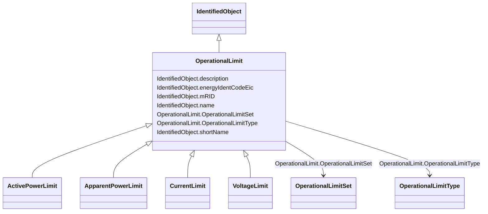

# OperationalLimit

_A value and normal value associated with a specific kind of limit. _

_The sub class value and normalValue attributes vary inversely to the associated OperationalLimitType.acceptableDuration (acceptableDuration for short).  _

_If a particular piece of equipment has multiple operational limits of the same kind (apparent power, current, etc.), the limit with the greatest acceptableDuration shall have the smallest limit value and the limit with the smallest acceptableDuration shall have the largest limit value.  Note: A large current can only be allowed to flow through a piece of equipment for a short duration without causing damage, but a lesser current can be allowed to flow for a longer duration._

**URI**: [cim:OperationalLimit](http://iec.ch/TC57/CIM100#OperationalLimit) 
**Type**: Class

## Inheritance
* [IdentifiedObject](IdentifiedObject.md)
    * **OperationalLimit**
        * [ActivePowerLimit](ActivePowerLimit.md)
        * [ApparentPowerLimit](ApparentPowerLimit.md)
        * [CurrentLimit](CurrentLimit.md)
        * [VoltageLimit](VoltageLimit.md)

## Attributes

| Name | URI | Cardinality and Range | Description | Inheritance |
| ---  | --- | --- | --- | --- |
| OperationalLimitSet | [cim:OperationalLimit.OperationalLimitSet](http://iec.ch/TC57/CIM100#OperationalLimit.OperationalLimitSet) | 1    [OperationalLimitSet](OperationalLimitSet.md)  | The limit set to which the limit values belong | direct |
| OperationalLimitType | [cim:OperationalLimit.OperationalLimitType](http://iec.ch/TC57/CIM100#OperationalLimit.OperationalLimitType) | 1    [OperationalLimitType](OperationalLimitType.md)  | The limit type associated with this limit | direct |
| description | [cim:IdentifiedObject.description](http://iec.ch/TC57/CIM100#IdentifiedObject.description) | 0..1    string  | The description is a free human readable text describing or naming the object | [IdentifiedObject](IdentifiedObject.md) |
| energyIdentCodeEic | [eu:IdentifiedObject.energyIdentCodeEic](http://iec.ch/TC57/CIM100-European#IdentifiedObject.energyIdentCodeEic) | 0..1    string  | The attribute is used for an exchange of the EIC code (Energy identification ... | [IdentifiedObject](IdentifiedObject.md) |
| mRID | [cim:IdentifiedObject.mRID](http://iec.ch/TC57/CIM100#IdentifiedObject.mRID) | 1    string  | Master resource identifier issued by a model authority | [IdentifiedObject](IdentifiedObject.md) |
| name | [cim:IdentifiedObject.name](http://iec.ch/TC57/CIM100#IdentifiedObject.name) | 1    string  | The name is any free human readable and possibly non unique text naming the o... | [IdentifiedObject](IdentifiedObject.md) |
| shortName | [eu:IdentifiedObject.shortName](http://iec.ch/TC57/CIM100-European#IdentifiedObject.shortName) | 0..1    string  | The attribute is used for an exchange of a human readable short name with len... | [IdentifiedObject](IdentifiedObject.md) |

## Usages

| used by | used in | type | used |
| ---  | --- | --- | --- |
| [OperationalLimitSet](OperationalLimitSet.md) | OperationalLimitValue | range | [OperationalLimit](OperationalLimit.md) |
| [OperationalLimitType](OperationalLimitType.md) | OperationalLimit | range | [OperationalLimit](OperationalLimit.md) |

## Identifier and Mapping Information

### Schema Source

* from schema: http://iec.ch/TC57/ns/CIM/CoreEquipment-EU#Package_CoreEquipmentProfile

## Mappings

| Mapping Type | Mapped Value |
| ---  | ---  |
| self | cim:OperationalLimit |
| native | this:OperationalLimit |

