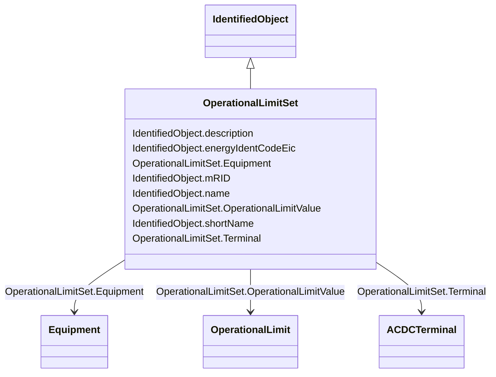

# OperationalLimitSet

_A set of limits associated with equipment.  Sets of limits might apply to a specific temperature, or season for example. A set of limits may contain different severities of limit levels that would apply to the same equipment. The set may contain limits of different types such as apparent power and current limits or high and low voltage limits  that are logically applied together as a set._

**URI**: [cim:OperationalLimitSet](http://iec.ch/TC57/CIM100#OperationalLimitSet) 
**Type**: Class

## Inheritance
* [IdentifiedObject](IdentifiedObject.md)
    * **OperationalLimitSet**

## Attributes

| Name | URI | Cardinality and Range | Description | Inheritance |
| ---  | --- | --- | --- | --- |
| Terminal | [cim:OperationalLimitSet.Terminal](http://iec.ch/TC57/CIM100#OperationalLimitSet.Terminal) | 1    [ACDCTerminal](ACDCTerminal.md)  | The terminal where the operational limit set apply | direct |
| Equipment | [cim:OperationalLimitSet.Equipment](http://iec.ch/TC57/CIM100#OperationalLimitSet.Equipment) | 0..1    [Equipment](Equipment.md)  | The equipment to which the limit set applies | direct |
| OperationalLimitValue | [cim:OperationalLimitSet.OperationalLimitValue](http://iec.ch/TC57/CIM100#OperationalLimitSet.OperationalLimitValue) | *    [OperationalLimit](OperationalLimit.md)  | Values of equipment limits | direct |
| description | [cim:IdentifiedObject.description](http://iec.ch/TC57/CIM100#IdentifiedObject.description) | 0..1    string  | The description is a free human readable text describing or naming the object | [IdentifiedObject](IdentifiedObject.md) |
| energyIdentCodeEic | [eu:IdentifiedObject.energyIdentCodeEic](http://iec.ch/TC57/CIM100-European#IdentifiedObject.energyIdentCodeEic) | 0..1    string  | The attribute is used for an exchange of the EIC code (Energy identification ... | [IdentifiedObject](IdentifiedObject.md) |
| mRID | [cim:IdentifiedObject.mRID](http://iec.ch/TC57/CIM100#IdentifiedObject.mRID) | 1    string  | Master resource identifier issued by a model authority | [IdentifiedObject](IdentifiedObject.md) |
| name | [cim:IdentifiedObject.name](http://iec.ch/TC57/CIM100#IdentifiedObject.name) | 1    string  | The name is any free human readable and possibly non unique text naming the o... | [IdentifiedObject](IdentifiedObject.md) |
| shortName | [eu:IdentifiedObject.shortName](http://iec.ch/TC57/CIM100-European#IdentifiedObject.shortName) | 0..1    string  | The attribute is used for an exchange of a human readable short name with len... | [IdentifiedObject](IdentifiedObject.md) |

## Usages

| used by | used in | type | used |
| ---  | --- | --- | --- |
| [ACDCConverter](ACDCConverter.md) | OperationalLimitSet | range | [OperationalLimitSet](OperationalLimitSet.md) |
| [ACDCConverterDCTerminal](ACDCConverterDCTerminal.md) | OperationalLimitSet | range | [OperationalLimitSet](OperationalLimitSet.md) |
| [ACDCTerminal](ACDCTerminal.md) | OperationalLimitSet | range | [OperationalLimitSet](OperationalLimitSet.md) |
| [ACLineSegment](ACLineSegment.md) | OperationalLimitSet | range | [OperationalLimitSet](OperationalLimitSet.md) |
| [ActivePowerLimit](ActivePowerLimit.md) | OperationalLimitSet | range | [OperationalLimitSet](OperationalLimitSet.md) |
| [ApparentPowerLimit](ApparentPowerLimit.md) | OperationalLimitSet | range | [OperationalLimitSet](OperationalLimitSet.md) |
| [AsynchronousMachine](AsynchronousMachine.md) | OperationalLimitSet | range | [OperationalLimitSet](OperationalLimitSet.md) |
| [AuxiliaryEquipment](AuxiliaryEquipment.md) | OperationalLimitSet | range | [OperationalLimitSet](OperationalLimitSet.md) |
| [BatteryUnit](BatteryUnit.md) | OperationalLimitSet | range | [OperationalLimitSet](OperationalLimitSet.md) |
| [Breaker](Breaker.md) | OperationalLimitSet | range | [OperationalLimitSet](OperationalLimitSet.md) |
| [BusbarSection](BusbarSection.md) | OperationalLimitSet | range | [OperationalLimitSet](OperationalLimitSet.md) |
| [Clamp](Clamp.md) | OperationalLimitSet | range | [OperationalLimitSet](OperationalLimitSet.md) |
| [ConductingEquipment](ConductingEquipment.md) | OperationalLimitSet | range | [OperationalLimitSet](OperationalLimitSet.md) |
| [Conductor](Conductor.md) | OperationalLimitSet | range | [OperationalLimitSet](OperationalLimitSet.md) |
| [ConformLoad](ConformLoad.md) | OperationalLimitSet | range | [OperationalLimitSet](OperationalLimitSet.md) |
| [Connector](Connector.md) | OperationalLimitSet | range | [OperationalLimitSet](OperationalLimitSet.md) |
| [CsConverter](CsConverter.md) | OperationalLimitSet | range | [OperationalLimitSet](OperationalLimitSet.md) |
| [CurrentLimit](CurrentLimit.md) | OperationalLimitSet | range | [OperationalLimitSet](OperationalLimitSet.md) |
| [CurrentTransformer](CurrentTransformer.md) | OperationalLimitSet | range | [OperationalLimitSet](OperationalLimitSet.md) |
| [Cut](Cut.md) | OperationalLimitSet | range | [OperationalLimitSet](OperationalLimitSet.md) |
| [DCBaseTerminal](DCBaseTerminal.md) | OperationalLimitSet | range | [OperationalLimitSet](OperationalLimitSet.md) |
| [DCBreaker](DCBreaker.md) | OperationalLimitSet | range | [OperationalLimitSet](OperationalLimitSet.md) |
| [DCBusbar](DCBusbar.md) | OperationalLimitSet | range | [OperationalLimitSet](OperationalLimitSet.md) |
| [DCChopper](DCChopper.md) | OperationalLimitSet | range | [OperationalLimitSet](OperationalLimitSet.md) |
| [DCConductingEquipment](DCConductingEquipment.md) | OperationalLimitSet | range | [OperationalLimitSet](OperationalLimitSet.md) |
| [DCDisconnector](DCDisconnector.md) | OperationalLimitSet | range | [OperationalLimitSet](OperationalLimitSet.md) |
| [DCGround](DCGround.md) | OperationalLimitSet | range | [OperationalLimitSet](OperationalLimitSet.md) |
| [DCLineSegment](DCLineSegment.md) | OperationalLimitSet | range | [OperationalLimitSet](OperationalLimitSet.md) |
| [DCSeriesDevice](DCSeriesDevice.md) | OperationalLimitSet | range | [OperationalLimitSet](OperationalLimitSet.md) |
| [DCShunt](DCShunt.md) | OperationalLimitSet | range | [OperationalLimitSet](OperationalLimitSet.md) |
| [DCSwitch](DCSwitch.md) | OperationalLimitSet | range | [OperationalLimitSet](OperationalLimitSet.md) |
| [DCTerminal](DCTerminal.md) | OperationalLimitSet | range | [OperationalLimitSet](OperationalLimitSet.md) |
| [Disconnector](Disconnector.md) | OperationalLimitSet | range | [OperationalLimitSet](OperationalLimitSet.md) |
| [DisconnectingCircuitBreaker](DisconnectingCircuitBreaker.md) | OperationalLimitSet | range | [OperationalLimitSet](OperationalLimitSet.md) |
| [EarthFaultCompensator](EarthFaultCompensator.md) | OperationalLimitSet | range | [OperationalLimitSet](OperationalLimitSet.md) |
| [EnergyConnection](EnergyConnection.md) | OperationalLimitSet | range | [OperationalLimitSet](OperationalLimitSet.md) |
| [EnergyConsumer](EnergyConsumer.md) | OperationalLimitSet | range | [OperationalLimitSet](OperationalLimitSet.md) |
| [EnergySource](EnergySource.md) | OperationalLimitSet | range | [OperationalLimitSet](OperationalLimitSet.md) |
| [Equipment](Equipment.md) | OperationalLimitSet | range | [OperationalLimitSet](OperationalLimitSet.md) |
| [EquivalentBranch](EquivalentBranch.md) | OperationalLimitSet | range | [OperationalLimitSet](OperationalLimitSet.md) |
| [EquivalentEquipment](EquivalentEquipment.md) | OperationalLimitSet | range | [OperationalLimitSet](OperationalLimitSet.md) |
| [EquivalentInjection](EquivalentInjection.md) | OperationalLimitSet | range | [OperationalLimitSet](OperationalLimitSet.md) |
| [EquivalentShunt](EquivalentShunt.md) | OperationalLimitSet | range | [OperationalLimitSet](OperationalLimitSet.md) |
| [ExternalNetworkInjection](ExternalNetworkInjection.md) | OperationalLimitSet | range | [OperationalLimitSet](OperationalLimitSet.md) |
| [FaultIndicator](FaultIndicator.md) | OperationalLimitSet | range | [OperationalLimitSet](OperationalLimitSet.md) |
| [Fuse](Fuse.md) | OperationalLimitSet | range | [OperationalLimitSet](OperationalLimitSet.md) |
| [GeneratingUnit](GeneratingUnit.md) | OperationalLimitSet | range | [OperationalLimitSet](OperationalLimitSet.md) |
| [Ground](Ground.md) | OperationalLimitSet | range | [OperationalLimitSet](OperationalLimitSet.md) |
| [GroundDisconnector](GroundDisconnector.md) | OperationalLimitSet | range | [OperationalLimitSet](OperationalLimitSet.md) |
| [GroundingImpedance](GroundingImpedance.md) | OperationalLimitSet | range | [OperationalLimitSet](OperationalLimitSet.md) |
| [HydroGeneratingUnit](HydroGeneratingUnit.md) | OperationalLimitSet | range | [OperationalLimitSet](OperationalLimitSet.md) |
| [HydroPump](HydroPump.md) | OperationalLimitSet | range | [OperationalLimitSet](OperationalLimitSet.md) |
| [Jumper](Jumper.md) | OperationalLimitSet | range | [OperationalLimitSet](OperationalLimitSet.md) |
| [Junction](Junction.md) | OperationalLimitSet | range | [OperationalLimitSet](OperationalLimitSet.md) |
| [LinearShuntCompensator](LinearShuntCompensator.md) | OperationalLimitSet | range | [OperationalLimitSet](OperationalLimitSet.md) |
| [LoadBreakSwitch](LoadBreakSwitch.md) | OperationalLimitSet | range | [OperationalLimitSet](OperationalLimitSet.md) |
| [NonConformLoad](NonConformLoad.md) | OperationalLimitSet | range | [OperationalLimitSet](OperationalLimitSet.md) |
| [NonlinearShuntCompensator](NonlinearShuntCompensator.md) | OperationalLimitSet | range | [OperationalLimitSet](OperationalLimitSet.md) |
| [NuclearGeneratingUnit](NuclearGeneratingUnit.md) | OperationalLimitSet | range | [OperationalLimitSet](OperationalLimitSet.md) |
| [OperationalLimit](OperationalLimit.md) | OperationalLimitSet | range | [OperationalLimitSet](OperationalLimitSet.md) |
| [PetersenCoil](PetersenCoil.md) | OperationalLimitSet | range | [OperationalLimitSet](OperationalLimitSet.md) |
| [PhotoVoltaicUnit](PhotoVoltaicUnit.md) | OperationalLimitSet | range | [OperationalLimitSet](OperationalLimitSet.md) |
| [PostLineSensor](PostLineSensor.md) | OperationalLimitSet | range | [OperationalLimitSet](OperationalLimitSet.md) |
| [PotentialTransformer](PotentialTransformer.md) | OperationalLimitSet | range | [OperationalLimitSet](OperationalLimitSet.md) |
| [PowerElectronicsConnection](PowerElectronicsConnection.md) | OperationalLimitSet | range | [OperationalLimitSet](OperationalLimitSet.md) |
| [PowerElectronicsUnit](PowerElectronicsUnit.md) | OperationalLimitSet | range | [OperationalLimitSet](OperationalLimitSet.md) |
| [PowerElectronicsWindUnit](PowerElectronicsWindUnit.md) | OperationalLimitSet | range | [OperationalLimitSet](OperationalLimitSet.md) |
| [PowerTransformer](PowerTransformer.md) | OperationalLimitSet | range | [OperationalLimitSet](OperationalLimitSet.md) |
| [ProtectedSwitch](ProtectedSwitch.md) | OperationalLimitSet | range | [OperationalLimitSet](OperationalLimitSet.md) |
| [RegulatingCondEq](RegulatingCondEq.md) | OperationalLimitSet | range | [OperationalLimitSet](OperationalLimitSet.md) |
| [RotatingMachine](RotatingMachine.md) | OperationalLimitSet | range | [OperationalLimitSet](OperationalLimitSet.md) |
| [Sensor](Sensor.md) | OperationalLimitSet | range | [OperationalLimitSet](OperationalLimitSet.md) |
| [SeriesCompensator](SeriesCompensator.md) | OperationalLimitSet | range | [OperationalLimitSet](OperationalLimitSet.md) |
| [ShuntCompensator](ShuntCompensator.md) | OperationalLimitSet | range | [OperationalLimitSet](OperationalLimitSet.md) |
| [SolarGeneratingUnit](SolarGeneratingUnit.md) | OperationalLimitSet | range | [OperationalLimitSet](OperationalLimitSet.md) |
| [StaticVarCompensator](StaticVarCompensator.md) | OperationalLimitSet | range | [OperationalLimitSet](OperationalLimitSet.md) |
| [StationSupply](StationSupply.md) | OperationalLimitSet | range | [OperationalLimitSet](OperationalLimitSet.md) |
| [SurgeArrester](SurgeArrester.md) | OperationalLimitSet | range | [OperationalLimitSet](OperationalLimitSet.md) |
| [Switch](Switch.md) | OperationalLimitSet | range | [OperationalLimitSet](OperationalLimitSet.md) |
| [SynchronousMachine](SynchronousMachine.md) | OperationalLimitSet | range | [OperationalLimitSet](OperationalLimitSet.md) |
| [Terminal](Terminal.md) | OperationalLimitSet | range | [OperationalLimitSet](OperationalLimitSet.md) |
| [ThermalGeneratingUnit](ThermalGeneratingUnit.md) | OperationalLimitSet | range | [OperationalLimitSet](OperationalLimitSet.md) |
| [VoltageLimit](VoltageLimit.md) | OperationalLimitSet | range | [OperationalLimitSet](OperationalLimitSet.md) |
| [VsConverter](VsConverter.md) | OperationalLimitSet | range | [OperationalLimitSet](OperationalLimitSet.md) |
| [WaveTrap](WaveTrap.md) | OperationalLimitSet | range | [OperationalLimitSet](OperationalLimitSet.md) |
| [WindGeneratingUnit](WindGeneratingUnit.md) | OperationalLimitSet | range | [OperationalLimitSet](OperationalLimitSet.md) |

## Identifier and Mapping Information

### Schema Source

* from schema: http://iec.ch/TC57/ns/CIM/CoreEquipment-EU#Package_CoreEquipmentProfile

## Mappings

| Mapping Type | Mapped Value |
| ---  | ---  |
| self | cim:OperationalLimitSet |
| native | this:OperationalLimitSet |

