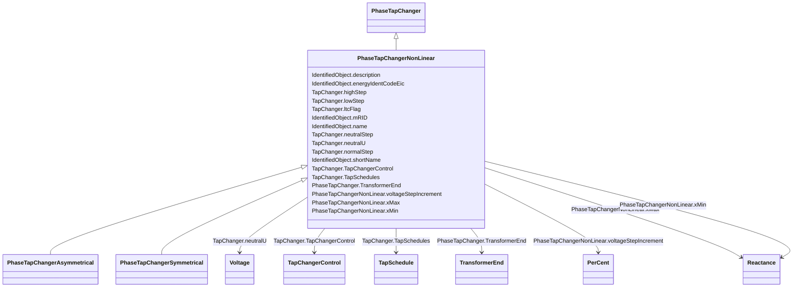

# PhaseTapChangerNonLinear

_The non-linear phase tap changer describes the non-linear behaviour of a phase tap changer. This is a base class for the symmetrical and asymmetrical phase tap changer models. The details of these models can be found in IEC 61970-301._

**URI**: [cim:PhaseTapChangerNonLinear](http://iec.ch/TC57/CIM100#PhaseTapChangerNonLinear) 
**Type**: Class

## Inheritance
* [IdentifiedObject](IdentifiedObject.md)
    * [PowerSystemResource](PowerSystemResource.md)
        * [TapChanger](TapChanger.md)
            * [PhaseTapChanger](PhaseTapChanger.md)
                * **PhaseTapChangerNonLinear**
                    * [PhaseTapChangerAsymmetrical](PhaseTapChangerAsymmetrical.md)
                    * [PhaseTapChangerSymmetrical](PhaseTapChangerSymmetrical.md)

## Attributes

| Name | URI | Cardinality and Range | Description | Inheritance |
| ---  | --- | --- | --- | --- |
| voltageStepIncrement | [cim:PhaseTapChangerNonLinear.voltageStepIncrement](http://iec.ch/TC57/CIM100#PhaseTapChangerNonLinear.voltageStepIncrement) | 1    [PerCent](PerCent.md)  | The voltage step increment on the out of phase winding (the PowerTransformerE... | direct |
| xMax | [cim:PhaseTapChangerNonLinear.xMax](http://iec.ch/TC57/CIM100#PhaseTapChangerNonLinear.xMax) | 1    [Reactance](Reactance.md)  | The reactance depends on the tap position according to a "u" shaped curve | direct |
| xMin | [cim:PhaseTapChangerNonLinear.xMin](http://iec.ch/TC57/CIM100#PhaseTapChangerNonLinear.xMin) | 1    [Reactance](Reactance.md)  | The reactance depend on the tap position according to a "u" shaped curve | direct |
| TransformerEnd | [cim:PhaseTapChanger.TransformerEnd](http://iec.ch/TC57/CIM100#PhaseTapChanger.TransformerEnd) | 1    [TransformerEnd](TransformerEnd.md)  | Transformer end to which this phase tap changer belongs | [PhaseTapChanger](PhaseTapChanger.md) |
| TapSchedules | [cim:TapChanger.TapSchedules](http://iec.ch/TC57/CIM100#TapChanger.TapSchedules) | *    [TapSchedule](TapSchedule.md)  | A TapChanger can have TapSchedules | [TapChanger](TapChanger.md) |
| highStep | [cim:TapChanger.highStep](http://iec.ch/TC57/CIM100#TapChanger.highStep) | 1    integer  | Highest possible tap step position, advance from neutral | [TapChanger](TapChanger.md) |
| lowStep | [cim:TapChanger.lowStep](http://iec.ch/TC57/CIM100#TapChanger.lowStep) | 1    integer  | Lowest possible tap step position, retard from neutral | [TapChanger](TapChanger.md) |
| ltcFlag | [cim:TapChanger.ltcFlag](http://iec.ch/TC57/CIM100#TapChanger.ltcFlag) | 1    boolean  | Specifies whether or not a TapChanger has load tap changing capabilities | [TapChanger](TapChanger.md) |
| neutralStep | [cim:TapChanger.neutralStep](http://iec.ch/TC57/CIM100#TapChanger.neutralStep) | 1    integer  | The neutral tap step position for this winding | [TapChanger](TapChanger.md) |
| neutralU | [cim:TapChanger.neutralU](http://iec.ch/TC57/CIM100#TapChanger.neutralU) | 1    [Voltage](Voltage.md)  | Voltage at which the winding operates at the neutral tap setting | [TapChanger](TapChanger.md) |
| normalStep | [cim:TapChanger.normalStep](http://iec.ch/TC57/CIM100#TapChanger.normalStep) | 1    integer  | The tap step position used in "normal" network operation for this winding | [TapChanger](TapChanger.md) |
| TapChangerControl | [cim:TapChanger.TapChangerControl](http://iec.ch/TC57/CIM100#TapChanger.TapChangerControl) | 0..1    [TapChangerControl](TapChangerControl.md)  | The regulating control scheme in which this tap changer participates | [TapChanger](TapChanger.md) |
| description | [cim:IdentifiedObject.description](http://iec.ch/TC57/CIM100#IdentifiedObject.description) | 0..1    string  | The description is a free human readable text describing or naming the object | [IdentifiedObject](IdentifiedObject.md) |
| energyIdentCodeEic | [eu:IdentifiedObject.energyIdentCodeEic](http://iec.ch/TC57/CIM100-European#IdentifiedObject.energyIdentCodeEic) | 0..1    string  | The attribute is used for an exchange of the EIC code (Energy identification ... | [IdentifiedObject](IdentifiedObject.md) |
| mRID | [cim:IdentifiedObject.mRID](http://iec.ch/TC57/CIM100#IdentifiedObject.mRID) | 1    string  | Master resource identifier issued by a model authority | [IdentifiedObject](IdentifiedObject.md) |
| name | [cim:IdentifiedObject.name](http://iec.ch/TC57/CIM100#IdentifiedObject.name) | 1    string  | The name is any free human readable and possibly non unique text naming the o... | [IdentifiedObject](IdentifiedObject.md) |
| shortName | [eu:IdentifiedObject.shortName](http://iec.ch/TC57/CIM100-European#IdentifiedObject.shortName) | 0..1    string  | The attribute is used for an exchange of a human readable short name with len... | [IdentifiedObject](IdentifiedObject.md) |

## Identifier and Mapping Information

### Schema Source

* from schema: http://iec.ch/TC57/ns/CIM/CoreEquipment-EU#Package_CoreEquipmentProfile

## Mappings

| Mapping Type | Mapped Value |
| ---  | ---  |
| self | cim:PhaseTapChangerNonLinear |
| native | this:PhaseTapChangerNonLinear |

