# PowerElectronicsConnection

_A connection to the AC network for energy production or consumption that uses power electronics rather than rotating machines._

**URI**: [cim:PowerElectronicsConnection](http://iec.ch/TC57/CIM100#PowerElectronicsConnection) 
**Type**: Class

```mermaid
 classDiagram
    class PowerElectronicsConnection
    click PowerElectronicsConnection href "../PowerElectronicsConnection"
      RegulatingCondEq <|-- PowerElectronicsConnection
        click RegulatingCondEq href "../RegulatingCondEq"
      
      PowerElectronicsConnection : Equipment.aggregate
        
      PowerElectronicsConnection : ConductingEquipment.BaseVoltage
        
          PowerElectronicsConnection --> BaseVoltage : ConductingEquipment.BaseVoltage
          click BaseVoltage href "../BaseVoltage"
        
      PowerElectronicsConnection : IdentifiedObject.description
        
      PowerElectronicsConnection : IdentifiedObject.energyIdentCodeEic
        
      PowerElectronicsConnection : Equipment.EquipmentContainer
        
          PowerElectronicsConnection --> EquipmentContainer : Equipment.EquipmentContainer
          click EquipmentContainer href "../EquipmentContainer"
        
      PowerElectronicsConnection : PowerElectronicsConnection.maxQ
        
          PowerElectronicsConnection --> ReactivePower : PowerElectronicsConnection.maxQ
          click ReactivePower href "../ReactivePower"
        
      PowerElectronicsConnection : PowerElectronicsConnection.minQ
        
          PowerElectronicsConnection --> ReactivePower : PowerElectronicsConnection.minQ
          click ReactivePower href "../ReactivePower"
        
      PowerElectronicsConnection : IdentifiedObject.mRID
        
      PowerElectronicsConnection : IdentifiedObject.name
        
      PowerElectronicsConnection : Equipment.normallyInService
        
      PowerElectronicsConnection : Equipment.OperationalLimitSet
        
          PowerElectronicsConnection --> OperationalLimitSet : Equipment.OperationalLimitSet
          click OperationalLimitSet href "../OperationalLimitSet"
        
      PowerElectronicsConnection : PowerElectronicsConnection.PowerElectronicsUnit
        
          PowerElectronicsConnection --> PowerElectronicsUnit : PowerElectronicsConnection.PowerElectronicsUnit
          click PowerElectronicsUnit href "../PowerElectronicsUnit"
        
      PowerElectronicsConnection : PowerElectronicsConnection.ratedS
        
          PowerElectronicsConnection --> ApparentPower : PowerElectronicsConnection.ratedS
          click ApparentPower href "../ApparentPower"
        
      PowerElectronicsConnection : PowerElectronicsConnection.ratedU
        
          PowerElectronicsConnection --> Voltage : PowerElectronicsConnection.ratedU
          click Voltage href "../Voltage"
        
      PowerElectronicsConnection : RegulatingCondEq.RegulatingControl
        
          PowerElectronicsConnection --> RegulatingControl : RegulatingCondEq.RegulatingControl
          click RegulatingControl href "../RegulatingControl"
        
      PowerElectronicsConnection : IdentifiedObject.shortName
        
      PowerElectronicsConnection : ConductingEquipment.Terminals
        
          PowerElectronicsConnection --> Terminal : ConductingEquipment.Terminals
          click Terminal href "../Terminal"
        
      
```

## Inheritance
* [IdentifiedObject](IdentifiedObject.md)
    * [PowerSystemResource](PowerSystemResource.md)
        * [Equipment](Equipment.md)
            * [ConductingEquipment](ConductingEquipment.md)
                * [EnergyConnection](EnergyConnection.md)
                    * [RegulatingCondEq](RegulatingCondEq.md)
                        * **PowerElectronicsConnection**

## Attributes

| Name | URI | Cardinality and Range | Description | Inheritance |
| ---  | --- | --- | --- | --- |
| maxQ | [cim:PowerElectronicsConnection.maxQ](http://iec.ch/TC57/CIM100#PowerElectronicsConnection.maxQ) | 0..1    [ReactivePower](ReactivePower.md)  | Maximum reactive power limit | direct |
| minQ | [cim:PowerElectronicsConnection.minQ](http://iec.ch/TC57/CIM100#PowerElectronicsConnection.minQ) | 0..1    [ReactivePower](ReactivePower.md)  | Minimum reactive power limit for the unit | direct |
| ratedS | [cim:PowerElectronicsConnection.ratedS](http://iec.ch/TC57/CIM100#PowerElectronicsConnection.ratedS) | 0..1    [ApparentPower](ApparentPower.md)  | Nameplate apparent power rating for the unit | direct |
| ratedU | [cim:PowerElectronicsConnection.ratedU](http://iec.ch/TC57/CIM100#PowerElectronicsConnection.ratedU) | 0..1    [Voltage](Voltage.md)  | Rated voltage (nameplate data, Ur in IEC 60909-0) | direct |
| PowerElectronicsUnit | [cim:PowerElectronicsConnection.PowerElectronicsUnit](http://iec.ch/TC57/CIM100#PowerElectronicsConnection.PowerElectronicsUnit) | 0..1    [PowerElectronicsUnit](PowerElectronicsUnit.md)  | An AC network connection may have several power electronics units connecting ... | direct |
| RegulatingControl | [cim:RegulatingCondEq.RegulatingControl](http://iec.ch/TC57/CIM100#RegulatingCondEq.RegulatingControl) | 0..1    [RegulatingControl](RegulatingControl.md)  | The regulating control scheme in which this equipment participates | [RegulatingCondEq](RegulatingCondEq.md) |
| BaseVoltage | [cim:ConductingEquipment.BaseVoltage](http://iec.ch/TC57/CIM100#ConductingEquipment.BaseVoltage) | 0..1    [BaseVoltage](BaseVoltage.md)  | Base voltage of this conducting equipment | [ConductingEquipment](ConductingEquipment.md) |
| Terminals | [cim:ConductingEquipment.Terminals](http://iec.ch/TC57/CIM100#ConductingEquipment.Terminals) | *    [Terminal](Terminal.md)  | Conducting equipment have terminals that may be connected to other conducting... | [ConductingEquipment](ConductingEquipment.md) |
| aggregate | [cim:Equipment.aggregate](http://iec.ch/TC57/CIM100#Equipment.aggregate) | 0..1    boolean  | The aggregate flag provides an alternative way of representing an aggregated ... | [Equipment](Equipment.md) |
| normallyInService | [cim:Equipment.normallyInService](http://iec.ch/TC57/CIM100#Equipment.normallyInService) | 0..1    boolean  | Specifies the availability of the equipment under normal operating conditions | [Equipment](Equipment.md) |
| EquipmentContainer | [cim:Equipment.EquipmentContainer](http://iec.ch/TC57/CIM100#Equipment.EquipmentContainer) | 0..1    [EquipmentContainer](EquipmentContainer.md)  | Container of this equipment | [Equipment](Equipment.md) |
| OperationalLimitSet | [cim:Equipment.OperationalLimitSet](http://iec.ch/TC57/CIM100#Equipment.OperationalLimitSet) | *    [OperationalLimitSet](OperationalLimitSet.md)  | The operational limit sets associated with this equipment | [Equipment](Equipment.md) |
| description | [cim:IdentifiedObject.description](http://iec.ch/TC57/CIM100#IdentifiedObject.description) | 0..1    string  | The description is a free human readable text describing or naming the object | [IdentifiedObject](IdentifiedObject.md) |
| energyIdentCodeEic | [eu:IdentifiedObject.energyIdentCodeEic](http://iec.ch/TC57/CIM100-European#IdentifiedObject.energyIdentCodeEic) | 0..1    string  | The attribute is used for an exchange of the EIC code (Energy identification ... | [IdentifiedObject](IdentifiedObject.md) |
| mRID | [cim:IdentifiedObject.mRID](http://iec.ch/TC57/CIM100#IdentifiedObject.mRID) | 1    string  | Master resource identifier issued by a model authority | [IdentifiedObject](IdentifiedObject.md) |
| name | [cim:IdentifiedObject.name](http://iec.ch/TC57/CIM100#IdentifiedObject.name) | 1    string  | The name is any free human readable and possibly non unique text naming the o... | [IdentifiedObject](IdentifiedObject.md) |
| shortName | [eu:IdentifiedObject.shortName](http://iec.ch/TC57/CIM100-European#IdentifiedObject.shortName) | 0..1    string  | The attribute is used for an exchange of a human readable short name with len... | [IdentifiedObject](IdentifiedObject.md) |

## Usages

| used by | used in | type | used |
| ---  | --- | --- | --- |
| [BatteryUnit](BatteryUnit.md) | PowerElectronicsConnection | range | [PowerElectronicsConnection](PowerElectronicsConnection.md) |
| [PhotoVoltaicUnit](PhotoVoltaicUnit.md) | PowerElectronicsConnection | range | [PowerElectronicsConnection](PowerElectronicsConnection.md) |
| [PowerElectronicsUnit](PowerElectronicsUnit.md) | PowerElectronicsConnection | range | [PowerElectronicsConnection](PowerElectronicsConnection.md) |
| [PowerElectronicsWindUnit](PowerElectronicsWindUnit.md) | PowerElectronicsConnection | range | [PowerElectronicsConnection](PowerElectronicsConnection.md) |

## Identifier and Mapping Information

### Schema Source

* from schema: http://iec.ch/TC57/ns/CIM/CoreEquipment-EU#Package_CoreEquipmentProfile

## Mappings

| Mapping Type | Mapped Value |
| ---  | ---  |
| self | cim:PowerElectronicsConnection |
| native | this:PowerElectronicsConnection |

