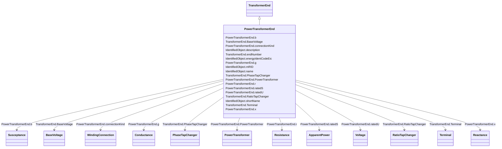

# PowerTransformerEnd

_A PowerTransformerEnd is associated with each Terminal of a PowerTransformer._

_The impedance values r, r0, x, and x0 of a PowerTransformerEnd represents a star equivalent as follows._

_1) for a two Terminal PowerTransformer the high voltage (TransformerEnd.endNumber=1) PowerTransformerEnd has non zero values on r, r0, x, and x0 while the low voltage (TransformerEnd.endNumber=2) PowerTransformerEnd has zero values for r, r0, x, and x0.  Parameters are always provided, even if the PowerTransformerEnds have the same rated voltage.  In this case, the parameters are provided at the PowerTransformerEnd which has TransformerEnd.endNumber equal to 1._

_2) for a three Terminal PowerTransformer the three PowerTransformerEnds represent a star equivalent with each leg in the star represented by r, r0, x, and x0 values._

_3) For a three Terminal transformer each PowerTransformerEnd shall have g, g0, b and b0 values corresponding to the no load losses distributed on the three PowerTransformerEnds. The total no load loss shunt impedances may also be placed at one of the PowerTransformerEnds, preferably the end numbered 1, having the shunt values on end 1.  This is the preferred way._

_4) for a PowerTransformer with more than three Terminals the PowerTransformerEnd impedance values cannot be used. Instead use the TransformerMeshImpedance or split the transformer into multiple PowerTransformers._

_Each PowerTransformerEnd must be contained by a PowerTransformer. Because a PowerTransformerEnd (or any other object) can not be contained by more than one parent, a PowerTransformerEnd can not have an association to an EquipmentContainer (Substation, VoltageLevel, etc)._

**URI**: [cim:PowerTransformerEnd](http://iec.ch/TC57/CIM100#PowerTransformerEnd) 
**Type**: Class

## Inheritance
* [IdentifiedObject](IdentifiedObject.md)
    * [TransformerEnd](TransformerEnd.md)
        * **PowerTransformerEnd**

## Attributes

| Name | URI | Cardinality and Range | Description | Inheritance |
| ---  | --- | --- | --- | --- |
| PowerTransformer | [cim:PowerTransformerEnd.PowerTransformer](http://iec.ch/TC57/CIM100#PowerTransformerEnd.PowerTransformer) | 1..1    [PowerTransformer](PowerTransformer.md)  | The power transformer of this power transformer end | direct |
| b | [cim:PowerTransformerEnd.b](http://iec.ch/TC57/CIM100#PowerTransformerEnd.b) | 1..1    [Susceptance](Susceptance.md)  | Magnetizing branch susceptance (B mag) | direct |
| connectionKind | [cim:PowerTransformerEnd.connectionKind](http://iec.ch/TC57/CIM100#PowerTransformerEnd.connectionKind) | 0..1    [WindingConnection](WindingConnection.md)  | Kind of connection | direct |
| ratedS | [cim:PowerTransformerEnd.ratedS](http://iec.ch/TC57/CIM100#PowerTransformerEnd.ratedS) | 0..1    [ApparentPower](ApparentPower.md)  | Normal apparent power rating | direct |
| g | [cim:PowerTransformerEnd.g](http://iec.ch/TC57/CIM100#PowerTransformerEnd.g) | 0..1    [Conductance](Conductance.md)  | Magnetizing branch conductance | direct |
| ratedU | [cim:PowerTransformerEnd.ratedU](http://iec.ch/TC57/CIM100#PowerTransformerEnd.ratedU) | 1..1    [Voltage](Voltage.md)  | Rated voltage: phase-phase for three-phase windings, and either phase-phase o... | direct |
| r | [cim:PowerTransformerEnd.r](http://iec.ch/TC57/CIM100#PowerTransformerEnd.r) | 1..1    [Resistance](Resistance.md)  | Resistance (star-model) of the transformer end | direct |
| x | [cim:PowerTransformerEnd.x](http://iec.ch/TC57/CIM100#PowerTransformerEnd.x) | 1..1    [Reactance](Reactance.md)  | Positive sequence series reactance (star-model) of the transformer end | direct |
| BaseVoltage | [cim:TransformerEnd.BaseVoltage](http://iec.ch/TC57/CIM100#TransformerEnd.BaseVoltage) | 1..1    [BaseVoltage](BaseVoltage.md)  | Base voltage of the transformer end | [TransformerEnd](TransformerEnd.md) |
| PhaseTapChanger | [cim:TransformerEnd.PhaseTapChanger](http://iec.ch/TC57/CIM100#TransformerEnd.PhaseTapChanger) | 0..1    [PhaseTapChanger](PhaseTapChanger.md)  | Phase tap changer associated with this transformer end | [TransformerEnd](TransformerEnd.md) |
| RatioTapChanger | [cim:TransformerEnd.RatioTapChanger](http://iec.ch/TC57/CIM100#TransformerEnd.RatioTapChanger) | 0..1    [RatioTapChanger](RatioTapChanger.md)  | Ratio tap changer associated with this transformer end | [TransformerEnd](TransformerEnd.md) |
| Terminal | [cim:TransformerEnd.Terminal](http://iec.ch/TC57/CIM100#TransformerEnd.Terminal) | 1..1    [Terminal](Terminal.md)  | Terminal of the power transformer to which this transformer end belongs | [TransformerEnd](TransformerEnd.md) |
| endNumber | [cim:TransformerEnd.endNumber](http://iec.ch/TC57/CIM100#TransformerEnd.endNumber) | 1..1    integer  | Number for this transformer end, corresponding to the end's order in the powe... | [TransformerEnd](TransformerEnd.md) |
| description | [cim:IdentifiedObject.description](http://iec.ch/TC57/CIM100#IdentifiedObject.description) | 0..1    string  | The description is a free human readable text describing or naming the object | [IdentifiedObject](IdentifiedObject.md) |
| energyIdentCodeEic | [eu:IdentifiedObject.energyIdentCodeEic](http://iec.ch/TC57/CIM100-European#IdentifiedObject.energyIdentCodeEic) | 0..1    string  | The attribute is used for an exchange of the EIC code (Energy identification ... | [IdentifiedObject](IdentifiedObject.md) |
| mRID | [cim:IdentifiedObject.mRID](http://iec.ch/TC57/CIM100#IdentifiedObject.mRID) | 1..1    string  | Master resource identifier issued by a model authority | [IdentifiedObject](IdentifiedObject.md) |
| name | [cim:IdentifiedObject.name](http://iec.ch/TC57/CIM100#IdentifiedObject.name) | 1..1    string  | The name is any free human readable and possibly non unique text naming the o... | [IdentifiedObject](IdentifiedObject.md) |
| shortName | [eu:IdentifiedObject.shortName](http://iec.ch/TC57/CIM100-European#IdentifiedObject.shortName) | 0..1    string  | The attribute is used for an exchange of a human readable short name with len... | [IdentifiedObject](IdentifiedObject.md) |

## Usages

| used by | used in | type | used |
| ---  | --- | --- | --- |
| [PowerTransformer](PowerTransformer.md) | PowerTransformerEnd | range | [PowerTransformerEnd](PowerTransformerEnd.md) |

## Identifier and Mapping Information

### Schema Source

* from schema: http://iec.ch/TC57/ns/CIM/CoreEquipment-EU#Package_CoreEquipmentProfile

## Mappings

| Mapping Type | Mapped Value |
| ---  | ---  |
| self | cim:PowerTransformerEnd |
| native | this:PowerTransformerEnd |

