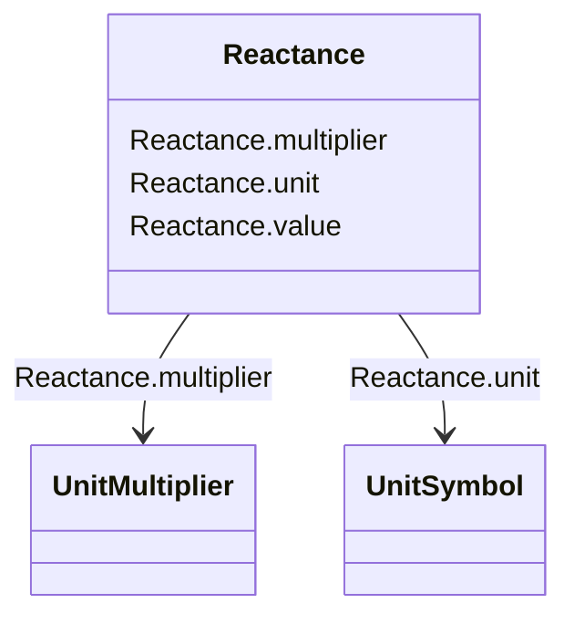

# Reactance

_Reactance (imaginary part of impedance), at rated frequency._

**URI**: [cim:Reactance](http://iec.ch/TC57/CIM100#Reactance) 
**Type**: Class

<!-- no inheritance hierarchy -->

## Attributes

| Name | URI | Cardinality and Range | Description | Inheritance |
| ---  | --- | --- | --- | --- |
| value | [cim:Reactance.value](http://iec.ch/TC57/CIM100#Reactance.value) | 0..1    float  |  | direct |
| unit | [cim:Reactance.unit](http://iec.ch/TC57/CIM100#Reactance.unit) | 0..1    [UnitSymbol](UnitSymbol.md)  |  | direct |
| multiplier | [cim:Reactance.multiplier](http://iec.ch/TC57/CIM100#Reactance.multiplier) | 0..1    [UnitMultiplier](UnitMultiplier.md)  |  | direct |

## Usages

| used by | used in | type | used |
| ---  | --- | --- | --- |
| [ACLineSegment](ACLineSegment.md) | x | range | [Reactance](Reactance.md) |
| [EquivalentBranch](EquivalentBranch.md) | x | range | [Reactance](Reactance.md) |
| [EquivalentBranch](EquivalentBranch.md) | x21 | range | [Reactance](Reactance.md) |
| [PhaseTapChangerAsymmetrical](PhaseTapChangerAsymmetrical.md) | xMax | range | [Reactance](Reactance.md) |
| [PhaseTapChangerAsymmetrical](PhaseTapChangerAsymmetrical.md) | xMin | range | [Reactance](Reactance.md) |
| [PhaseTapChangerLinear](PhaseTapChangerLinear.md) | xMax | range | [Reactance](Reactance.md) |
| [PhaseTapChangerLinear](PhaseTapChangerLinear.md) | xMin | range | [Reactance](Reactance.md) |
| [PhaseTapChangerNonLinear](PhaseTapChangerNonLinear.md) | xMax | range | [Reactance](Reactance.md) |
| [PhaseTapChangerNonLinear](PhaseTapChangerNonLinear.md) | xMin | range | [Reactance](Reactance.md) |
| [PhaseTapChangerSymmetrical](PhaseTapChangerSymmetrical.md) | xMax | range | [Reactance](Reactance.md) |
| [PhaseTapChangerSymmetrical](PhaseTapChangerSymmetrical.md) | xMin | range | [Reactance](Reactance.md) |
| [PowerTransformerEnd](PowerTransformerEnd.md) | x | range | [Reactance](Reactance.md) |
| [SeriesCompensator](SeriesCompensator.md) | x | range | [Reactance](Reactance.md) |
| [StaticVarCompensator](StaticVarCompensator.md) | capacitiveRating | range | [Reactance](Reactance.md) |
| [StaticVarCompensator](StaticVarCompensator.md) | inductiveRating | range | [Reactance](Reactance.md) |

## Identifier and Mapping Information

### Schema Source

* from schema: http://iec.ch/TC57/ns/CIM/CoreEquipment-EU#Package_CoreEquipmentProfile

## Mappings

| Mapping Type | Mapped Value |
| ---  | ---  |
| self | cim:Reactance |
| native | this:Reactance |

