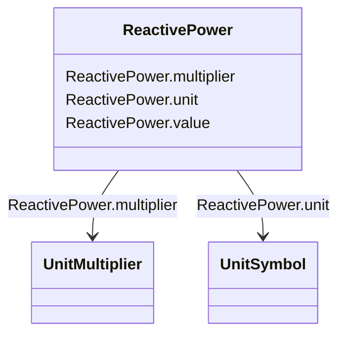

# ReactivePower

_Product of RMS value of the voltage and the RMS value of the quadrature component of the current._

**URI**: [cim:ReactivePower](http://iec.ch/TC57/CIM100#ReactivePower) 
**Type**: Class

<!-- no inheritance hierarchy -->

## Attributes

| Name | URI | Cardinality and Range | Description | Inheritance |
| ---  | --- | --- | --- | --- |
| value | [cim:ReactivePower.value](http://iec.ch/TC57/CIM100#ReactivePower.value) | 0..1    float  |  | direct |
| unit | [cim:ReactivePower.unit](http://iec.ch/TC57/CIM100#ReactivePower.unit) | 0..1    [UnitSymbol](UnitSymbol.md)  |  | direct |
| multiplier | [cim:ReactivePower.multiplier](http://iec.ch/TC57/CIM100#ReactivePower.multiplier) | 0..1    [UnitMultiplier](UnitMultiplier.md)  |  | direct |

## Usages

| used by | used in | type | used |
| ---  | --- | --- | --- |
| [ConformLoad](ConformLoad.md) | qfixed | range | [ReactivePower](ReactivePower.md) |
| [EnergyConsumer](EnergyConsumer.md) | qfixed | range | [ReactivePower](ReactivePower.md) |
| [EquivalentInjection](EquivalentInjection.md) | maxQ | range | [ReactivePower](ReactivePower.md) |
| [EquivalentInjection](EquivalentInjection.md) | minQ | range | [ReactivePower](ReactivePower.md) |
| [ExternalNetworkInjection](ExternalNetworkInjection.md) | maxQ | range | [ReactivePower](ReactivePower.md) |
| [ExternalNetworkInjection](ExternalNetworkInjection.md) | minQ | range | [ReactivePower](ReactivePower.md) |
| [NonConformLoad](NonConformLoad.md) | qfixed | range | [ReactivePower](ReactivePower.md) |
| [PowerElectronicsConnection](PowerElectronicsConnection.md) | maxQ | range | [ReactivePower](ReactivePower.md) |
| [PowerElectronicsConnection](PowerElectronicsConnection.md) | minQ | range | [ReactivePower](ReactivePower.md) |
| [StationSupply](StationSupply.md) | qfixed | range | [ReactivePower](ReactivePower.md) |
| [SynchronousMachine](SynchronousMachine.md) | maxQ | range | [ReactivePower](ReactivePower.md) |
| [SynchronousMachine](SynchronousMachine.md) | minQ | range | [ReactivePower](ReactivePower.md) |

## Identifier and Mapping Information

### Schema Source

* from schema: http://iec.ch/TC57/ns/CIM/CoreEquipment-EU#Package_CoreEquipmentProfile

## Mappings

| Mapping Type | Mapped Value |
| ---  | ---  |
| self | cim:ReactivePower |
| native | this:ReactivePower |

