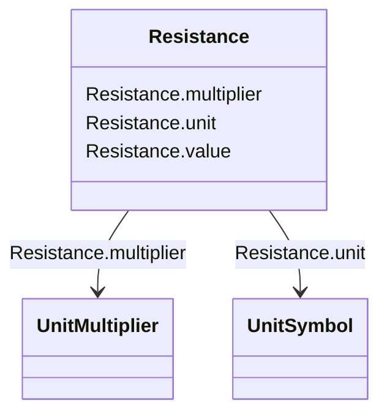

# Resistance

_Resistance (real part of impedance)._

**URI**: [cim:Resistance](http://iec.ch/TC57/CIM100#Resistance) 
**Type**: Class

<!-- no inheritance hierarchy -->

## Attributes

| Name | URI | Cardinality and Range | Description | Inheritance |
| ---  | --- | --- | --- | --- |
| value | [cim:Resistance.value](http://iec.ch/TC57/CIM100#Resistance.value) | 0..1    float  |  | direct |
| unit | [cim:Resistance.unit](http://iec.ch/TC57/CIM100#Resistance.unit) | 0..1    [UnitSymbol](UnitSymbol.md)  |  | direct |
| multiplier | [cim:Resistance.multiplier](http://iec.ch/TC57/CIM100#Resistance.multiplier) | 0..1    [UnitMultiplier](UnitMultiplier.md)  |  | direct |

## Usages

| used by | used in | type | used |
| ---  | --- | --- | --- |
| [ACDCConverter](ACDCConverter.md) | resistiveLoss | range | [Resistance](Resistance.md) |
| [ACLineSegment](ACLineSegment.md) | r | range | [Resistance](Resistance.md) |
| [CsConverter](CsConverter.md) | resistiveLoss | range | [Resistance](Resistance.md) |
| [DCGround](DCGround.md) | r | range | [Resistance](Resistance.md) |
| [DCLineSegment](DCLineSegment.md) | resistance | range | [Resistance](Resistance.md) |
| [DCSeriesDevice](DCSeriesDevice.md) | resistance | range | [Resistance](Resistance.md) |
| [DCShunt](DCShunt.md) | resistance | range | [Resistance](Resistance.md) |
| [EquivalentBranch](EquivalentBranch.md) | r | range | [Resistance](Resistance.md) |
| [EquivalentBranch](EquivalentBranch.md) | r21 | range | [Resistance](Resistance.md) |
| [PowerTransformerEnd](PowerTransformerEnd.md) | r | range | [Resistance](Resistance.md) |
| [SeriesCompensator](SeriesCompensator.md) | r | range | [Resistance](Resistance.md) |
| [VsConverter](VsConverter.md) | resistiveLoss | range | [Resistance](Resistance.md) |

## Identifier and Mapping Information

### Schema Source

* from schema: http://iec.ch/TC57/ns/CIM/CoreEquipment-EU#Package_CoreEquipmentProfile

## Mappings

| Mapping Type | Mapped Value |
| ---  | ---  |
| self | cim:Resistance |
| native | this:Resistance |

