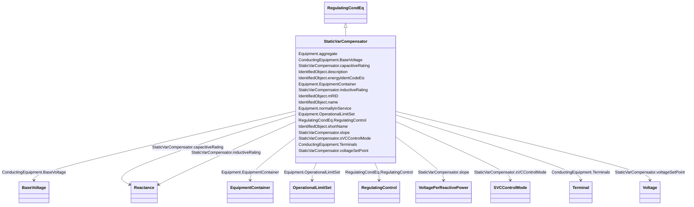

# StaticVarCompensator

_A facility for providing variable and controllable shunt reactive power. The SVC typically consists of a stepdown transformer, filter, thyristor-controlled reactor, and thyristor-switched capacitor arms._

__

_The SVC may operate in fixed MVar output mode or in voltage control mode. When in voltage control mode, the output of the SVC will be proportional to the deviation of voltage at the controlled bus from the voltage setpoint.  The SVC characteristic slope defines the proportion.  If the voltage at the controlled bus is equal to the voltage setpoint, the SVC MVar output is zero._

**URI**: [cim:StaticVarCompensator](http://iec.ch/TC57/CIM100#StaticVarCompensator) 
**Type**: Class

## Inheritance
* [IdentifiedObject](IdentifiedObject.md)
    * [PowerSystemResource](PowerSystemResource.md)
        * [Equipment](Equipment.md)
            * [ConductingEquipment](ConductingEquipment.md)
                * [EnergyConnection](EnergyConnection.md)
                    * [RegulatingCondEq](RegulatingCondEq.md)
                        * **StaticVarCompensator**

## Attributes

| Name | URI | Cardinality and Range | Description | Inheritance |
| ---  | --- | --- | --- | --- |
| capacitiveRating | [cim:StaticVarCompensator.capacitiveRating](http://iec.ch/TC57/CIM100#StaticVarCompensator.capacitiveRating) | 1    [Reactance](Reactance.md)  | Capacitive reactance at maximum capacitive reactive power | direct |
| inductiveRating | [cim:StaticVarCompensator.inductiveRating](http://iec.ch/TC57/CIM100#StaticVarCompensator.inductiveRating) | 1    [Reactance](Reactance.md)  | Inductive reactance at maximum inductive reactive power | direct |
| slope | [cim:StaticVarCompensator.slope](http://iec.ch/TC57/CIM100#StaticVarCompensator.slope) | 1    [VoltagePerReactivePower](VoltagePerReactivePower.md)  | The characteristics slope of an SVC defines how the reactive power output cha... | direct |
| sVCControlMode | [cim:StaticVarCompensator.sVCControlMode](http://iec.ch/TC57/CIM100#StaticVarCompensator.sVCControlMode) | 0..1    [SVCControlMode](SVCControlMode.md)  | SVC control mode | direct |
| voltageSetPoint | [cim:StaticVarCompensator.voltageSetPoint](http://iec.ch/TC57/CIM100#StaticVarCompensator.voltageSetPoint) | 0..1    [Voltage](Voltage.md)  | The reactive power output of the SVC is proportional to the difference betwee... | direct |
| RegulatingControl | [cim:RegulatingCondEq.RegulatingControl](http://iec.ch/TC57/CIM100#RegulatingCondEq.RegulatingControl) | 0..1    [RegulatingControl](RegulatingControl.md)  | The regulating control scheme in which this equipment participates | [RegulatingCondEq](RegulatingCondEq.md) |
| BaseVoltage | [cim:ConductingEquipment.BaseVoltage](http://iec.ch/TC57/CIM100#ConductingEquipment.BaseVoltage) | 0..1    [BaseVoltage](BaseVoltage.md)  | Base voltage of this conducting equipment | [ConductingEquipment](ConductingEquipment.md) |
| Terminals | [cim:ConductingEquipment.Terminals](http://iec.ch/TC57/CIM100#ConductingEquipment.Terminals) | *    [Terminal](Terminal.md)  | Conducting equipment have terminals that may be connected to other conducting... | [ConductingEquipment](ConductingEquipment.md) |
| aggregate | [cim:Equipment.aggregate](http://iec.ch/TC57/CIM100#Equipment.aggregate) | 0..1    boolean  | The aggregate flag provides an alternative way of representing an aggregated ... | [Equipment](Equipment.md) |
| normallyInService | [cim:Equipment.normallyInService](http://iec.ch/TC57/CIM100#Equipment.normallyInService) | 0..1    boolean  | Specifies the availability of the equipment under normal operating conditions | [Equipment](Equipment.md) |
| EquipmentContainer | [cim:Equipment.EquipmentContainer](http://iec.ch/TC57/CIM100#Equipment.EquipmentContainer) | 0..1    [EquipmentContainer](EquipmentContainer.md)  | Container of this equipment | [Equipment](Equipment.md) |
| OperationalLimitSet | [cim:Equipment.OperationalLimitSet](http://iec.ch/TC57/CIM100#Equipment.OperationalLimitSet) | *    [OperationalLimitSet](OperationalLimitSet.md)  | The operational limit sets associated with this equipment | [Equipment](Equipment.md) |
| description | [cim:IdentifiedObject.description](http://iec.ch/TC57/CIM100#IdentifiedObject.description) | 0..1    string  | The description is a free human readable text describing or naming the object | [IdentifiedObject](IdentifiedObject.md) |
| energyIdentCodeEic | [eu:IdentifiedObject.energyIdentCodeEic](http://iec.ch/TC57/CIM100-European#IdentifiedObject.energyIdentCodeEic) | 0..1    string  | The attribute is used for an exchange of the EIC code (Energy identification ... | [IdentifiedObject](IdentifiedObject.md) |
| mRID | [cim:IdentifiedObject.mRID](http://iec.ch/TC57/CIM100#IdentifiedObject.mRID) | 1    string  | Master resource identifier issued by a model authority | [IdentifiedObject](IdentifiedObject.md) |
| name | [cim:IdentifiedObject.name](http://iec.ch/TC57/CIM100#IdentifiedObject.name) | 1    string  | The name is any free human readable and possibly non unique text naming the o... | [IdentifiedObject](IdentifiedObject.md) |
| shortName | [eu:IdentifiedObject.shortName](http://iec.ch/TC57/CIM100-European#IdentifiedObject.shortName) | 0..1    string  | The attribute is used for an exchange of a human readable short name with len... | [IdentifiedObject](IdentifiedObject.md) |

## Identifier and Mapping Information

### Schema Source

* from schema: http://iec.ch/TC57/ns/CIM/CoreEquipment-EU#Package_CoreEquipmentProfile

## Mappings

| Mapping Type | Mapped Value |
| ---  | ---  |
| self | cim:StaticVarCompensator |
| native | this:StaticVarCompensator |

