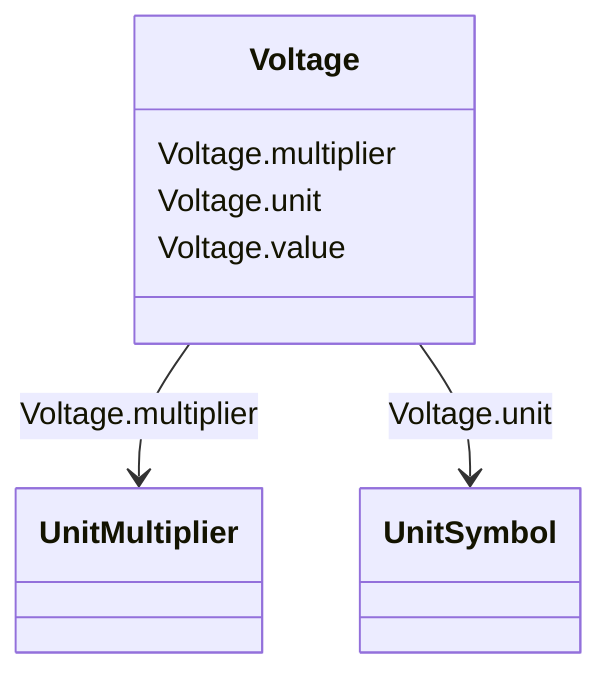

# Voltage

_Electrical voltage, can be both AC and DC._

**URI**: [cim:Voltage](http://iec.ch/TC57/CIM100#Voltage) 
**Type**: Class

<!-- no inheritance hierarchy -->

## Attributes

| Name | URI | Cardinality and Range | Description | Inheritance |
| ---  | --- | --- | --- | --- |
| value | [cim:Voltage.value](http://iec.ch/TC57/CIM100#Voltage.value) | 0..1    float  |  | direct |
| multiplier | [cim:Voltage.multiplier](http://iec.ch/TC57/CIM100#Voltage.multiplier) | 0..1    [UnitMultiplier](UnitMultiplier.md)  |  | direct |
| unit | [cim:Voltage.unit](http://iec.ch/TC57/CIM100#Voltage.unit) | 0..1    [UnitSymbol](UnitSymbol.md)  |  | direct |

## Usages

| used by | used in | type | used |
| ---  | --- | --- | --- |
| [ACDCConverter](ACDCConverter.md) | maxUdc | range | [Voltage](Voltage.md) |
| [ACDCConverter](ACDCConverter.md) | minUdc | range | [Voltage](Voltage.md) |
| [ACDCConverter](ACDCConverter.md) | ratedUdc | range | [Voltage](Voltage.md) |
| [ACDCConverter](ACDCConverter.md) | valveU0 | range | [Voltage](Voltage.md) |
| [AsynchronousMachine](AsynchronousMachine.md) | ratedU | range | [Voltage](Voltage.md) |
| [BaseVoltage](BaseVoltage.md) | nominalVoltage | range | [Voltage](Voltage.md) |
| [CsConverter](CsConverter.md) | maxUdc | range | [Voltage](Voltage.md) |
| [CsConverter](CsConverter.md) | minUdc | range | [Voltage](Voltage.md) |
| [CsConverter](CsConverter.md) | ratedUdc | range | [Voltage](Voltage.md) |
| [CsConverter](CsConverter.md) | valveU0 | range | [Voltage](Voltage.md) |
| [DCBreaker](DCBreaker.md) | ratedUdc | range | [Voltage](Voltage.md) |
| [DCBusbar](DCBusbar.md) | ratedUdc | range | [Voltage](Voltage.md) |
| [DCChopper](DCChopper.md) | ratedUdc | range | [Voltage](Voltage.md) |
| [DCConductingEquipment](DCConductingEquipment.md) | ratedUdc | range | [Voltage](Voltage.md) |
| [DCDisconnector](DCDisconnector.md) | ratedUdc | range | [Voltage](Voltage.md) |
| [DCGround](DCGround.md) | ratedUdc | range | [Voltage](Voltage.md) |
| [DCLineSegment](DCLineSegment.md) | ratedUdc | range | [Voltage](Voltage.md) |
| [DCSeriesDevice](DCSeriesDevice.md) | ratedUdc | range | [Voltage](Voltage.md) |
| [DCShunt](DCShunt.md) | ratedUdc | range | [Voltage](Voltage.md) |
| [DCSwitch](DCSwitch.md) | ratedUdc | range | [Voltage](Voltage.md) |
| [EnergySource](EnergySource.md) | nominalVoltage | range | [Voltage](Voltage.md) |
| [LinearShuntCompensator](LinearShuntCompensator.md) | nomU | range | [Voltage](Voltage.md) |
| [NonlinearShuntCompensator](NonlinearShuntCompensator.md) | nomU | range | [Voltage](Voltage.md) |
| [PhaseTapChanger](PhaseTapChanger.md) | neutralU | range | [Voltage](Voltage.md) |
| [PhaseTapChangerAsymmetrical](PhaseTapChangerAsymmetrical.md) | neutralU | range | [Voltage](Voltage.md) |
| [PhaseTapChangerLinear](PhaseTapChangerLinear.md) | neutralU | range | [Voltage](Voltage.md) |
| [PhaseTapChangerNonLinear](PhaseTapChangerNonLinear.md) | neutralU | range | [Voltage](Voltage.md) |
| [PhaseTapChangerSymmetrical](PhaseTapChangerSymmetrical.md) | neutralU | range | [Voltage](Voltage.md) |
| [PhaseTapChangerTabular](PhaseTapChangerTabular.md) | neutralU | range | [Voltage](Voltage.md) |
| [PowerElectronicsConnection](PowerElectronicsConnection.md) | ratedU | range | [Voltage](Voltage.md) |
| [PowerTransformerEnd](PowerTransformerEnd.md) | ratedU | range | [Voltage](Voltage.md) |
| [RatioTapChanger](RatioTapChanger.md) | neutralU | range | [Voltage](Voltage.md) |
| [RotatingMachine](RotatingMachine.md) | ratedU | range | [Voltage](Voltage.md) |
| [ShuntCompensator](ShuntCompensator.md) | nomU | range | [Voltage](Voltage.md) |
| [StaticVarCompensator](StaticVarCompensator.md) | voltageSetPoint | range | [Voltage](Voltage.md) |
| [SynchronousMachine](SynchronousMachine.md) | ratedU | range | [Voltage](Voltage.md) |
| [TapChanger](TapChanger.md) | neutralU | range | [Voltage](Voltage.md) |
| [VoltageLevel](VoltageLevel.md) | highVoltageLimit | range | [Voltage](Voltage.md) |
| [VoltageLevel](VoltageLevel.md) | lowVoltageLimit | range | [Voltage](Voltage.md) |
| [VoltageLimit](VoltageLimit.md) | normalValue | range | [Voltage](Voltage.md) |
| [VsConverter](VsConverter.md) | maxUdc | range | [Voltage](Voltage.md) |
| [VsConverter](VsConverter.md) | minUdc | range | [Voltage](Voltage.md) |
| [VsConverter](VsConverter.md) | ratedUdc | range | [Voltage](Voltage.md) |
| [VsConverter](VsConverter.md) | valveU0 | range | [Voltage](Voltage.md) |

## Identifier and Mapping Information

### Schema Source

* from schema: http://iec.ch/TC57/ns/CIM/CoreEquipment-EU#Package_CoreEquipmentProfile

## Mappings

| Mapping Type | Mapped Value |
| ---  | ---  |
| self | cim:Voltage |
| native | this:Voltage |

