# VsConverter

_DC side of the voltage source converter (VSC)._

**URI**: [cim:VsConverter](http://iec.ch/TC57/CIM100#VsConverter) 
**Type**: Class

```mermaid
 classDiagram
    class VsConverter
    click VsConverter href "../VsConverter"
      ACDCConverter <|-- VsConverter
        click ACDCConverter href "../ACDCConverter"
      
      VsConverter : Equipment.aggregate
        
      VsConverter : ACDCConverter.baseS
        
          VsConverter --> ApparentPower : ACDCConverter.baseS
          click ApparentPower href "../ApparentPower"
        
      VsConverter : ConductingEquipment.BaseVoltage
        
          VsConverter --> BaseVoltage : ConductingEquipment.BaseVoltage
          click BaseVoltage href "../BaseVoltage"
        
      VsConverter : VsConverter.CapabilityCurve
        
          VsConverter --> VsCapabilityCurve : VsConverter.CapabilityCurve
          click VsCapabilityCurve href "../VsCapabilityCurve"
        
      VsConverter : ACDCConverter.DCTerminals
        
          VsConverter --> ACDCConverterDCTerminal : ACDCConverter.DCTerminals
          click ACDCConverterDCTerminal href "../ACDCConverterDCTerminal"
        
      VsConverter : IdentifiedObject.description
        
      VsConverter : IdentifiedObject.energyIdentCodeEic
        
      VsConverter : Equipment.EquipmentContainer
        
          VsConverter --> EquipmentContainer : Equipment.EquipmentContainer
          click EquipmentContainer href "../EquipmentContainer"
        
      VsConverter : ACDCConverter.idleLoss
        
          VsConverter --> ActivePower : ACDCConverter.idleLoss
          click ActivePower href "../ActivePower"
        
      VsConverter : VsConverter.maxModulationIndex
        
      VsConverter : ACDCConverter.maxP
        
          VsConverter --> ActivePower : ACDCConverter.maxP
          click ActivePower href "../ActivePower"
        
      VsConverter : ACDCConverter.maxUdc
        
          VsConverter --> Voltage : ACDCConverter.maxUdc
          click Voltage href "../Voltage"
        
      VsConverter : ACDCConverter.minP
        
          VsConverter --> ActivePower : ACDCConverter.minP
          click ActivePower href "../ActivePower"
        
      VsConverter : ACDCConverter.minUdc
        
          VsConverter --> Voltage : ACDCConverter.minUdc
          click Voltage href "../Voltage"
        
      VsConverter : IdentifiedObject.mRID
        
      VsConverter : IdentifiedObject.name
        
      VsConverter : Equipment.normallyInService
        
      VsConverter : ACDCConverter.numberOfValves
        
      VsConverter : Equipment.OperationalLimitSet
        
          VsConverter --> OperationalLimitSet : Equipment.OperationalLimitSet
          click OperationalLimitSet href "../OperationalLimitSet"
        
      VsConverter : ACDCConverter.PccTerminal
        
          VsConverter --> Terminal : ACDCConverter.PccTerminal
          click Terminal href "../Terminal"
        
      VsConverter : ACDCConverter.ratedUdc
        
          VsConverter --> Voltage : ACDCConverter.ratedUdc
          click Voltage href "../Voltage"
        
      VsConverter : ACDCConverter.resistiveLoss
        
          VsConverter --> Resistance : ACDCConverter.resistiveLoss
          click Resistance href "../Resistance"
        
      VsConverter : IdentifiedObject.shortName
        
      VsConverter : ACDCConverter.switchingLoss
        
          VsConverter --> ActivePowerPerCurrentFlow : ACDCConverter.switchingLoss
          click ActivePowerPerCurrentFlow href "../ActivePowerPerCurrentFlow"
        
      VsConverter : ConductingEquipment.Terminals
        
          VsConverter --> Terminal : ConductingEquipment.Terminals
          click Terminal href "../Terminal"
        
      VsConverter : ACDCConverter.valveU0
        
          VsConverter --> Voltage : ACDCConverter.valveU0
          click Voltage href "../Voltage"
        
      
```

## Inheritance
* [IdentifiedObject](IdentifiedObject.md)
    * [PowerSystemResource](PowerSystemResource.md)
        * [Equipment](Equipment.md)
            * [ConductingEquipment](ConductingEquipment.md)
                * [ACDCConverter](ACDCConverter.md)
                    * **VsConverter**

## Attributes

| Name | URI | Cardinality and Range | Description | Inheritance |
| ---  | --- | --- | --- | --- |
| CapabilityCurve | [cim:VsConverter.CapabilityCurve](http://iec.ch/TC57/CIM100#VsConverter.CapabilityCurve) | 0..1    [VsCapabilityCurve](VsCapabilityCurve.md)  | Capability curve of this converter | direct |
| maxModulationIndex | [cim:VsConverter.maxModulationIndex](http://iec.ch/TC57/CIM100#VsConverter.maxModulationIndex) | 0..1    float  | The maximum quotient between the AC converter voltage (Uc) and DC voltage (Ud... | direct |
| baseS | [cim:ACDCConverter.baseS](http://iec.ch/TC57/CIM100#ACDCConverter.baseS) | 0..1    [ApparentPower](ApparentPower.md)  | Base apparent power of the converter pole | [ACDCConverter](ACDCConverter.md) |
| idleLoss | [cim:ACDCConverter.idleLoss](http://iec.ch/TC57/CIM100#ACDCConverter.idleLoss) | 0..1    [ActivePower](ActivePower.md)  | Active power loss in pole at no power transfer | [ACDCConverter](ACDCConverter.md) |
| maxUdc | [cim:ACDCConverter.maxUdc](http://iec.ch/TC57/CIM100#ACDCConverter.maxUdc) | 0..1    [Voltage](Voltage.md)  | The maximum voltage on the DC side at which the converter should operate | [ACDCConverter](ACDCConverter.md) |
| minUdc | [cim:ACDCConverter.minUdc](http://iec.ch/TC57/CIM100#ACDCConverter.minUdc) | 0..1    [Voltage](Voltage.md)  | The minimum voltage on the DC side at which the converter should operate | [ACDCConverter](ACDCConverter.md) |
| numberOfValves | [cim:ACDCConverter.numberOfValves](http://iec.ch/TC57/CIM100#ACDCConverter.numberOfValves) | 0..1    integer  | Number of valves in the converter | [ACDCConverter](ACDCConverter.md) |
| ratedUdc | [cim:ACDCConverter.ratedUdc](http://iec.ch/TC57/CIM100#ACDCConverter.ratedUdc) | 0..1    [Voltage](Voltage.md)  | Rated converter DC voltage, also called UdN | [ACDCConverter](ACDCConverter.md) |
| resistiveLoss | [cim:ACDCConverter.resistiveLoss](http://iec.ch/TC57/CIM100#ACDCConverter.resistiveLoss) | 0..1    [Resistance](Resistance.md)  | It is converter’s configuration data used in power flow | [ACDCConverter](ACDCConverter.md) |
| switchingLoss | [cim:ACDCConverter.switchingLoss](http://iec.ch/TC57/CIM100#ACDCConverter.switchingLoss) | 0..1    [ActivePowerPerCurrentFlow](ActivePowerPerCurrentFlow.md)  | Switching losses, relative to the base apparent power 'baseS' | [ACDCConverter](ACDCConverter.md) |
| valveU0 | [cim:ACDCConverter.valveU0](http://iec.ch/TC57/CIM100#ACDCConverter.valveU0) | 0..1    [Voltage](Voltage.md)  | Valve threshold voltage, also called Uvalve | [ACDCConverter](ACDCConverter.md) |
| maxP | [cim:ACDCConverter.maxP](http://iec.ch/TC57/CIM100#ACDCConverter.maxP) | 0..1    [ActivePower](ActivePower.md)  | Maximum active power limit | [ACDCConverter](ACDCConverter.md) |
| minP | [cim:ACDCConverter.minP](http://iec.ch/TC57/CIM100#ACDCConverter.minP) | 0..1    [ActivePower](ActivePower.md)  | Minimum active power limit | [ACDCConverter](ACDCConverter.md) |
| PccTerminal | [cim:ACDCConverter.PccTerminal](http://iec.ch/TC57/CIM100#ACDCConverter.PccTerminal) | 0..1    [Terminal](Terminal.md)  | Point of common coupling terminal for this converter DC side | [ACDCConverter](ACDCConverter.md) |
| DCTerminals | [cim:ACDCConverter.DCTerminals](http://iec.ch/TC57/CIM100#ACDCConverter.DCTerminals) | *    [ACDCConverterDCTerminal](ACDCConverterDCTerminal.md)  | A DC converter have DC converter terminals | [ACDCConverter](ACDCConverter.md) |
| BaseVoltage | [cim:ConductingEquipment.BaseVoltage](http://iec.ch/TC57/CIM100#ConductingEquipment.BaseVoltage) | 0..1    [BaseVoltage](BaseVoltage.md)  | Base voltage of this conducting equipment | [ConductingEquipment](ConductingEquipment.md) |
| Terminals | [cim:ConductingEquipment.Terminals](http://iec.ch/TC57/CIM100#ConductingEquipment.Terminals) | *    [Terminal](Terminal.md)  | Conducting equipment have terminals that may be connected to other conducting... | [ConductingEquipment](ConductingEquipment.md) |
| aggregate | [cim:Equipment.aggregate](http://iec.ch/TC57/CIM100#Equipment.aggregate) | 0..1    boolean  | The aggregate flag provides an alternative way of representing an aggregated ... | [Equipment](Equipment.md) |
| normallyInService | [cim:Equipment.normallyInService](http://iec.ch/TC57/CIM100#Equipment.normallyInService) | 0..1    boolean  | Specifies the availability of the equipment under normal operating conditions | [Equipment](Equipment.md) |
| EquipmentContainer | [cim:Equipment.EquipmentContainer](http://iec.ch/TC57/CIM100#Equipment.EquipmentContainer) | 0..1    [EquipmentContainer](EquipmentContainer.md)  | Container of this equipment | [Equipment](Equipment.md) |
| OperationalLimitSet | [cim:Equipment.OperationalLimitSet](http://iec.ch/TC57/CIM100#Equipment.OperationalLimitSet) | *    [OperationalLimitSet](OperationalLimitSet.md)  | The operational limit sets associated with this equipment | [Equipment](Equipment.md) |
| description | [cim:IdentifiedObject.description](http://iec.ch/TC57/CIM100#IdentifiedObject.description) | 0..1    string  | The description is a free human readable text describing or naming the object | [IdentifiedObject](IdentifiedObject.md) |
| energyIdentCodeEic | [eu:IdentifiedObject.energyIdentCodeEic](http://iec.ch/TC57/CIM100-European#IdentifiedObject.energyIdentCodeEic) | 0..1    string  | The attribute is used for an exchange of the EIC code (Energy identification ... | [IdentifiedObject](IdentifiedObject.md) |
| mRID | [cim:IdentifiedObject.mRID](http://iec.ch/TC57/CIM100#IdentifiedObject.mRID) | 1    string  | Master resource identifier issued by a model authority | [IdentifiedObject](IdentifiedObject.md) |
| name | [cim:IdentifiedObject.name](http://iec.ch/TC57/CIM100#IdentifiedObject.name) | 1    string  | The name is any free human readable and possibly non unique text naming the o... | [IdentifiedObject](IdentifiedObject.md) |
| shortName | [eu:IdentifiedObject.shortName](http://iec.ch/TC57/CIM100-European#IdentifiedObject.shortName) | 0..1    string  | The attribute is used for an exchange of a human readable short name with len... | [IdentifiedObject](IdentifiedObject.md) |

## Usages

| used by | used in | type | used |
| ---  | --- | --- | --- |
| [VsCapabilityCurve](VsCapabilityCurve.md) | VsConverterDCSides | range | [VsConverter](VsConverter.md) |

## Identifier and Mapping Information

### Schema Source

* from schema: http://iec.ch/TC57/ns/CIM/CoreEquipment-EU#Package_CoreEquipmentProfile

## Mappings

| Mapping Type | Mapped Value |
| ---  | ---  |
| self | cim:VsConverter |
| native | this:VsConverter |

