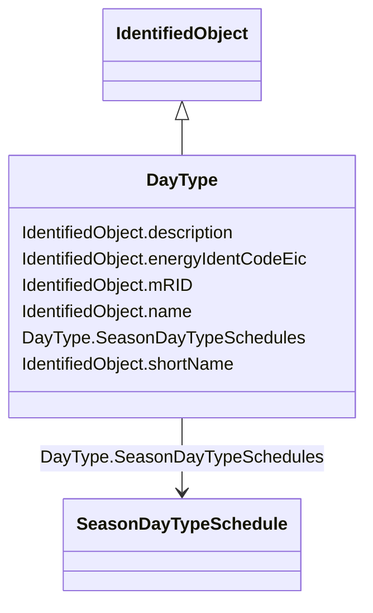

# DayType

_Group of similar days.   For example it could be used to represent weekdays, weekend, or holidays._

**URI**: [cim:DayType](http://iec.ch/TC57/CIM100#DayType) 
**Type**: Class

## Inheritance
* [IdentifiedObject](IdentifiedObject.md)
    * **DayType**

## Attributes

| Name | URI | Cardinality and Range | Description | Inheritance |
| ---  | --- | --- | --- | --- |
| SeasonDayTypeSchedules | [cim:DayType.SeasonDayTypeSchedules](http://iec.ch/TC57/CIM100#DayType.SeasonDayTypeSchedules) | 0..*    [SeasonDayTypeSchedule](SeasonDayTypeSchedule.md)  | Schedules that use this DayType | direct |
| description | [cim:IdentifiedObject.description](http://iec.ch/TC57/CIM100#IdentifiedObject.description) | 0..1    string  | The description is a free human readable text describing or naming the object | [IdentifiedObject](IdentifiedObject.md) |
| energyIdentCodeEic | [eu:IdentifiedObject.energyIdentCodeEic](http://iec.ch/TC57/CIM100-European#IdentifiedObject.energyIdentCodeEic) | 0..1    string  | The attribute is used for an exchange of the EIC code (Energy identification ... | [IdentifiedObject](IdentifiedObject.md) |
| mRID | [cim:IdentifiedObject.mRID](http://iec.ch/TC57/CIM100#IdentifiedObject.mRID) | 1..1    string  | Master resource identifier issued by a model authority | [IdentifiedObject](IdentifiedObject.md) |
| name | [cim:IdentifiedObject.name](http://iec.ch/TC57/CIM100#IdentifiedObject.name) | 1..1    string  | The name is any free human readable and possibly non unique text naming the o... | [IdentifiedObject](IdentifiedObject.md) |
| shortName | [eu:IdentifiedObject.shortName](http://iec.ch/TC57/CIM100-European#IdentifiedObject.shortName) | 0..1    string  | The attribute is used for an exchange of a human readable short name with len... | [IdentifiedObject](IdentifiedObject.md) |

## Usages

| used by | used in | type | used |
| ---  | --- | --- | --- |
| [ConformLoadSchedule](ConformLoadSchedule.md) | DayType | range | [DayType](DayType.md) |
| [RegulationSchedule](RegulationSchedule.md) | DayType | range | [DayType](DayType.md) |
| [TapSchedule](TapSchedule.md) | DayType | range | [DayType](DayType.md) |
| [NonConformLoadSchedule](NonConformLoadSchedule.md) | DayType | range | [DayType](DayType.md) |
| [SeasonDayTypeSchedule](SeasonDayTypeSchedule.md) | DayType | range | [DayType](DayType.md) |
| [SwitchSchedule](SwitchSchedule.md) | DayType | range | [DayType](DayType.md) |

## Identifier and Mapping Information

### Schema Source

* from schema: http://iec.ch/TC57/ns/CIM/CoreEquipment-EU#Package_CoreEquipmentProfile

## Mappings

| Mapping Type | Mapped Value |
| ---  | ---  |
| self | cim:DayType |
| native | this:DayType |

