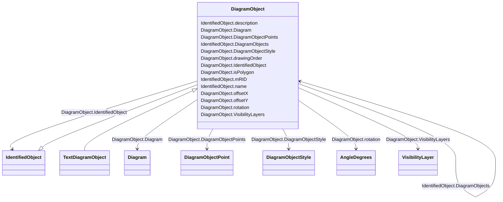

# DiagramObject

_An object that defines one or more points in a given space. This object can be associated with anything that specializes IdentifiedObject. For single line diagrams such objects typically include such items as analog values, breakers, disconnectors, power transformers, and transmission lines._

**URI**: [cim:DiagramObject](http://iec.ch/TC57/CIM100#DiagramObject) 
**Type**: Class

## Inheritance
* [IdentifiedObject](IdentifiedObject.md)
    * **DiagramObject**
        * [TextDiagramObject](TextDiagramObject.md)

## Attributes

| Name | URI | Cardinality and Range | Description | Inheritance |
| ---  | --- | --- | --- | --- |
| Diagram | [cim:DiagramObject.Diagram](http://iec.ch/TC57/CIM100#DiagramObject.Diagram) | 1    [Diagram](Diagram.md)  | A diagram object is part of a diagram | direct |
| drawingOrder | [cim:DiagramObject.drawingOrder](http://iec.ch/TC57/CIM100#DiagramObject.drawingOrder) | 0..1    integer  | The drawing order of this element | direct |
| isPolygon | [cim:DiagramObject.isPolygon](http://iec.ch/TC57/CIM100#DiagramObject.isPolygon) | 0..1    boolean  | Defines whether or not the diagram objects points define the boundaries of a ... | direct |
| offsetX | [cim:DiagramObject.offsetX](http://iec.ch/TC57/CIM100#DiagramObject.offsetX) | 0..1    float  | The offset in the X direction | direct |
| offsetY | [cim:DiagramObject.offsetY](http://iec.ch/TC57/CIM100#DiagramObject.offsetY) | 0..1    float  | The offset in the Y direction | direct |
| rotation | [cim:DiagramObject.rotation](http://iec.ch/TC57/CIM100#DiagramObject.rotation) | 0..1    [AngleDegrees](AngleDegrees.md)  | Sets the angle of rotation of the diagram object | direct |
| IdentifiedObject | [cim:DiagramObject.IdentifiedObject](http://iec.ch/TC57/CIM100#DiagramObject.IdentifiedObject) | 0..1    [IdentifiedObject](IdentifiedObject.md)  | The domain object to which this diagram object is associated | direct |
| DiagramObjectPoints | [cim:DiagramObject.DiagramObjectPoints](http://iec.ch/TC57/CIM100#DiagramObject.DiagramObjectPoints) | *    [DiagramObjectPoint](DiagramObjectPoint.md)  | A diagram object can have 0 or more points to reflect its layout position, ro... | direct |
| VisibilityLayers | [cim:DiagramObject.VisibilityLayers](http://iec.ch/TC57/CIM100#DiagramObject.VisibilityLayers) | *    [VisibilityLayer](VisibilityLayer.md)  | A diagram object can be part of multiple visibility layers | direct |
| DiagramObjectStyle | [cim:DiagramObject.DiagramObjectStyle](http://iec.ch/TC57/CIM100#DiagramObject.DiagramObjectStyle) | 0..1    [DiagramObjectStyle](DiagramObjectStyle.md)  | A diagram object has a style associated that provides a reference for the sty... | direct |
| DiagramObjects | [cim:IdentifiedObject.DiagramObjects](http://iec.ch/TC57/CIM100#IdentifiedObject.DiagramObjects) | *    [DiagramObject](DiagramObject.md)  | The diagram objects that are associated with the domain object | [IdentifiedObject](IdentifiedObject.md) |
| mRID | [cim:IdentifiedObject.mRID](http://iec.ch/TC57/CIM100#IdentifiedObject.mRID) | 1    string  | Master resource identifier issued by a model authority | [IdentifiedObject](IdentifiedObject.md) |
| name | [cim:IdentifiedObject.name](http://iec.ch/TC57/CIM100#IdentifiedObject.name) | 1    string  | The name is any free human readable and possibly non unique text naming the o... | [IdentifiedObject](IdentifiedObject.md) |
| description | [cim:IdentifiedObject.description](http://iec.ch/TC57/CIM100#IdentifiedObject.description) | 0..1    string  | The description is a free human readable text describing or naming the object | [IdentifiedObject](IdentifiedObject.md) |

## Usages

| used by | used in | type | used |
| ---  | --- | --- | --- |
| [Diagram](Diagram.md) | DiagramElements | range | [DiagramObject](DiagramObject.md) |
| [Diagram](Diagram.md) | DiagramObjects | range | [DiagramObject](DiagramObject.md) |
| [DiagramObject](DiagramObject.md) | DiagramObjects | range | [DiagramObject](DiagramObject.md) |
| [DiagramObjectPoint](DiagramObjectPoint.md) | DiagramObject | range | [DiagramObject](DiagramObject.md) |
| [DiagramObjectStyle](DiagramObjectStyle.md) | StyledObjects | range | [DiagramObject](DiagramObject.md) |
| [DiagramObjectStyle](DiagramObjectStyle.md) | DiagramObjects | range | [DiagramObject](DiagramObject.md) |
| [DiagramStyle](DiagramStyle.md) | DiagramObjects | range | [DiagramObject](DiagramObject.md) |
| [IdentifiedObject](IdentifiedObject.md) | DiagramObjects | range | [DiagramObject](DiagramObject.md) |
| [TextDiagramObject](TextDiagramObject.md) | DiagramObjects | range | [DiagramObject](DiagramObject.md) |
| [VisibilityLayer](VisibilityLayer.md) | VisibleObjects | range | [DiagramObject](DiagramObject.md) |
| [VisibilityLayer](VisibilityLayer.md) | DiagramObjects | range | [DiagramObject](DiagramObject.md) |

## Identifier and Mapping Information

### Schema Source

* from schema: http://iec.ch/TC57/ns/CIM/DiagramLayout-EU#Package_DiagramLayoutProfile

## Mappings

| Mapping Type | Mapped Value |
| ---  | ---  |
| self | cim:DiagramObject |
| native | this:DiagramObject |

