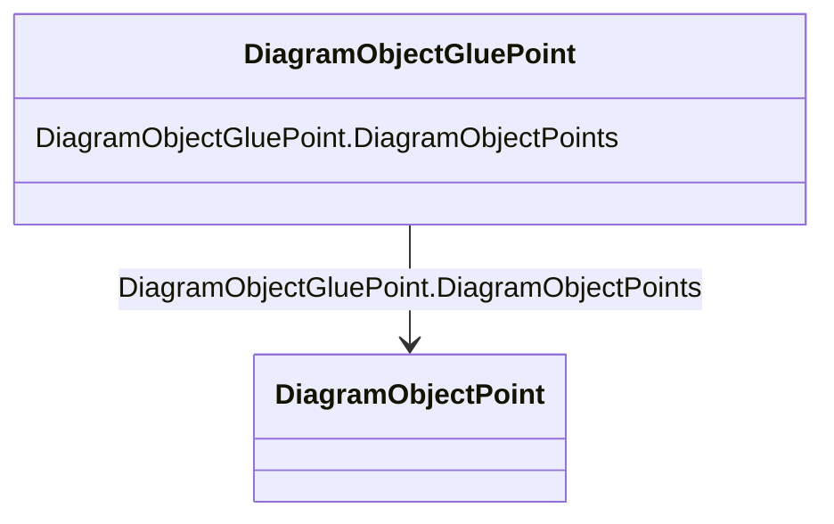

# DiagramObjectGluePoint

_This is used for grouping diagram object points from different diagram objects that are considered to be glued together in a diagram even if they are not at the exact same coordinates._

**URI**: [cim:DiagramObjectGluePoint](http://iec.ch/TC57/CIM100#DiagramObjectGluePoint) 
**Type**: Class

<!-- no inheritance hierarchy -->

## Attributes

| Name | URI | Cardinality and Range | Description | Inheritance |
| ---  | --- | --- | --- | --- |
| DiagramObjectPoints | [cim:DiagramObjectGluePoint.DiagramObjectPoints](http://iec.ch/TC57/CIM100#DiagramObjectGluePoint.DiagramObjectPoints) | 1..*    [DiagramObjectPoint](DiagramObjectPoint.md)  | A diagram object glue point is associated with 2 or more object points that a... | direct |

## Usages

| used by | used in | type | used |
| ---  | --- | --- | --- |
| [DiagramObjectPoint](DiagramObjectPoint.md) | DiagramObjectGluePoint | range | [DiagramObjectGluePoint](DiagramObjectGluePoint.md) |

## Identifier and Mapping Information

### Schema Source

* from schema: http://iec.ch/TC57/ns/CIM/DiagramLayout-EU#Package_DiagramLayoutProfile

## Mappings

| Mapping Type | Mapped Value |
| ---  | ---  |
| self | cim:DiagramObjectGluePoint |
| native | this:DiagramObjectGluePoint |

