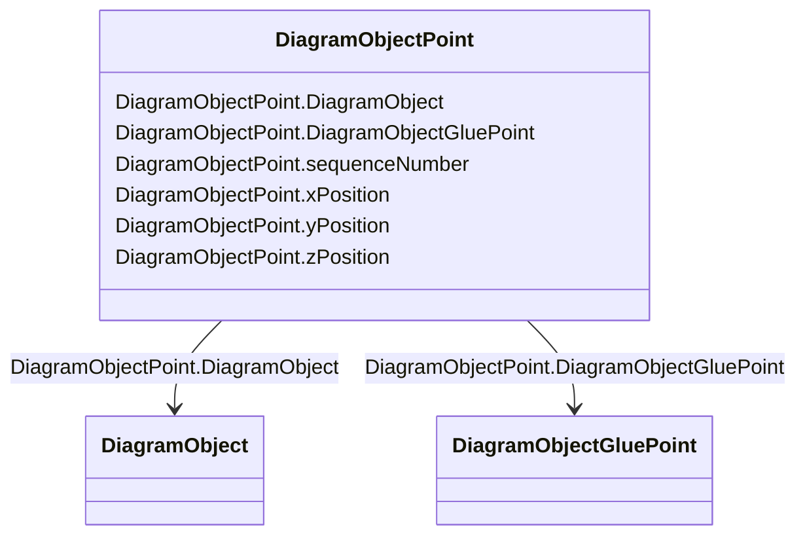

# DiagramObjectPoint

_A point in a given space defined by 3 coordinates and associated to a diagram object.  The coordinates may be positive or negative as the origin does not have to be in the corner of a diagram._

**URI**: [cim:DiagramObjectPoint](http://iec.ch/TC57/CIM100#DiagramObjectPoint) 
**Type**: Class

<!-- no inheritance hierarchy -->

## Attributes

| Name | URI | Cardinality and Range | Description | Inheritance |
| ---  | --- | --- | --- | --- |
| DiagramObject | [cim:DiagramObjectPoint.DiagramObject](http://iec.ch/TC57/CIM100#DiagramObjectPoint.DiagramObject) | 1..1    [DiagramObject](DiagramObject.md)  | The diagram object with which the points are associated | direct |
| DiagramObjectGluePoint | [cim:DiagramObjectPoint.DiagramObjectGluePoint](http://iec.ch/TC57/CIM100#DiagramObjectPoint.DiagramObjectGluePoint) | 0..1    [DiagramObjectGluePoint](DiagramObjectGluePoint.md)  | The 'glue' point to which this point is associated | direct |
| sequenceNumber | [cim:DiagramObjectPoint.sequenceNumber](http://iec.ch/TC57/CIM100#DiagramObjectPoint.sequenceNumber) | 0..1    integer  | The sequence position of the point, used for defining the order of points for... | direct |
| xPosition | [cim:DiagramObjectPoint.xPosition](http://iec.ch/TC57/CIM100#DiagramObjectPoint.xPosition) | 1..1    float  | The X coordinate of this point | direct |
| yPosition | [cim:DiagramObjectPoint.yPosition](http://iec.ch/TC57/CIM100#DiagramObjectPoint.yPosition) | 1..1    float  | The Y coordinate of this point | direct |
| zPosition | [cim:DiagramObjectPoint.zPosition](http://iec.ch/TC57/CIM100#DiagramObjectPoint.zPosition) | 0..1    float  | The Z coordinate of this point | direct |

## Usages

| used by | used in | type | used |
| ---  | --- | --- | --- |
| [DiagramObject](DiagramObject.md) | DiagramObjectPoints | range | [DiagramObjectPoint](DiagramObjectPoint.md) |
| [DiagramObjectGluePoint](DiagramObjectGluePoint.md) | DiagramObjectPoints | range | [DiagramObjectPoint](DiagramObjectPoint.md) |
| [TextDiagramObject](TextDiagramObject.md) | DiagramObjectPoints | range | [DiagramObjectPoint](DiagramObjectPoint.md) |

## Identifier and Mapping Information

### Schema Source

* from schema: http://iec.ch/TC57/ns/CIM/DiagramLayout-EU#Package_DiagramLayoutProfile

## Mappings

| Mapping Type | Mapped Value |
| ---  | ---  |
| self | cim:DiagramObjectPoint |
| native | this:DiagramObjectPoint |

