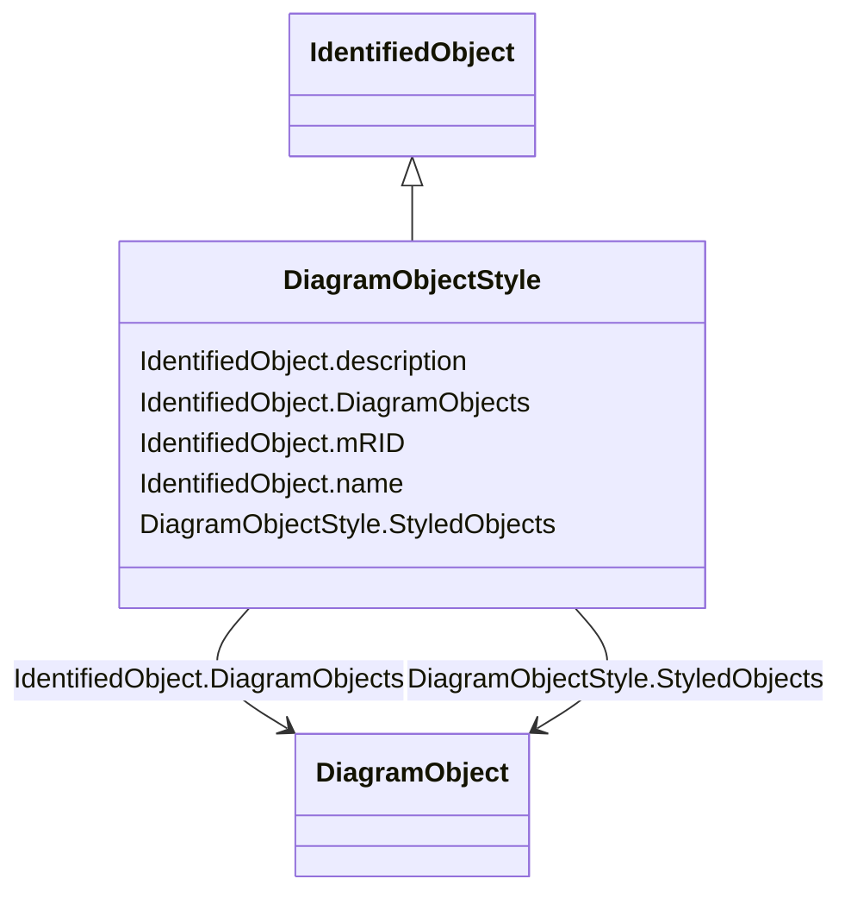

# DiagramObjectStyle

_A reference to a style used by the originating system for a diagram object.  A diagram object style describes information such as line thickness, shape such as circle or rectangle etc, and colour._

**URI**: [cim:DiagramObjectStyle](http://iec.ch/TC57/CIM100#DiagramObjectStyle) 
**Type**: Class

## Inheritance
* [IdentifiedObject](IdentifiedObject.md)
    * **DiagramObjectStyle**

## Attributes

| Name | URI | Cardinality and Range | Description | Inheritance |
| ---  | --- | --- | --- | --- |
| StyledObjects | [cim:DiagramObjectStyle.StyledObjects](http://iec.ch/TC57/CIM100#DiagramObjectStyle.StyledObjects) | *    [DiagramObject](DiagramObject.md)  | A style can be assigned to multiple diagram objects | direct |
| DiagramObjects | [cim:IdentifiedObject.DiagramObjects](http://iec.ch/TC57/CIM100#IdentifiedObject.DiagramObjects) | *    [DiagramObject](DiagramObject.md)  | The diagram objects that are associated with the domain object | [IdentifiedObject](IdentifiedObject.md) |
| mRID | [cim:IdentifiedObject.mRID](http://iec.ch/TC57/CIM100#IdentifiedObject.mRID) | 1    string  | Master resource identifier issued by a model authority | [IdentifiedObject](IdentifiedObject.md) |
| name | [cim:IdentifiedObject.name](http://iec.ch/TC57/CIM100#IdentifiedObject.name) | 1    string  | The name is any free human readable and possibly non unique text naming the o... | [IdentifiedObject](IdentifiedObject.md) |
| description | [cim:IdentifiedObject.description](http://iec.ch/TC57/CIM100#IdentifiedObject.description) | 0..1    string  | The description is a free human readable text describing or naming the object | [IdentifiedObject](IdentifiedObject.md) |

## Usages

| used by | used in | type | used |
| ---  | --- | --- | --- |
| [DiagramObject](DiagramObject.md) | DiagramObjectStyle | range | [DiagramObjectStyle](DiagramObjectStyle.md) |
| [TextDiagramObject](TextDiagramObject.md) | DiagramObjectStyle | range | [DiagramObjectStyle](DiagramObjectStyle.md) |

## Identifier and Mapping Information

### Schema Source

* from schema: http://iec.ch/TC57/ns/CIM/DiagramLayout-EU#Package_DiagramLayoutProfile

## Mappings

| Mapping Type | Mapped Value |
| ---  | ---  |
| self | cim:DiagramObjectStyle |
| native | this:DiagramObjectStyle |

