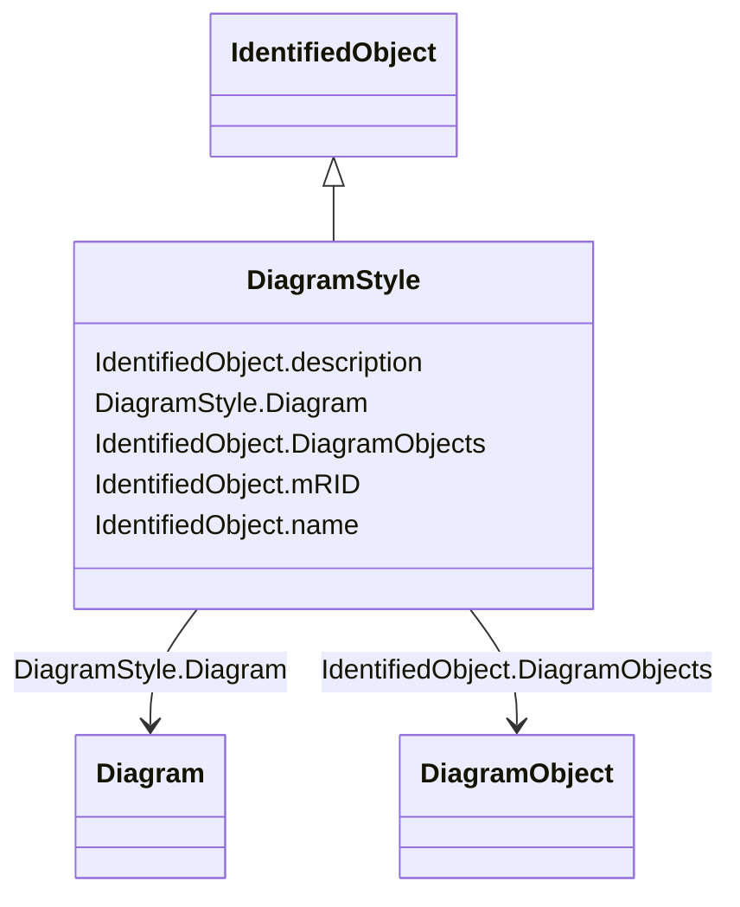

# DiagramStyle

_The diagram style refers to a style used by the originating system for a diagram.  A diagram style describes information such as schematic, geographic, etc._

**URI**: [cim:DiagramStyle](http://iec.ch/TC57/CIM100#DiagramStyle) 
**Type**: Class

## Inheritance
* [IdentifiedObject](IdentifiedObject.md)
    * **DiagramStyle**

## Attributes

| Name | URI | Cardinality and Range | Description | Inheritance |
| ---  | --- | --- | --- | --- |
| Diagram | [cim:DiagramStyle.Diagram](http://iec.ch/TC57/CIM100#DiagramStyle.Diagram) | 0..*    [Diagram](Diagram.md)  | A DiagramStyle can be used by many Diagrams | direct |
| DiagramObjects | [cim:IdentifiedObject.DiagramObjects](http://iec.ch/TC57/CIM100#IdentifiedObject.DiagramObjects) | 0..*    [DiagramObject](DiagramObject.md)  | The diagram objects that are associated with the domain object | [IdentifiedObject](IdentifiedObject.md) |
| mRID | [cim:IdentifiedObject.mRID](http://iec.ch/TC57/CIM100#IdentifiedObject.mRID) | 1..1    string  | Master resource identifier issued by a model authority | [IdentifiedObject](IdentifiedObject.md) |
| name | [cim:IdentifiedObject.name](http://iec.ch/TC57/CIM100#IdentifiedObject.name) | 1..1    string  | The name is any free human readable and possibly non unique text naming the o... | [IdentifiedObject](IdentifiedObject.md) |
| description | [cim:IdentifiedObject.description](http://iec.ch/TC57/CIM100#IdentifiedObject.description) | 0..1    string  | The description is a free human readable text describing or naming the object | [IdentifiedObject](IdentifiedObject.md) |

## Usages

| used by | used in | type | used |
| ---  | --- | --- | --- |
| [Diagram](Diagram.md) | DiagramStyle | range | [DiagramStyle](DiagramStyle.md) |

## Identifier and Mapping Information

### Schema Source

* from schema: http://iec.ch/TC57/ns/CIM/DiagramLayout-EU#Package_DiagramLayoutProfile

## Mappings

| Mapping Type | Mapped Value |
| ---  | ---  |
| self | cim:DiagramStyle |
| native | this:DiagramStyle |

