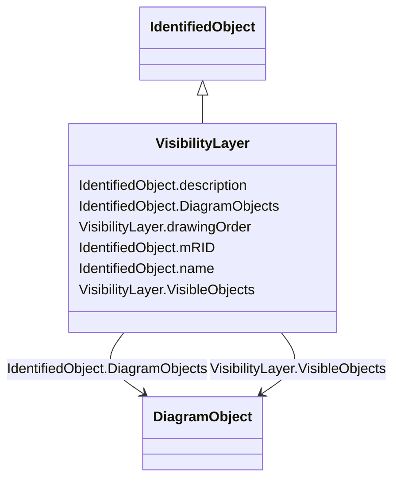

# VisibilityLayer

_Layers are typically used for grouping diagram objects according to themes and scales. Themes are used to display or hide certain information (e.g., lakes, borders), while scales are used for hiding or displaying information depending on the current zoom level (hide text when it is too small to be read, or when it exceeds the screen size). This is also called de-cluttering._

_CIM based graphics exchange supports an m:n relationship between diagram objects and layers. The importing system shall convert an m:n case into an appropriate 1:n representation if the importing system does not support m:n._

**URI**: [cim:VisibilityLayer](http://iec.ch/TC57/CIM100#VisibilityLayer) 
**Type**: Class

## Inheritance
* [IdentifiedObject](IdentifiedObject.md)
    * **VisibilityLayer**

## Attributes

| Name | URI | Cardinality and Range | Description | Inheritance |
| ---  | --- | --- | --- | --- |
| VisibleObjects | [cim:VisibilityLayer.VisibleObjects](http://iec.ch/TC57/CIM100#VisibilityLayer.VisibleObjects) | 1..*    [DiagramObject](DiagramObject.md)  | A visibility layer can contain one or more diagram objects | direct |
| drawingOrder | [cim:VisibilityLayer.drawingOrder](http://iec.ch/TC57/CIM100#VisibilityLayer.drawingOrder) | 0..1    integer  | The drawing order for this layer | direct |
| DiagramObjects | [cim:IdentifiedObject.DiagramObjects](http://iec.ch/TC57/CIM100#IdentifiedObject.DiagramObjects) | 0..*    [DiagramObject](DiagramObject.md)  | The diagram objects that are associated with the domain object | [IdentifiedObject](IdentifiedObject.md) |
| mRID | [cim:IdentifiedObject.mRID](http://iec.ch/TC57/CIM100#IdentifiedObject.mRID) | 1..1    string  | Master resource identifier issued by a model authority | [IdentifiedObject](IdentifiedObject.md) |
| name | [cim:IdentifiedObject.name](http://iec.ch/TC57/CIM100#IdentifiedObject.name) | 1..1    string  | The name is any free human readable and possibly non unique text naming the o... | [IdentifiedObject](IdentifiedObject.md) |
| description | [cim:IdentifiedObject.description](http://iec.ch/TC57/CIM100#IdentifiedObject.description) | 0..1    string  | The description is a free human readable text describing or naming the object | [IdentifiedObject](IdentifiedObject.md) |

## Usages

| used by | used in | type | used |
| ---  | --- | --- | --- |
| [DiagramObject](DiagramObject.md) | VisibilityLayers | range | [VisibilityLayer](VisibilityLayer.md) |
| [TextDiagramObject](TextDiagramObject.md) | VisibilityLayers | range | [VisibilityLayer](VisibilityLayer.md) |

## Identifier and Mapping Information

### Schema Source

* from schema: http://iec.ch/TC57/ns/CIM/DiagramLayout-EU#Package_DiagramLayoutProfile

## Mappings

| Mapping Type | Mapped Value |
| ---  | ---  |
| self | cim:VisibilityLayer |
| native | this:VisibilityLayer |

