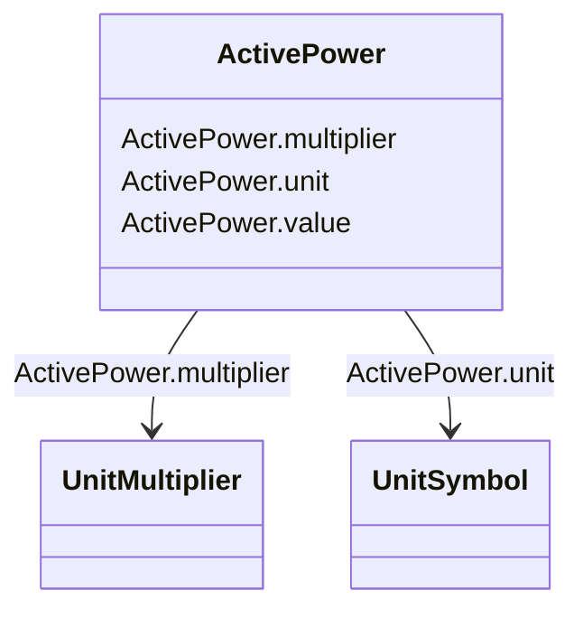

# ActivePower

_Product of RMS value of the voltage and the RMS value of the in-phase component of the current._

**URI**: [cim:ActivePower](http://iec.ch/TC57/CIM100#ActivePower) 
**Type**: Class

<!-- no inheritance hierarchy -->

## Attributes

| Name | URI | Cardinality and Range | Description | Inheritance |
| ---  | --- | --- | --- | --- |
| value | [cim:ActivePower.value](http://iec.ch/TC57/CIM100#ActivePower.value) | 0..1    float  |  | direct |
| multiplier | [cim:ActivePower.multiplier](http://iec.ch/TC57/CIM100#ActivePower.multiplier) | 0..1    [UnitMultiplier](UnitMultiplier.md)  |  | direct |
| unit | [cim:ActivePower.unit](http://iec.ch/TC57/CIM100#ActivePower.unit) | 0..1    [UnitSymbol](UnitSymbol.md)  |  | direct |

## Usages

| used by | used in | type | used |
| ---  | --- | --- | --- |
| [GovHydroIEEE0](GovHydroIEEE0.md) | mwbase | range | [ActivePower](ActivePower.md) |
| [GovHydroIEEE2](GovHydroIEEE2.md) | mwbase | range | [ActivePower](ActivePower.md) |
| [GovSteamIEEE1](GovSteamIEEE1.md) | mwbase | range | [ActivePower](ActivePower.md) |
| [GovCT1](GovCT1.md) | mwbase | range | [ActivePower](ActivePower.md) |
| [GovCT2](GovCT2.md) | mwbase | range | [ActivePower](ActivePower.md) |
| [GovGAST](GovGAST.md) | mwbase | range | [ActivePower](ActivePower.md) |
| [GovGAST1](GovGAST1.md) | mwbase | range | [ActivePower](ActivePower.md) |
| [GovGAST1](GovGAST1.md) | db2 | range | [ActivePower](ActivePower.md) |
| [GovGAST2](GovGAST2.md) | mwbase | range | [ActivePower](ActivePower.md) |
| [GovGAST2](GovGAST2.md) | trate | range | [ActivePower](ActivePower.md) |
| [GovGASTWD](GovGASTWD.md) | mwbase | range | [ActivePower](ActivePower.md) |
| [GovGASTWD](GovGASTWD.md) | trate | range | [ActivePower](ActivePower.md) |
| [GovHydro1](GovHydro1.md) | mwbase | range | [ActivePower](ActivePower.md) |
| [GovHydro2](GovHydro2.md) | mwbase | range | [ActivePower](ActivePower.md) |
| [GovHydro2](GovHydro2.md) | db2 | range | [ActivePower](ActivePower.md) |
| [GovHydro3](GovHydro3.md) | mwbase | range | [ActivePower](ActivePower.md) |
| [GovHydro3](GovHydro3.md) | db2 | range | [ActivePower](ActivePower.md) |
| [GovHydro4](GovHydro4.md) | mwbase | range | [ActivePower](ActivePower.md) |
| [GovHydro4](GovHydro4.md) | db2 | range | [ActivePower](ActivePower.md) |
| [GovHydroDD](GovHydroDD.md) | mwbase | range | [ActivePower](ActivePower.md) |
| [GovHydroDD](GovHydroDD.md) | db2 | range | [ActivePower](ActivePower.md) |
| [GovHydroPID](GovHydroPID.md) | mwbase | range | [ActivePower](ActivePower.md) |
| [GovHydroPID](GovHydroPID.md) | db2 | range | [ActivePower](ActivePower.md) |
| [GovHydroPID2](GovHydroPID2.md) | mwbase | range | [ActivePower](ActivePower.md) |
| [GovHydroR](GovHydroR.md) | mwbase | range | [ActivePower](ActivePower.md) |
| [GovHydroR](GovHydroR.md) | db2 | range | [ActivePower](ActivePower.md) |
| [GovHydroWEH](GovHydroWEH.md) | mwbase | range | [ActivePower](ActivePower.md) |
| [GovHydroWPID](GovHydroWPID.md) | mwbase | range | [ActivePower](ActivePower.md) |
| [GovSteam0](GovSteam0.md) | mwbase | range | [ActivePower](ActivePower.md) |
| [GovSteam1](GovSteam1.md) | mwbase | range | [ActivePower](ActivePower.md) |
| [GovSteam1](GovSteam1.md) | db2 | range | [ActivePower](ActivePower.md) |
| [GovSteamCC](GovSteamCC.md) | mwbase | range | [ActivePower](ActivePower.md) |
| [GovSteamEU](GovSteamEU.md) | mwbase | range | [ActivePower](ActivePower.md) |
| [GovSteamFV2](GovSteamFV2.md) | mwbase | range | [ActivePower](ActivePower.md) |
| [GovSteamFV3](GovSteamFV3.md) | mwbase | range | [ActivePower](ActivePower.md) |
| [GovSteamSGO](GovSteamSGO.md) | mwbase | range | [ActivePower](ActivePower.md) |
| [TurbLCFB1](TurbLCFB1.md) | mwbase | range | [ActivePower](ActivePower.md) |
| [TurbLCFB1](TurbLCFB1.md) | pmwset | range | [ActivePower](ActivePower.md) |

## Identifier and Mapping Information

### Schema Source

* from schema: http://iec.ch/TC57/ns/CIM/Dynamics-EU#Package_DynamicsProfile

## Mappings

| Mapping Type | Mapped Value |
| ---  | ---  |
| self | cim:ActivePower |
| native | this:ActivePower |

