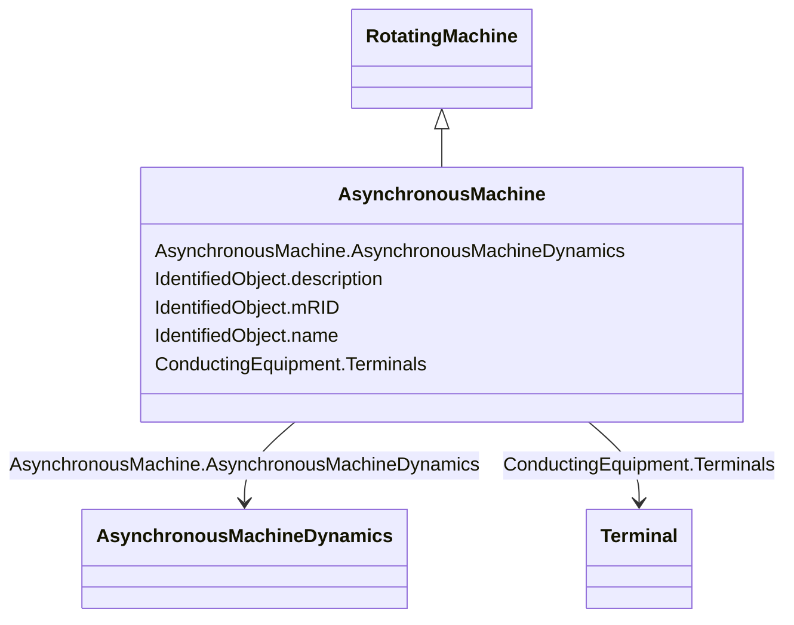

# AsynchronousMachine

_A rotating machine whose shaft rotates asynchronously with the electrical field.  Also known as an induction machine with no external connection to the rotor windings, e.g. squirrel-cage induction machine._

**URI**: [cim:AsynchronousMachine](http://iec.ch/TC57/CIM100#AsynchronousMachine) 
**Type**: Class

## Inheritance
* [IdentifiedObject](IdentifiedObject.md)
    * [PowerSystemResource](PowerSystemResource.md)
        * [Equipment](Equipment.md)
            * [ConductingEquipment](ConductingEquipment.md)
                * [EnergyConnection](EnergyConnection.md)
                    * [RegulatingCondEq](RegulatingCondEq.md)
                        * [RotatingMachine](RotatingMachine.md)
                            * **AsynchronousMachine**

## Attributes

| Name | URI | Cardinality and Range | Description | Inheritance |
| ---  | --- | --- | --- | --- |
| AsynchronousMachineDynamics | [cim:AsynchronousMachine.AsynchronousMachineDynamics](http://iec.ch/TC57/CIM100#AsynchronousMachine.AsynchronousMachineDynamics) | 0..1    [AsynchronousMachineDynamics](AsynchronousMachineDynamics.md)  | Asynchronous machine dynamics model used to describe dynamic behaviour of thi... | direct |
| Terminals | [cim:ConductingEquipment.Terminals](http://iec.ch/TC57/CIM100#ConductingEquipment.Terminals) | 0..*    [Terminal](Terminal.md)  | Conducting equipment have terminals that may be connected to other conducting... | [ConductingEquipment](ConductingEquipment.md) |
| description | [cim:IdentifiedObject.description](http://iec.ch/TC57/CIM100#IdentifiedObject.description) | 0..1    string  | The description is a free human readable text describing or naming the object | [IdentifiedObject](IdentifiedObject.md) |
| mRID | [cim:IdentifiedObject.mRID](http://iec.ch/TC57/CIM100#IdentifiedObject.mRID) | 1..1    string  | Master resource identifier issued by a model authority | [IdentifiedObject](IdentifiedObject.md) |
| name | [cim:IdentifiedObject.name](http://iec.ch/TC57/CIM100#IdentifiedObject.name) | 0..1    string  | The name is any free human readable and possibly non unique text naming the o... | [IdentifiedObject](IdentifiedObject.md) |

## Usages

| used by | used in | type | used |
| ---  | --- | --- | --- |
| [AsynchronousMachineUserDefined](AsynchronousMachineUserDefined.md) | AsynchronousMachine | range | [AsynchronousMachine](AsynchronousMachine.md) |
| [AsynchronousMachineDynamics](AsynchronousMachineDynamics.md) | AsynchronousMachine | range | [AsynchronousMachine](AsynchronousMachine.md) |
| [AsynchronousMachineTimeConstantReactance](AsynchronousMachineTimeConstantReactance.md) | AsynchronousMachine | range | [AsynchronousMachine](AsynchronousMachine.md) |
| [AsynchronousMachineEquivalentCircuit](AsynchronousMachineEquivalentCircuit.md) | AsynchronousMachine | range | [AsynchronousMachine](AsynchronousMachine.md) |

## Identifier and Mapping Information

### Schema Source

* from schema: http://iec.ch/TC57/ns/CIM/Dynamics-EU#Package_DynamicsProfile

## Mappings

| Mapping Type | Mapped Value |
| ---  | ---  |
| self | cim:AsynchronousMachine |
| native | this:AsynchronousMachine |

