# AsynchronousMachineDynamics

_Asynchronous machine whose behaviour is described by reference to a standard model expressed in either time constant reactance form or equivalent circuit form or by definition of a user-defined model._

_Parameter details:_

_<ol>_

_	<li>Asynchronous machine parameters such as <i>Xl, Xs,</i> etc. are actually used as inductances in the model, but are commonly referred to as reactances since, at nominal frequency, the PU values are the same. However, some references use the symbol <i>L</i> instead of <i>X</i>.</li>_

_</ol>_

**URI**: [cim:AsynchronousMachineDynamics](http://iec.ch/TC57/CIM100#AsynchronousMachineDynamics) 
**Type**: Class

```mermaid
 classDiagram
    class AsynchronousMachineDynamics
      RotatingMachineDynamics <|-- AsynchronousMachineDynamics
      

      AsynchronousMachineDynamics <|-- AsynchronousMachineUserDefined
      AsynchronousMachineDynamics <|-- AsynchronousMachineTimeConstantReactance
      AsynchronousMachineDynamics <|-- AsynchronousMachineEquivalentCircuit
      
      
      AsynchronousMachineDynamics : AsynchronousMachineDynamics.AsynchronousMachine
        
          AsynchronousMachineDynamics --> AsynchronousMachine : AsynchronousMachineDynamics.AsynchronousMachine
        
      AsynchronousMachineDynamics : RotatingMachineDynamics.damping
        
      AsynchronousMachineDynamics : IdentifiedObject.description
        
      AsynchronousMachineDynamics : DynamicsFunctionBlock.enabled
        
      AsynchronousMachineDynamics : RotatingMachineDynamics.inertia
        
          AsynchronousMachineDynamics --> Seconds : RotatingMachineDynamics.inertia
        
      AsynchronousMachineDynamics : AsynchronousMachineDynamics.MechanicalLoadDynamics
        
          AsynchronousMachineDynamics --> MechanicalLoadDynamics : AsynchronousMachineDynamics.MechanicalLoadDynamics
        
      AsynchronousMachineDynamics : IdentifiedObject.mRID
        
      AsynchronousMachineDynamics : IdentifiedObject.name
        
      AsynchronousMachineDynamics : RotatingMachineDynamics.saturationFactor
        
      AsynchronousMachineDynamics : RotatingMachineDynamics.saturationFactor120
        
      AsynchronousMachineDynamics : RotatingMachineDynamics.statorLeakageReactance
        
          AsynchronousMachineDynamics --> PU : RotatingMachineDynamics.statorLeakageReactance
        
      AsynchronousMachineDynamics : RotatingMachineDynamics.statorResistance
        
          AsynchronousMachineDynamics --> PU : RotatingMachineDynamics.statorResistance
        
      AsynchronousMachineDynamics : AsynchronousMachineDynamics.TurbineGovernorDynamics
        
          AsynchronousMachineDynamics --> TurbineGovernorDynamics : AsynchronousMachineDynamics.TurbineGovernorDynamics
        
      AsynchronousMachineDynamics : AsynchronousMachineDynamics.WindTurbineType1or2Dynamics
        
          AsynchronousMachineDynamics --> WindTurbineType1or2Dynamics : AsynchronousMachineDynamics.WindTurbineType1or2Dynamics
        
      
```

## Inheritance
* [IdentifiedObject](IdentifiedObject.md)
    * [DynamicsFunctionBlock](DynamicsFunctionBlock.md)
        * [RotatingMachineDynamics](RotatingMachineDynamics.md)
            * **AsynchronousMachineDynamics**
                * [AsynchronousMachineUserDefined](AsynchronousMachineUserDefined.md)
                * [AsynchronousMachineTimeConstantReactance](AsynchronousMachineTimeConstantReactance.md)
                * [AsynchronousMachineEquivalentCircuit](AsynchronousMachineEquivalentCircuit.md)

## Attributes

| Name | URI | Cardinality and Range | Description | Inheritance |
| ---  | --- | --- | --- | --- |
| AsynchronousMachine | [cim:AsynchronousMachineDynamics.AsynchronousMachine](http://iec.ch/TC57/CIM100#AsynchronousMachineDynamics.AsynchronousMachine) | 1..1    [AsynchronousMachine](AsynchronousMachine.md)  | Asynchronous machine to which this asynchronous machine dynamics model applie... | direct |
| TurbineGovernorDynamics | [cim:AsynchronousMachineDynamics.TurbineGovernorDynamics](http://iec.ch/TC57/CIM100#AsynchronousMachineDynamics.TurbineGovernorDynamics) | 0..1    [TurbineGovernorDynamics](TurbineGovernorDynamics.md)  | Turbine-governor model associated with this asynchronous machine model | direct |
| MechanicalLoadDynamics | [cim:AsynchronousMachineDynamics.MechanicalLoadDynamics](http://iec.ch/TC57/CIM100#AsynchronousMachineDynamics.MechanicalLoadDynamics) | 0..1    [MechanicalLoadDynamics](MechanicalLoadDynamics.md)  | Mechanical load model associated with this asynchronous machine model | direct |
| WindTurbineType1or2Dynamics | [cim:AsynchronousMachineDynamics.WindTurbineType1or2Dynamics](http://iec.ch/TC57/CIM100#AsynchronousMachineDynamics.WindTurbineType1or2Dynamics) | 0..1    [WindTurbineType1or2Dynamics](WindTurbineType1or2Dynamics.md)  | Wind generator type 1 or type 2 model associated with this asynchronous machi... | direct |
| damping | [cim:RotatingMachineDynamics.damping](http://iec.ch/TC57/CIM100#RotatingMachineDynamics.damping) | 1..1    float  | Damping torque coefficient (<i>D</i>) (&gt;= 0) | [RotatingMachineDynamics](RotatingMachineDynamics.md) |
| inertia | [cim:RotatingMachineDynamics.inertia](http://iec.ch/TC57/CIM100#RotatingMachineDynamics.inertia) | 1..1    [Seconds](Seconds.md)  | Inertia constant of generator or motor and mechanical load (<i>H</i>) (&gt; 0... | [RotatingMachineDynamics](RotatingMachineDynamics.md) |
| saturationFactor | [cim:RotatingMachineDynamics.saturationFactor](http://iec.ch/TC57/CIM100#RotatingMachineDynamics.saturationFactor) | 0..1    float  | Saturation factor at rated terminal voltage (<i>S1</i>) (&gt;= 0) | [RotatingMachineDynamics](RotatingMachineDynamics.md) |
| saturationFactor120 | [cim:RotatingMachineDynamics.saturationFactor120](http://iec.ch/TC57/CIM100#RotatingMachineDynamics.saturationFactor120) | 0..1    float  | Saturation factor at 120% of rated terminal voltage (<i>S12</i>) (&gt;= Rotat... | [RotatingMachineDynamics](RotatingMachineDynamics.md) |
| statorLeakageReactance | [cim:RotatingMachineDynamics.statorLeakageReactance](http://iec.ch/TC57/CIM100#RotatingMachineDynamics.statorLeakageReactance) | 1..1    [PU](PU.md)  | Stator leakage reactance (<i>Xl</i>) (&gt;= 0) | [RotatingMachineDynamics](RotatingMachineDynamics.md) |
| statorResistance | [cim:RotatingMachineDynamics.statorResistance](http://iec.ch/TC57/CIM100#RotatingMachineDynamics.statorResistance) | 1..1    [PU](PU.md)  | Stator (armature) resistance (<i>Rs</i>) (&gt;= 0) | [RotatingMachineDynamics](RotatingMachineDynamics.md) |
| enabled | [cim:DynamicsFunctionBlock.enabled](http://iec.ch/TC57/CIM100#DynamicsFunctionBlock.enabled) | 1..1    boolean  | Function block used indicator | [DynamicsFunctionBlock](DynamicsFunctionBlock.md) |
| description | [cim:IdentifiedObject.description](http://iec.ch/TC57/CIM100#IdentifiedObject.description) | 0..1    string  | The description is a free human readable text describing or naming the object | [IdentifiedObject](IdentifiedObject.md) |
| mRID | [cim:IdentifiedObject.mRID](http://iec.ch/TC57/CIM100#IdentifiedObject.mRID) | 1..1    string  | Master resource identifier issued by a model authority | [IdentifiedObject](IdentifiedObject.md) |
| name | [cim:IdentifiedObject.name](http://iec.ch/TC57/CIM100#IdentifiedObject.name) | 0..1    string  | The name is any free human readable and possibly non unique text naming the o... | [IdentifiedObject](IdentifiedObject.md) |

## Usages

| used by | used in | type | used |
| ---  | --- | --- | --- |
| [AsynchronousMachine](AsynchronousMachine.md) | AsynchronousMachineDynamics | range | [AsynchronousMachineDynamics](AsynchronousMachineDynamics.md) |
| [WindType1or2UserDefined](WindType1or2UserDefined.md) | AsynchronousMachineDynamics | range | [AsynchronousMachineDynamics](AsynchronousMachineDynamics.md) |
| [TurbineGovernorUserDefined](TurbineGovernorUserDefined.md) | AsynchronousMachineDynamics | range | [AsynchronousMachineDynamics](AsynchronousMachineDynamics.md) |
| [MechanicalLoadUserDefined](MechanicalLoadUserDefined.md) | AsynchronousMachineDynamics | range | [AsynchronousMachineDynamics](AsynchronousMachineDynamics.md) |
| [TurbineGovernorDynamics](TurbineGovernorDynamics.md) | AsynchronousMachineDynamics | range | [AsynchronousMachineDynamics](AsynchronousMachineDynamics.md) |
| [GovHydroIEEE0](GovHydroIEEE0.md) | AsynchronousMachineDynamics | range | [AsynchronousMachineDynamics](AsynchronousMachineDynamics.md) |
| [GovHydroIEEE2](GovHydroIEEE2.md) | AsynchronousMachineDynamics | range | [AsynchronousMachineDynamics](AsynchronousMachineDynamics.md) |
| [GovSteamIEEE1](GovSteamIEEE1.md) | AsynchronousMachineDynamics | range | [AsynchronousMachineDynamics](AsynchronousMachineDynamics.md) |
| [GovCT1](GovCT1.md) | AsynchronousMachineDynamics | range | [AsynchronousMachineDynamics](AsynchronousMachineDynamics.md) |
| [GovCT2](GovCT2.md) | AsynchronousMachineDynamics | range | [AsynchronousMachineDynamics](AsynchronousMachineDynamics.md) |
| [GovGAST](GovGAST.md) | AsynchronousMachineDynamics | range | [AsynchronousMachineDynamics](AsynchronousMachineDynamics.md) |
| [GovGAST1](GovGAST1.md) | AsynchronousMachineDynamics | range | [AsynchronousMachineDynamics](AsynchronousMachineDynamics.md) |
| [GovGAST2](GovGAST2.md) | AsynchronousMachineDynamics | range | [AsynchronousMachineDynamics](AsynchronousMachineDynamics.md) |
| [GovGAST3](GovGAST3.md) | AsynchronousMachineDynamics | range | [AsynchronousMachineDynamics](AsynchronousMachineDynamics.md) |
| [GovGAST4](GovGAST4.md) | AsynchronousMachineDynamics | range | [AsynchronousMachineDynamics](AsynchronousMachineDynamics.md) |
| [GovGASTWD](GovGASTWD.md) | AsynchronousMachineDynamics | range | [AsynchronousMachineDynamics](AsynchronousMachineDynamics.md) |
| [GovHydro1](GovHydro1.md) | AsynchronousMachineDynamics | range | [AsynchronousMachineDynamics](AsynchronousMachineDynamics.md) |
| [GovHydro2](GovHydro2.md) | AsynchronousMachineDynamics | range | [AsynchronousMachineDynamics](AsynchronousMachineDynamics.md) |
| [GovHydro3](GovHydro3.md) | AsynchronousMachineDynamics | range | [AsynchronousMachineDynamics](AsynchronousMachineDynamics.md) |
| [GovHydro4](GovHydro4.md) | AsynchronousMachineDynamics | range | [AsynchronousMachineDynamics](AsynchronousMachineDynamics.md) |
| [GovHydroDD](GovHydroDD.md) | AsynchronousMachineDynamics | range | [AsynchronousMachineDynamics](AsynchronousMachineDynamics.md) |
| [GovHydroFrancis](GovHydroFrancis.md) | AsynchronousMachineDynamics | range | [AsynchronousMachineDynamics](AsynchronousMachineDynamics.md) |
| [GovHydroPelton](GovHydroPelton.md) | AsynchronousMachineDynamics | range | [AsynchronousMachineDynamics](AsynchronousMachineDynamics.md) |
| [GovHydroPID](GovHydroPID.md) | AsynchronousMachineDynamics | range | [AsynchronousMachineDynamics](AsynchronousMachineDynamics.md) |
| [GovHydroPID2](GovHydroPID2.md) | AsynchronousMachineDynamics | range | [AsynchronousMachineDynamics](AsynchronousMachineDynamics.md) |
| [GovHydroR](GovHydroR.md) | AsynchronousMachineDynamics | range | [AsynchronousMachineDynamics](AsynchronousMachineDynamics.md) |
| [GovHydroWEH](GovHydroWEH.md) | AsynchronousMachineDynamics | range | [AsynchronousMachineDynamics](AsynchronousMachineDynamics.md) |
| [GovHydroWPID](GovHydroWPID.md) | AsynchronousMachineDynamics | range | [AsynchronousMachineDynamics](AsynchronousMachineDynamics.md) |
| [GovSteam0](GovSteam0.md) | AsynchronousMachineDynamics | range | [AsynchronousMachineDynamics](AsynchronousMachineDynamics.md) |
| [GovSteam1](GovSteam1.md) | AsynchronousMachineDynamics | range | [AsynchronousMachineDynamics](AsynchronousMachineDynamics.md) |
| [GovSteam2](GovSteam2.md) | AsynchronousMachineDynamics | range | [AsynchronousMachineDynamics](AsynchronousMachineDynamics.md) |
| [GovSteamBB](GovSteamBB.md) | AsynchronousMachineDynamics | range | [AsynchronousMachineDynamics](AsynchronousMachineDynamics.md) |
| [GovSteamEU](GovSteamEU.md) | AsynchronousMachineDynamics | range | [AsynchronousMachineDynamics](AsynchronousMachineDynamics.md) |
| [GovSteamFV2](GovSteamFV2.md) | AsynchronousMachineDynamics | range | [AsynchronousMachineDynamics](AsynchronousMachineDynamics.md) |
| [GovSteamFV3](GovSteamFV3.md) | AsynchronousMachineDynamics | range | [AsynchronousMachineDynamics](AsynchronousMachineDynamics.md) |
| [GovSteamFV4](GovSteamFV4.md) | AsynchronousMachineDynamics | range | [AsynchronousMachineDynamics](AsynchronousMachineDynamics.md) |
| [GovSteamSGO](GovSteamSGO.md) | AsynchronousMachineDynamics | range | [AsynchronousMachineDynamics](AsynchronousMachineDynamics.md) |
| [MechanicalLoadDynamics](MechanicalLoadDynamics.md) | AsynchronousMachineDynamics | range | [AsynchronousMachineDynamics](AsynchronousMachineDynamics.md) |
| [MechLoad1](MechLoad1.md) | AsynchronousMachineDynamics | range | [AsynchronousMachineDynamics](AsynchronousMachineDynamics.md) |
| [WindGenTurbineType1aIEC](WindGenTurbineType1aIEC.md) | AsynchronousMachineDynamics | range | [AsynchronousMachineDynamics](AsynchronousMachineDynamics.md) |
| [WindGenTurbineType1bIEC](WindGenTurbineType1bIEC.md) | AsynchronousMachineDynamics | range | [AsynchronousMachineDynamics](AsynchronousMachineDynamics.md) |
| [WindGenTurbineType2IEC](WindGenTurbineType2IEC.md) | AsynchronousMachineDynamics | range | [AsynchronousMachineDynamics](AsynchronousMachineDynamics.md) |
| [WindTurbineType1or2Dynamics](WindTurbineType1or2Dynamics.md) | AsynchronousMachineDynamics | range | [AsynchronousMachineDynamics](AsynchronousMachineDynamics.md) |
| [WindTurbineType1or2IEC](WindTurbineType1or2IEC.md) | AsynchronousMachineDynamics | range | [AsynchronousMachineDynamics](AsynchronousMachineDynamics.md) |

## Identifier and Mapping Information

### Schema Source

* from schema: http://iec.ch/TC57/ns/CIM/Dynamics-EU#Package_DynamicsProfile

## Mappings

| Mapping Type | Mapped Value |
| ---  | ---  |
| self | cim:AsynchronousMachineDynamics |
| native | this:AsynchronousMachineDynamics |

