# AsynchronousMachineTimeConstantReactance

_Parameter details:_

_<ol>_

_	<li>If <i>X'' </i>=<i> X'</i>, a single cage (one equivalent rotor winding per axis) is modelled.</li>_

_	<li>The “<i>p</i>” in the attribute names is a substitution for a “prime” in the usual parameter notation, e.g. <i>tpo</i> refers to <i>T'o</i>.</li>_

_</ol>_

_The parameters used for models expressed in time constant reactance form include:_

_- RotatingMachine.ratedS (<i>MVAbase</i>);_

_- RotatingMachineDynamics.damping (<i>D</i>);_

_- RotatingMachineDynamics.inertia (<i>H</i>);_

_- RotatingMachineDynamics.saturationFactor (<i>S1</i>);_

_- RotatingMachineDynamics.saturationFactor120 (<i>S12</i>);_

_- RotatingMachineDynamics.statorLeakageReactance (<i>Xl</i>);_

_- RotatingMachineDynamics.statorResistance (<i>Rs</i>);_

_- .xs (<i>Xs</i>);_

_- .xp (<i>X'</i>);_

_- .xpp (<i>X''</i>);_

_- .tpo (<i>T'o</i>);_

_- .tppo (<i>T''o</i>)._

**URI**: [cim:AsynchronousMachineTimeConstantReactance](http://iec.ch/TC57/CIM100#AsynchronousMachineTimeConstantReactance) 
**Type**: Class

```mermaid
 classDiagram
    class AsynchronousMachineTimeConstantReactance
    click AsynchronousMachineTimeConstantReactance href "../AsynchronousMachineTimeConstantReactance"
      AsynchronousMachineDynamics <|-- AsynchronousMachineTimeConstantReactance
        click AsynchronousMachineDynamics href "../AsynchronousMachineDynamics"
      
      AsynchronousMachineTimeConstantReactance : AsynchronousMachineDynamics.AsynchronousMachine
        
          AsynchronousMachineTimeConstantReactance --> AsynchronousMachine : AsynchronousMachineDynamics.AsynchronousMachine
          click AsynchronousMachine href "../AsynchronousMachine"
        
      AsynchronousMachineTimeConstantReactance : RotatingMachineDynamics.damping
        
      AsynchronousMachineTimeConstantReactance : IdentifiedObject.description
        
      AsynchronousMachineTimeConstantReactance : DynamicsFunctionBlock.enabled
        
      AsynchronousMachineTimeConstantReactance : RotatingMachineDynamics.inertia
        
          AsynchronousMachineTimeConstantReactance --> Seconds : RotatingMachineDynamics.inertia
          click Seconds href "../Seconds"
        
      AsynchronousMachineTimeConstantReactance : AsynchronousMachineDynamics.MechanicalLoadDynamics
        
          AsynchronousMachineTimeConstantReactance --> MechanicalLoadDynamics : AsynchronousMachineDynamics.MechanicalLoadDynamics
          click MechanicalLoadDynamics href "../MechanicalLoadDynamics"
        
      AsynchronousMachineTimeConstantReactance : IdentifiedObject.mRID
        
      AsynchronousMachineTimeConstantReactance : IdentifiedObject.name
        
      AsynchronousMachineTimeConstantReactance : RotatingMachineDynamics.saturationFactor
        
      AsynchronousMachineTimeConstantReactance : RotatingMachineDynamics.saturationFactor120
        
      AsynchronousMachineTimeConstantReactance : RotatingMachineDynamics.statorLeakageReactance
        
          AsynchronousMachineTimeConstantReactance --> PU : RotatingMachineDynamics.statorLeakageReactance
          click PU href "../PU"
        
      AsynchronousMachineTimeConstantReactance : RotatingMachineDynamics.statorResistance
        
          AsynchronousMachineTimeConstantReactance --> PU : RotatingMachineDynamics.statorResistance
          click PU href "../PU"
        
      AsynchronousMachineTimeConstantReactance : AsynchronousMachineTimeConstantReactance.tpo
        
          AsynchronousMachineTimeConstantReactance --> Seconds : AsynchronousMachineTimeConstantReactance.tpo
          click Seconds href "../Seconds"
        
      AsynchronousMachineTimeConstantReactance : AsynchronousMachineTimeConstantReactance.tppo
        
          AsynchronousMachineTimeConstantReactance --> Seconds : AsynchronousMachineTimeConstantReactance.tppo
          click Seconds href "../Seconds"
        
      AsynchronousMachineTimeConstantReactance : AsynchronousMachineDynamics.TurbineGovernorDynamics
        
          AsynchronousMachineTimeConstantReactance --> TurbineGovernorDynamics : AsynchronousMachineDynamics.TurbineGovernorDynamics
          click TurbineGovernorDynamics href "../TurbineGovernorDynamics"
        
      AsynchronousMachineTimeConstantReactance : AsynchronousMachineDynamics.WindTurbineType1or2Dynamics
        
          AsynchronousMachineTimeConstantReactance --> WindTurbineType1or2Dynamics : AsynchronousMachineDynamics.WindTurbineType1or2Dynamics
          click WindTurbineType1or2Dynamics href "../WindTurbineType1or2Dynamics"
        
      AsynchronousMachineTimeConstantReactance : AsynchronousMachineTimeConstantReactance.xp
        
          AsynchronousMachineTimeConstantReactance --> PU : AsynchronousMachineTimeConstantReactance.xp
          click PU href "../PU"
        
      AsynchronousMachineTimeConstantReactance : AsynchronousMachineTimeConstantReactance.xpp
        
          AsynchronousMachineTimeConstantReactance --> PU : AsynchronousMachineTimeConstantReactance.xpp
          click PU href "../PU"
        
      AsynchronousMachineTimeConstantReactance : AsynchronousMachineTimeConstantReactance.xs
        
          AsynchronousMachineTimeConstantReactance --> PU : AsynchronousMachineTimeConstantReactance.xs
          click PU href "../PU"
        
      
```

## Inheritance
* [IdentifiedObject](IdentifiedObject.md)
    * [DynamicsFunctionBlock](DynamicsFunctionBlock.md)
        * [RotatingMachineDynamics](RotatingMachineDynamics.md)
            * [AsynchronousMachineDynamics](AsynchronousMachineDynamics.md)
                * **AsynchronousMachineTimeConstantReactance**

## Attributes

| Name | URI | Cardinality and Range | Description | Inheritance |
| ---  | --- | --- | --- | --- |
| xs | [cim:AsynchronousMachineTimeConstantReactance.xs](http://iec.ch/TC57/CIM100#AsynchronousMachineTimeConstantReactance.xs) | 1    [PU](PU.md)  | Synchronous reactance (<i>Xs</i>) (&gt;= AsynchronousMachineTimeConstantReact... | direct |
| xp | [cim:AsynchronousMachineTimeConstantReactance.xp](http://iec.ch/TC57/CIM100#AsynchronousMachineTimeConstantReactance.xp) | 1    [PU](PU.md)  | Transient reactance (unsaturated) (<i>X'</i>) (&gt;= AsynchronousMachineTimeC... | direct |
| xpp | [cim:AsynchronousMachineTimeConstantReactance.xpp](http://iec.ch/TC57/CIM100#AsynchronousMachineTimeConstantReactance.xpp) | 1    [PU](PU.md)  | Subtransient reactance (unsaturated) (<i>X''</i>) (&gt; RotatingMachineDynami... | direct |
| tpo | [cim:AsynchronousMachineTimeConstantReactance.tpo](http://iec.ch/TC57/CIM100#AsynchronousMachineTimeConstantReactance.tpo) | 1    [Seconds](Seconds.md)  | Transient rotor time constant (<i>T'o</i>) (&gt; AsynchronousMachineTimeConst... | direct |
| tppo | [cim:AsynchronousMachineTimeConstantReactance.tppo](http://iec.ch/TC57/CIM100#AsynchronousMachineTimeConstantReactance.tppo) | 1    [Seconds](Seconds.md)  | Subtransient rotor time constant (<i>T''o</i>) (&gt; 0) | direct |
| AsynchronousMachine | [cim:AsynchronousMachineDynamics.AsynchronousMachine](http://iec.ch/TC57/CIM100#AsynchronousMachineDynamics.AsynchronousMachine) | 1    [AsynchronousMachine](AsynchronousMachine.md)  | Asynchronous machine to which this asynchronous machine dynamics model applie... | [AsynchronousMachineDynamics](AsynchronousMachineDynamics.md) |
| TurbineGovernorDynamics | [cim:AsynchronousMachineDynamics.TurbineGovernorDynamics](http://iec.ch/TC57/CIM100#AsynchronousMachineDynamics.TurbineGovernorDynamics) | 0..1    [TurbineGovernorDynamics](TurbineGovernorDynamics.md)  | Turbine-governor model associated with this asynchronous machine model | [AsynchronousMachineDynamics](AsynchronousMachineDynamics.md) |
| MechanicalLoadDynamics | [cim:AsynchronousMachineDynamics.MechanicalLoadDynamics](http://iec.ch/TC57/CIM100#AsynchronousMachineDynamics.MechanicalLoadDynamics) | 0..1    [MechanicalLoadDynamics](MechanicalLoadDynamics.md)  | Mechanical load model associated with this asynchronous machine model | [AsynchronousMachineDynamics](AsynchronousMachineDynamics.md) |
| WindTurbineType1or2Dynamics | [cim:AsynchronousMachineDynamics.WindTurbineType1or2Dynamics](http://iec.ch/TC57/CIM100#AsynchronousMachineDynamics.WindTurbineType1or2Dynamics) | 0..1    [WindTurbineType1or2Dynamics](WindTurbineType1or2Dynamics.md)  | Wind generator type 1 or type 2 model associated with this asynchronous machi... | [AsynchronousMachineDynamics](AsynchronousMachineDynamics.md) |
| damping | [cim:RotatingMachineDynamics.damping](http://iec.ch/TC57/CIM100#RotatingMachineDynamics.damping) | 1    float  | Damping torque coefficient (<i>D</i>) (&gt;= 0) | [RotatingMachineDynamics](RotatingMachineDynamics.md) |
| inertia | [cim:RotatingMachineDynamics.inertia](http://iec.ch/TC57/CIM100#RotatingMachineDynamics.inertia) | 1    [Seconds](Seconds.md)  | Inertia constant of generator or motor and mechanical load (<i>H</i>) (&gt; 0... | [RotatingMachineDynamics](RotatingMachineDynamics.md) |
| saturationFactor | [cim:RotatingMachineDynamics.saturationFactor](http://iec.ch/TC57/CIM100#RotatingMachineDynamics.saturationFactor) | 0..1    float  | Saturation factor at rated terminal voltage (<i>S1</i>) (&gt;= 0) | [RotatingMachineDynamics](RotatingMachineDynamics.md) |
| saturationFactor120 | [cim:RotatingMachineDynamics.saturationFactor120](http://iec.ch/TC57/CIM100#RotatingMachineDynamics.saturationFactor120) | 0..1    float  | Saturation factor at 120% of rated terminal voltage (<i>S12</i>) (&gt;= Rotat... | [RotatingMachineDynamics](RotatingMachineDynamics.md) |
| statorLeakageReactance | [cim:RotatingMachineDynamics.statorLeakageReactance](http://iec.ch/TC57/CIM100#RotatingMachineDynamics.statorLeakageReactance) | 1    [PU](PU.md)  | Stator leakage reactance (<i>Xl</i>) (&gt;= 0) | [RotatingMachineDynamics](RotatingMachineDynamics.md) |
| statorResistance | [cim:RotatingMachineDynamics.statorResistance](http://iec.ch/TC57/CIM100#RotatingMachineDynamics.statorResistance) | 1    [PU](PU.md)  | Stator (armature) resistance (<i>Rs</i>) (&gt;= 0) | [RotatingMachineDynamics](RotatingMachineDynamics.md) |
| enabled | [cim:DynamicsFunctionBlock.enabled](http://iec.ch/TC57/CIM100#DynamicsFunctionBlock.enabled) | 1    boolean  | Function block used indicator | [DynamicsFunctionBlock](DynamicsFunctionBlock.md) |
| description | [cim:IdentifiedObject.description](http://iec.ch/TC57/CIM100#IdentifiedObject.description) | 0..1    string  | The description is a free human readable text describing or naming the object | [IdentifiedObject](IdentifiedObject.md) |
| mRID | [cim:IdentifiedObject.mRID](http://iec.ch/TC57/CIM100#IdentifiedObject.mRID) | 1    string  | Master resource identifier issued by a model authority | [IdentifiedObject](IdentifiedObject.md) |
| name | [cim:IdentifiedObject.name](http://iec.ch/TC57/CIM100#IdentifiedObject.name) | 0..1    string  | The name is any free human readable and possibly non unique text naming the o... | [IdentifiedObject](IdentifiedObject.md) |

## Identifier and Mapping Information

### Schema Source

* from schema: http://iec.ch/TC57/ns/CIM/Dynamics-EU#Package_DynamicsProfile

## Mappings

| Mapping Type | Mapped Value |
| ---  | ---  |
| self | cim:AsynchronousMachineTimeConstantReactance |
| native | this:AsynchronousMachineTimeConstantReactance |

