# AsynchronousMachineUserDefined

_Asynchronous machine whose dynamic behaviour is described by a user-defined model._

**URI**: [cim:AsynchronousMachineUserDefined](http://iec.ch/TC57/CIM100#AsynchronousMachineUserDefined) 
**Type**: Class

```mermaid
 classDiagram
    class AsynchronousMachineUserDefined
    click AsynchronousMachineUserDefined href "../AsynchronousMachineUserDefined"
      AsynchronousMachineDynamics <|-- AsynchronousMachineUserDefined
        click AsynchronousMachineDynamics href "../AsynchronousMachineDynamics"
      
      AsynchronousMachineUserDefined : AsynchronousMachineDynamics.AsynchronousMachine
        
          AsynchronousMachineUserDefined --> AsynchronousMachine : AsynchronousMachineDynamics.AsynchronousMachine
          click AsynchronousMachine href "../AsynchronousMachine"
        
      AsynchronousMachineUserDefined : RotatingMachineDynamics.damping
        
      AsynchronousMachineUserDefined : IdentifiedObject.description
        
      AsynchronousMachineUserDefined : DynamicsFunctionBlock.enabled
        
      AsynchronousMachineUserDefined : RotatingMachineDynamics.inertia
        
          AsynchronousMachineUserDefined --> Seconds : RotatingMachineDynamics.inertia
          click Seconds href "../Seconds"
        
      AsynchronousMachineUserDefined : AsynchronousMachineDynamics.MechanicalLoadDynamics
        
          AsynchronousMachineUserDefined --> MechanicalLoadDynamics : AsynchronousMachineDynamics.MechanicalLoadDynamics
          click MechanicalLoadDynamics href "../MechanicalLoadDynamics"
        
      AsynchronousMachineUserDefined : IdentifiedObject.mRID
        
      AsynchronousMachineUserDefined : IdentifiedObject.name
        
      AsynchronousMachineUserDefined : AsynchronousMachineUserDefined.proprietary
        
      AsynchronousMachineUserDefined : AsynchronousMachineUserDefined.ProprietaryParameterDynamics
        
          AsynchronousMachineUserDefined --> ProprietaryParameterDynamics : AsynchronousMachineUserDefined.ProprietaryParameterDynamics
          click ProprietaryParameterDynamics href "../ProprietaryParameterDynamics"
        
      AsynchronousMachineUserDefined : RotatingMachineDynamics.saturationFactor
        
      AsynchronousMachineUserDefined : RotatingMachineDynamics.saturationFactor120
        
      AsynchronousMachineUserDefined : RotatingMachineDynamics.statorLeakageReactance
        
          AsynchronousMachineUserDefined --> PU : RotatingMachineDynamics.statorLeakageReactance
          click PU href "../PU"
        
      AsynchronousMachineUserDefined : RotatingMachineDynamics.statorResistance
        
          AsynchronousMachineUserDefined --> PU : RotatingMachineDynamics.statorResistance
          click PU href "../PU"
        
      AsynchronousMachineUserDefined : AsynchronousMachineDynamics.TurbineGovernorDynamics
        
          AsynchronousMachineUserDefined --> TurbineGovernorDynamics : AsynchronousMachineDynamics.TurbineGovernorDynamics
          click TurbineGovernorDynamics href "../TurbineGovernorDynamics"
        
      AsynchronousMachineUserDefined : AsynchronousMachineDynamics.WindTurbineType1or2Dynamics
        
          AsynchronousMachineUserDefined --> WindTurbineType1or2Dynamics : AsynchronousMachineDynamics.WindTurbineType1or2Dynamics
          click WindTurbineType1or2Dynamics href "../WindTurbineType1or2Dynamics"
        
      
```

## Inheritance
* [IdentifiedObject](IdentifiedObject.md)
    * [DynamicsFunctionBlock](DynamicsFunctionBlock.md)
        * [RotatingMachineDynamics](RotatingMachineDynamics.md)
            * [AsynchronousMachineDynamics](AsynchronousMachineDynamics.md)
                * **AsynchronousMachineUserDefined**

## Attributes

| Name | URI | Cardinality and Range | Description | Inheritance |
| ---  | --- | --- | --- | --- |
| proprietary | [cim:AsynchronousMachineUserDefined.proprietary](http://iec.ch/TC57/CIM100#AsynchronousMachineUserDefined.proprietary) | 1    boolean  | Behaviour is based on a proprietary model as opposed to a detailed model | direct |
| ProprietaryParameterDynamics | [cim:AsynchronousMachineUserDefined.ProprietaryParameterDynamics](http://iec.ch/TC57/CIM100#AsynchronousMachineUserDefined.ProprietaryParameterDynamics) | *    [ProprietaryParameterDynamics](ProprietaryParameterDynamics.md)  | Parameter of this proprietary user-defined model | direct |
| AsynchronousMachine | [cim:AsynchronousMachineDynamics.AsynchronousMachine](http://iec.ch/TC57/CIM100#AsynchronousMachineDynamics.AsynchronousMachine) | 1    [AsynchronousMachine](AsynchronousMachine.md)  | Asynchronous machine to which this asynchronous machine dynamics model applie... | [AsynchronousMachineDynamics](AsynchronousMachineDynamics.md) |
| TurbineGovernorDynamics | [cim:AsynchronousMachineDynamics.TurbineGovernorDynamics](http://iec.ch/TC57/CIM100#AsynchronousMachineDynamics.TurbineGovernorDynamics) | 0..1    [TurbineGovernorDynamics](TurbineGovernorDynamics.md)  | Turbine-governor model associated with this asynchronous machine model | [AsynchronousMachineDynamics](AsynchronousMachineDynamics.md) |
| MechanicalLoadDynamics | [cim:AsynchronousMachineDynamics.MechanicalLoadDynamics](http://iec.ch/TC57/CIM100#AsynchronousMachineDynamics.MechanicalLoadDynamics) | 0..1    [MechanicalLoadDynamics](MechanicalLoadDynamics.md)  | Mechanical load model associated with this asynchronous machine model | [AsynchronousMachineDynamics](AsynchronousMachineDynamics.md) |
| WindTurbineType1or2Dynamics | [cim:AsynchronousMachineDynamics.WindTurbineType1or2Dynamics](http://iec.ch/TC57/CIM100#AsynchronousMachineDynamics.WindTurbineType1or2Dynamics) | 0..1    [WindTurbineType1or2Dynamics](WindTurbineType1or2Dynamics.md)  | Wind generator type 1 or type 2 model associated with this asynchronous machi... | [AsynchronousMachineDynamics](AsynchronousMachineDynamics.md) |
| damping | [cim:RotatingMachineDynamics.damping](http://iec.ch/TC57/CIM100#RotatingMachineDynamics.damping) | 1    float  | Damping torque coefficient (<i>D</i>) (&gt;= 0) | [RotatingMachineDynamics](RotatingMachineDynamics.md) |
| inertia | [cim:RotatingMachineDynamics.inertia](http://iec.ch/TC57/CIM100#RotatingMachineDynamics.inertia) | 1    [Seconds](Seconds.md)  | Inertia constant of generator or motor and mechanical load (<i>H</i>) (&gt; 0... | [RotatingMachineDynamics](RotatingMachineDynamics.md) |
| saturationFactor | [cim:RotatingMachineDynamics.saturationFactor](http://iec.ch/TC57/CIM100#RotatingMachineDynamics.saturationFactor) | 0..1    float  | Saturation factor at rated terminal voltage (<i>S1</i>) (&gt;= 0) | [RotatingMachineDynamics](RotatingMachineDynamics.md) |
| saturationFactor120 | [cim:RotatingMachineDynamics.saturationFactor120](http://iec.ch/TC57/CIM100#RotatingMachineDynamics.saturationFactor120) | 0..1    float  | Saturation factor at 120% of rated terminal voltage (<i>S12</i>) (&gt;= Rotat... | [RotatingMachineDynamics](RotatingMachineDynamics.md) |
| statorLeakageReactance | [cim:RotatingMachineDynamics.statorLeakageReactance](http://iec.ch/TC57/CIM100#RotatingMachineDynamics.statorLeakageReactance) | 1    [PU](PU.md)  | Stator leakage reactance (<i>Xl</i>) (&gt;= 0) | [RotatingMachineDynamics](RotatingMachineDynamics.md) |
| statorResistance | [cim:RotatingMachineDynamics.statorResistance](http://iec.ch/TC57/CIM100#RotatingMachineDynamics.statorResistance) | 1    [PU](PU.md)  | Stator (armature) resistance (<i>Rs</i>) (&gt;= 0) | [RotatingMachineDynamics](RotatingMachineDynamics.md) |
| enabled | [cim:DynamicsFunctionBlock.enabled](http://iec.ch/TC57/CIM100#DynamicsFunctionBlock.enabled) | 1    boolean  | Function block used indicator | [DynamicsFunctionBlock](DynamicsFunctionBlock.md) |
| description | [cim:IdentifiedObject.description](http://iec.ch/TC57/CIM100#IdentifiedObject.description) | 0..1    string  | The description is a free human readable text describing or naming the object | [IdentifiedObject](IdentifiedObject.md) |
| mRID | [cim:IdentifiedObject.mRID](http://iec.ch/TC57/CIM100#IdentifiedObject.mRID) | 1    string  | Master resource identifier issued by a model authority | [IdentifiedObject](IdentifiedObject.md) |
| name | [cim:IdentifiedObject.name](http://iec.ch/TC57/CIM100#IdentifiedObject.name) | 0..1    string  | The name is any free human readable and possibly non unique text naming the o... | [IdentifiedObject](IdentifiedObject.md) |

## Usages

| used by | used in | type | used |
| ---  | --- | --- | --- |
| [ProprietaryParameterDynamics](ProprietaryParameterDynamics.md) | AsynchronousMachineUserDefined | range | [AsynchronousMachineUserDefined](AsynchronousMachineUserDefined.md) |

## Identifier and Mapping Information

### Schema Source

* from schema: http://iec.ch/TC57/ns/CIM/Dynamics-EU#Package_DynamicsProfile

## Mappings

| Mapping Type | Mapped Value |
| ---  | ---  |
| self | cim:AsynchronousMachineUserDefined |
| native | this:AsynchronousMachineUserDefined |

