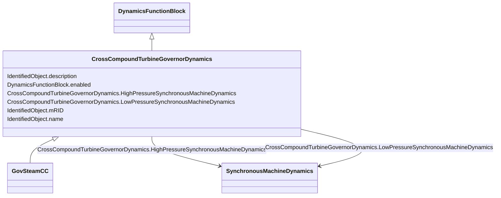

# CrossCompoundTurbineGovernorDynamics

_Turbine-governor cross-compound function block whose behaviour is described by reference to a standard model or by definition of a user-defined model._

**URI**: [cim:CrossCompoundTurbineGovernorDynamics](http://iec.ch/TC57/CIM100#CrossCompoundTurbineGovernorDynamics) 
**Type**: Class

## Inheritance
* [IdentifiedObject](IdentifiedObject.md)
    * [DynamicsFunctionBlock](DynamicsFunctionBlock.md)
        * **CrossCompoundTurbineGovernorDynamics**
            * [GovSteamCC](GovSteamCC.md)

## Attributes

| Name | URI | Cardinality and Range | Description | Inheritance |
| ---  | --- | --- | --- | --- |
| HighPressureSynchronousMachineDynamics | [cim:CrossCompoundTurbineGovernorDynamics.HighPressureSynchronousMachineDynamics](http://iec.ch/TC57/CIM100#CrossCompoundTurbineGovernorDynamics.HighPressureSynchronousMachineDynamics) | 1..1    [SynchronousMachineDynamics](SynchronousMachineDynamics.md)  | High-pressure synchronous machine with which this cross-compound turbine gove... | direct |
| LowPressureSynchronousMachineDynamics | [cim:CrossCompoundTurbineGovernorDynamics.LowPressureSynchronousMachineDynamics](http://iec.ch/TC57/CIM100#CrossCompoundTurbineGovernorDynamics.LowPressureSynchronousMachineDynamics) | 1..1    [SynchronousMachineDynamics](SynchronousMachineDynamics.md)  | Low-pressure synchronous machine with which this cross-compound turbine gover... | direct |
| enabled | [cim:DynamicsFunctionBlock.enabled](http://iec.ch/TC57/CIM100#DynamicsFunctionBlock.enabled) | 1..1    boolean  | Function block used indicator | [DynamicsFunctionBlock](DynamicsFunctionBlock.md) |
| description | [cim:IdentifiedObject.description](http://iec.ch/TC57/CIM100#IdentifiedObject.description) | 0..1    string  | The description is a free human readable text describing or naming the object | [IdentifiedObject](IdentifiedObject.md) |
| mRID | [cim:IdentifiedObject.mRID](http://iec.ch/TC57/CIM100#IdentifiedObject.mRID) | 1..1    string  | Master resource identifier issued by a model authority | [IdentifiedObject](IdentifiedObject.md) |
| name | [cim:IdentifiedObject.name](http://iec.ch/TC57/CIM100#IdentifiedObject.name) | 0..1    string  | The name is any free human readable and possibly non unique text naming the o... | [IdentifiedObject](IdentifiedObject.md) |

## Usages

| used by | used in | type | used |
| ---  | --- | --- | --- |
| [SynchronousMachineUserDefined](SynchronousMachineUserDefined.md) | CrossCompoundTurbineGovernorDyanmics | range | [CrossCompoundTurbineGovernorDynamics](CrossCompoundTurbineGovernorDynamics.md) |
| [SynchronousMachineUserDefined](SynchronousMachineUserDefined.md) | CrossCompoundTurbineGovernorDynamics | range | [CrossCompoundTurbineGovernorDynamics](CrossCompoundTurbineGovernorDynamics.md) |
| [SynchronousMachineSimplified](SynchronousMachineSimplified.md) | CrossCompoundTurbineGovernorDyanmics | range | [CrossCompoundTurbineGovernorDynamics](CrossCompoundTurbineGovernorDynamics.md) |
| [SynchronousMachineSimplified](SynchronousMachineSimplified.md) | CrossCompoundTurbineGovernorDynamics | range | [CrossCompoundTurbineGovernorDynamics](CrossCompoundTurbineGovernorDynamics.md) |
| [SynchronousMachineDynamics](SynchronousMachineDynamics.md) | CrossCompoundTurbineGovernorDyanmics | range | [CrossCompoundTurbineGovernorDynamics](CrossCompoundTurbineGovernorDynamics.md) |
| [SynchronousMachineDynamics](SynchronousMachineDynamics.md) | CrossCompoundTurbineGovernorDynamics | range | [CrossCompoundTurbineGovernorDynamics](CrossCompoundTurbineGovernorDynamics.md) |
| [SynchronousMachineDetailed](SynchronousMachineDetailed.md) | CrossCompoundTurbineGovernorDyanmics | range | [CrossCompoundTurbineGovernorDynamics](CrossCompoundTurbineGovernorDynamics.md) |
| [SynchronousMachineDetailed](SynchronousMachineDetailed.md) | CrossCompoundTurbineGovernorDynamics | range | [CrossCompoundTurbineGovernorDynamics](CrossCompoundTurbineGovernorDynamics.md) |
| [SynchronousMachineTimeConstantReactance](SynchronousMachineTimeConstantReactance.md) | CrossCompoundTurbineGovernorDyanmics | range | [CrossCompoundTurbineGovernorDynamics](CrossCompoundTurbineGovernorDynamics.md) |
| [SynchronousMachineTimeConstantReactance](SynchronousMachineTimeConstantReactance.md) | CrossCompoundTurbineGovernorDynamics | range | [CrossCompoundTurbineGovernorDynamics](CrossCompoundTurbineGovernorDynamics.md) |
| [SynchronousMachineEquivalentCircuit](SynchronousMachineEquivalentCircuit.md) | CrossCompoundTurbineGovernorDyanmics | range | [CrossCompoundTurbineGovernorDynamics](CrossCompoundTurbineGovernorDynamics.md) |
| [SynchronousMachineEquivalentCircuit](SynchronousMachineEquivalentCircuit.md) | CrossCompoundTurbineGovernorDynamics | range | [CrossCompoundTurbineGovernorDynamics](CrossCompoundTurbineGovernorDynamics.md) |

## Identifier and Mapping Information

### Schema Source

* from schema: http://iec.ch/TC57/ns/CIM/Dynamics-EU#Package_DynamicsProfile

## Mappings

| Mapping Type | Mapped Value |
| ---  | ---  |
| self | cim:CrossCompoundTurbineGovernorDynamics |
| native | this:CrossCompoundTurbineGovernorDynamics |

