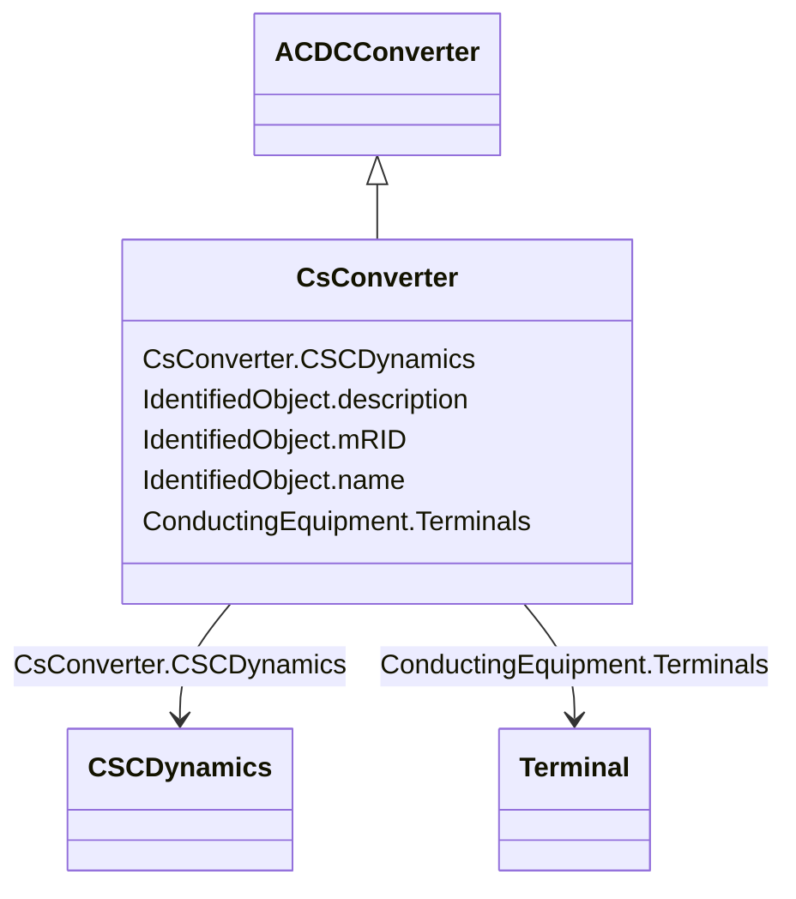

# CsConverter

_DC side of the current source converter (CSC)._

_The firing angle controls the dc voltage at the converter, both for rectifier and inverter. The difference between the dc voltages of the rectifier and inverter determines the dc current. The extinction angle is used to limit the dc voltage at the inverter, if needed, and is not used in active power control. The firing angle, transformer tap position and number of connected filters are the primary means to control a current source dc line. Higher level controls are built on top, e.g. dc voltage, dc current and active power. From a steady state perspective it is sufficient to specify the wanted active power transfer (ACDCConverter.targetPpcc) and the control functions will set the dc voltage, dc current, firing angle, transformer tap position and number of connected filters to meet this. Therefore attributes targetAlpha and targetGamma are not applicable in this case._

_The reactive power consumed by the converter is a function of the firing angle, transformer tap position and number of connected filter, which can be approximated with half of the active power. The losses is a function of the dc voltage and dc current._

_The attributes minAlpha and maxAlpha define the range of firing angles for rectifier operation between which no discrete tap changer action takes place. The range is typically 10-18 degrees._

_The attributes minGamma and maxGamma define the range of extinction angles for inverter operation between which no discrete tap changer action takes place. The range is typically 17-20 degrees._

**URI**: [cim:CsConverter](http://iec.ch/TC57/CIM100#CsConverter) 
**Type**: Class

## Inheritance
* [IdentifiedObject](IdentifiedObject.md)
    * [PowerSystemResource](PowerSystemResource.md)
        * [Equipment](Equipment.md)
            * [ConductingEquipment](ConductingEquipment.md)
                * [ACDCConverter](ACDCConverter.md)
                    * **CsConverter**

## Attributes

| Name | URI | Cardinality and Range | Description | Inheritance |
| ---  | --- | --- | --- | --- |
| CSCDynamics | [cim:CsConverter.CSCDynamics](http://iec.ch/TC57/CIM100#CsConverter.CSCDynamics) | 0..1    [CSCDynamics](CSCDynamics.md)  | Current source converter dynamics model used to describe dynamic behaviour of... | direct |
| Terminals | [cim:ConductingEquipment.Terminals](http://iec.ch/TC57/CIM100#ConductingEquipment.Terminals) | 0..*    [Terminal](Terminal.md)  | Conducting equipment have terminals that may be connected to other conducting... | [ConductingEquipment](ConductingEquipment.md) |
| description | [cim:IdentifiedObject.description](http://iec.ch/TC57/CIM100#IdentifiedObject.description) | 0..1    string  | The description is a free human readable text describing or naming the object | [IdentifiedObject](IdentifiedObject.md) |
| mRID | [cim:IdentifiedObject.mRID](http://iec.ch/TC57/CIM100#IdentifiedObject.mRID) | 1..1    string  | Master resource identifier issued by a model authority | [IdentifiedObject](IdentifiedObject.md) |
| name | [cim:IdentifiedObject.name](http://iec.ch/TC57/CIM100#IdentifiedObject.name) | 0..1    string  | The name is any free human readable and possibly non unique text naming the o... | [IdentifiedObject](IdentifiedObject.md) |

## Usages

| used by | used in | type | used |
| ---  | --- | --- | --- |
| [CSCUserDefined](CSCUserDefined.md) | CSConverter | range | [CsConverter](CsConverter.md) |
| [CSCDynamics](CSCDynamics.md) | CSConverter | range | [CsConverter](CsConverter.md) |

## Identifier and Mapping Information

### Schema Source

* from schema: http://iec.ch/TC57/ns/CIM/Dynamics-EU#Package_DynamicsProfile

## Mappings

| Mapping Type | Mapped Value |
| ---  | ---  |
| self | cim:CsConverter |
| native | this:CsConverter |

