# DiscExcContIEEEDEC1A

_IEEE type DEC1A discontinuous excitation control model that boosts generator excitation to a level higher than that demanded by the voltage regulator and stabilizer immediately following a system fault._

_Reference: IEEE 421.5-2005, 12.2._

**URI**: [cim:DiscExcContIEEEDEC1A](http://iec.ch/TC57/CIM100#DiscExcContIEEEDEC1A) 
**Type**: Class

```mermaid
 classDiagram
    class DiscExcContIEEEDEC1A
    click DiscExcContIEEEDEC1A href "../DiscExcContIEEEDEC1A"
      DiscontinuousExcitationControlDynamics <|-- DiscExcContIEEEDEC1A
        click DiscontinuousExcitationControlDynamics href "../DiscontinuousExcitationControlDynamics"
      
      DiscExcContIEEEDEC1A : IdentifiedObject.description
        
      DiscExcContIEEEDEC1A : DynamicsFunctionBlock.enabled
        
      DiscExcContIEEEDEC1A : DiscExcContIEEEDEC1A.esc
        
          DiscExcContIEEEDEC1A --> PU : DiscExcContIEEEDEC1A.esc
          click PU href "../PU"
        
      DiscExcContIEEEDEC1A : DiscontinuousExcitationControlDynamics.ExcitationSystemDynamics
        
          DiscExcContIEEEDEC1A --> ExcitationSystemDynamics : DiscontinuousExcitationControlDynamics.ExcitationSystemDynamics
          click ExcitationSystemDynamics href "../ExcitationSystemDynamics"
        
      DiscExcContIEEEDEC1A : DiscExcContIEEEDEC1A.kan
        
          DiscExcContIEEEDEC1A --> PU : DiscExcContIEEEDEC1A.kan
          click PU href "../PU"
        
      DiscExcContIEEEDEC1A : DiscExcContIEEEDEC1A.ketl
        
          DiscExcContIEEEDEC1A --> PU : DiscExcContIEEEDEC1A.ketl
          click PU href "../PU"
        
      DiscExcContIEEEDEC1A : IdentifiedObject.mRID
        
      DiscExcContIEEEDEC1A : IdentifiedObject.name
        
      DiscExcContIEEEDEC1A : DiscontinuousExcitationControlDynamics.RemoteInputSignal
        
          DiscExcContIEEEDEC1A --> RemoteInputSignal : DiscontinuousExcitationControlDynamics.RemoteInputSignal
          click RemoteInputSignal href "../RemoteInputSignal"
        
      DiscExcContIEEEDEC1A : DiscExcContIEEEDEC1A.tan
        
          DiscExcContIEEEDEC1A --> Seconds : DiscExcContIEEEDEC1A.tan
          click Seconds href "../Seconds"
        
      DiscExcContIEEEDEC1A : DiscExcContIEEEDEC1A.td
        
          DiscExcContIEEEDEC1A --> Seconds : DiscExcContIEEEDEC1A.td
          click Seconds href "../Seconds"
        
      DiscExcContIEEEDEC1A : DiscExcContIEEEDEC1A.tl1
        
          DiscExcContIEEEDEC1A --> Seconds : DiscExcContIEEEDEC1A.tl1
          click Seconds href "../Seconds"
        
      DiscExcContIEEEDEC1A : DiscExcContIEEEDEC1A.tl2
        
          DiscExcContIEEEDEC1A --> Seconds : DiscExcContIEEEDEC1A.tl2
          click Seconds href "../Seconds"
        
      DiscExcContIEEEDEC1A : DiscExcContIEEEDEC1A.tw5
        
          DiscExcContIEEEDEC1A --> Seconds : DiscExcContIEEEDEC1A.tw5
          click Seconds href "../Seconds"
        
      DiscExcContIEEEDEC1A : DiscExcContIEEEDEC1A.val
        
          DiscExcContIEEEDEC1A --> PU : DiscExcContIEEEDEC1A.val
          click PU href "../PU"
        
      DiscExcContIEEEDEC1A : DiscExcContIEEEDEC1A.vanmax
        
          DiscExcContIEEEDEC1A --> PU : DiscExcContIEEEDEC1A.vanmax
          click PU href "../PU"
        
      DiscExcContIEEEDEC1A : DiscExcContIEEEDEC1A.vomax
        
          DiscExcContIEEEDEC1A --> PU : DiscExcContIEEEDEC1A.vomax
          click PU href "../PU"
        
      DiscExcContIEEEDEC1A : DiscExcContIEEEDEC1A.vomin
        
          DiscExcContIEEEDEC1A --> PU : DiscExcContIEEEDEC1A.vomin
          click PU href "../PU"
        
      DiscExcContIEEEDEC1A : DiscExcContIEEEDEC1A.vsmax
        
          DiscExcContIEEEDEC1A --> PU : DiscExcContIEEEDEC1A.vsmax
          click PU href "../PU"
        
      DiscExcContIEEEDEC1A : DiscExcContIEEEDEC1A.vsmin
        
          DiscExcContIEEEDEC1A --> PU : DiscExcContIEEEDEC1A.vsmin
          click PU href "../PU"
        
      DiscExcContIEEEDEC1A : DiscExcContIEEEDEC1A.vtc
        
          DiscExcContIEEEDEC1A --> PU : DiscExcContIEEEDEC1A.vtc
          click PU href "../PU"
        
      DiscExcContIEEEDEC1A : DiscExcContIEEEDEC1A.vtlmt
        
          DiscExcContIEEEDEC1A --> PU : DiscExcContIEEEDEC1A.vtlmt
          click PU href "../PU"
        
      DiscExcContIEEEDEC1A : DiscExcContIEEEDEC1A.vtm
        
          DiscExcContIEEEDEC1A --> PU : DiscExcContIEEEDEC1A.vtm
          click PU href "../PU"
        
      DiscExcContIEEEDEC1A : DiscExcContIEEEDEC1A.vtn
        
          DiscExcContIEEEDEC1A --> PU : DiscExcContIEEEDEC1A.vtn
          click PU href "../PU"
        
      
```

## Inheritance
* [IdentifiedObject](IdentifiedObject.md)
    * [DynamicsFunctionBlock](DynamicsFunctionBlock.md)
        * [DiscontinuousExcitationControlDynamics](DiscontinuousExcitationControlDynamics.md)
            * **DiscExcContIEEEDEC1A**

## Attributes

| Name | URI | Cardinality and Range | Description | Inheritance |
| ---  | --- | --- | --- | --- |
| vtlmt | [cim:DiscExcContIEEEDEC1A.vtlmt](http://iec.ch/TC57/CIM100#DiscExcContIEEEDEC1A.vtlmt) | 1    [PU](PU.md)  | Voltage reference (<i>V</i><i>TLMT</i>) | direct |
| vomax | [cim:DiscExcContIEEEDEC1A.vomax](http://iec.ch/TC57/CIM100#DiscExcContIEEEDEC1A.vomax) | 1    [PU](PU.md)  | Limiter (<i>V</i><i>OMAX</i>) (&gt; DiscExcContIEEEDEC1A | direct |
| vomin | [cim:DiscExcContIEEEDEC1A.vomin](http://iec.ch/TC57/CIM100#DiscExcContIEEEDEC1A.vomin) | 1    [PU](PU.md)  | Limiter (<i>V</i><i>OMIN</i>) (&lt; DiscExcContIEEEDEC1A | direct |
| ketl | [cim:DiscExcContIEEEDEC1A.ketl](http://iec.ch/TC57/CIM100#DiscExcContIEEEDEC1A.ketl) | 1    [PU](PU.md)  | Terminal voltage limiter gain (<i>K</i><i>ETL</i>) | direct |
| vtc | [cim:DiscExcContIEEEDEC1A.vtc](http://iec.ch/TC57/CIM100#DiscExcContIEEEDEC1A.vtc) | 1    [PU](PU.md)  | Terminal voltage level reference (<i>V</i><i>TC</i>) | direct |
| val | [cim:DiscExcContIEEEDEC1A.val](http://iec.ch/TC57/CIM100#DiscExcContIEEEDEC1A.val) | 1    [PU](PU.md)  | Regulator voltage reference (<i>V</i><i>AL</i>) | direct |
| esc | [cim:DiscExcContIEEEDEC1A.esc](http://iec.ch/TC57/CIM100#DiscExcContIEEEDEC1A.esc) | 1    [PU](PU.md)  | Speed change reference (<i>E</i><i>SC</i>) | direct |
| kan | [cim:DiscExcContIEEEDEC1A.kan](http://iec.ch/TC57/CIM100#DiscExcContIEEEDEC1A.kan) | 1    [PU](PU.md)  | Discontinuous controller gain (<i>K</i><i>AN</i>) | direct |
| tan | [cim:DiscExcContIEEEDEC1A.tan](http://iec.ch/TC57/CIM100#DiscExcContIEEEDEC1A.tan) | 1    [Seconds](Seconds.md)  | Discontinuous controller time constant (<i>T</i><i>AN</i>) (&gt;= ... | direct |
| tw5 | [cim:DiscExcContIEEEDEC1A.tw5](http://iec.ch/TC57/CIM100#DiscExcContIEEEDEC1A.tw5) | 1    [Seconds](Seconds.md)  | DEC washout time constant (<i>T</i><i>W</i>5) (&gt;= 0) | direct |
| vsmax | [cim:DiscExcContIEEEDEC1A.vsmax](http://iec.ch/TC57/CIM100#DiscExcContIEEEDEC1A.vsmax) | 1    [PU](PU.md)  | Limiter (<i>V</i><i>SMAX</i>)(&gt; DiscExcContIEEEDEC1A | direct |
| vsmin | [cim:DiscExcContIEEEDEC1A.vsmin](http://iec.ch/TC57/CIM100#DiscExcContIEEEDEC1A.vsmin) | 1    [PU](PU.md)  | Limiter (<i>V</i><i>SMIN</i>) (&lt; DiscExcContIEEEDEC1A | direct |
| td | [cim:DiscExcContIEEEDEC1A.td](http://iec.ch/TC57/CIM100#DiscExcContIEEEDEC1A.td) | 1    [Seconds](Seconds.md)  | Time constant (<i>T</i><i>D</i>) (&gt;= 0) | direct |
| tl1 | [cim:DiscExcContIEEEDEC1A.tl1](http://iec.ch/TC57/CIM100#DiscExcContIEEEDEC1A.tl1) | 1    [Seconds](Seconds.md)  | Time constant (<i>T</i><i>L</i>1) (&gt;= 0) | direct |
| tl2 | [cim:DiscExcContIEEEDEC1A.tl2](http://iec.ch/TC57/CIM100#DiscExcContIEEEDEC1A.tl2) | 1    [Seconds](Seconds.md)  | Time constant (<i>T</i><i>L</i>2) (&gt;= 0) | direct |
| vtm | [cim:DiscExcContIEEEDEC1A.vtm](http://iec.ch/TC57/CIM100#DiscExcContIEEEDEC1A.vtm) | 1    [PU](PU.md)  | Voltage limits (<i>V</i><i>TM</i>) | direct |
| vtn | [cim:DiscExcContIEEEDEC1A.vtn](http://iec.ch/TC57/CIM100#DiscExcContIEEEDEC1A.vtn) | 1    [PU](PU.md)  | Voltage limits (<i>V</i><i>TN</i>) | direct |
| vanmax | [cim:DiscExcContIEEEDEC1A.vanmax](http://iec.ch/TC57/CIM100#DiscExcContIEEEDEC1A.vanmax) | 1    [PU](PU.md)  | Limiter for Van (<i>V</i><i>ANMAX</i>) | direct |
| RemoteInputSignal | [cim:DiscontinuousExcitationControlDynamics.RemoteInputSignal](http://iec.ch/TC57/CIM100#DiscontinuousExcitationControlDynamics.RemoteInputSignal) | 0..1    [RemoteInputSignal](RemoteInputSignal.md)  | Remote input signal used by this discontinuous excitation control system mode... | [DiscontinuousExcitationControlDynamics](DiscontinuousExcitationControlDynamics.md) |
| ExcitationSystemDynamics | [cim:DiscontinuousExcitationControlDynamics.ExcitationSystemDynamics](http://iec.ch/TC57/CIM100#DiscontinuousExcitationControlDynamics.ExcitationSystemDynamics) | 1    [ExcitationSystemDynamics](ExcitationSystemDynamics.md)  | Excitation system model with which this discontinuous excitation control mode... | [DiscontinuousExcitationControlDynamics](DiscontinuousExcitationControlDynamics.md) |
| enabled | [cim:DynamicsFunctionBlock.enabled](http://iec.ch/TC57/CIM100#DynamicsFunctionBlock.enabled) | 1    boolean  | Function block used indicator | [DynamicsFunctionBlock](DynamicsFunctionBlock.md) |
| description | [cim:IdentifiedObject.description](http://iec.ch/TC57/CIM100#IdentifiedObject.description) | 0..1    string  | The description is a free human readable text describing or naming the object | [IdentifiedObject](IdentifiedObject.md) |
| mRID | [cim:IdentifiedObject.mRID](http://iec.ch/TC57/CIM100#IdentifiedObject.mRID) | 1    string  | Master resource identifier issued by a model authority | [IdentifiedObject](IdentifiedObject.md) |
| name | [cim:IdentifiedObject.name](http://iec.ch/TC57/CIM100#IdentifiedObject.name) | 0..1    string  | The name is any free human readable and possibly non unique text naming the o... | [IdentifiedObject](IdentifiedObject.md) |

## Identifier and Mapping Information

### Schema Source

* from schema: http://iec.ch/TC57/ns/CIM/Dynamics-EU#Package_DynamicsProfile

## Mappings

| Mapping Type | Mapped Value |
| ---  | ---  |
| self | cim:DiscExcContIEEEDEC1A |
| native | this:DiscExcContIEEEDEC1A |

